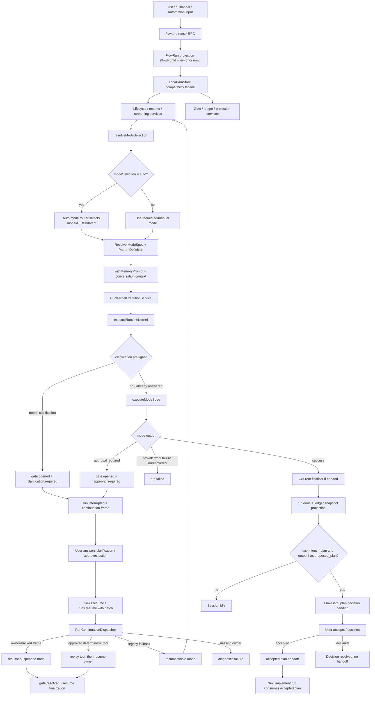
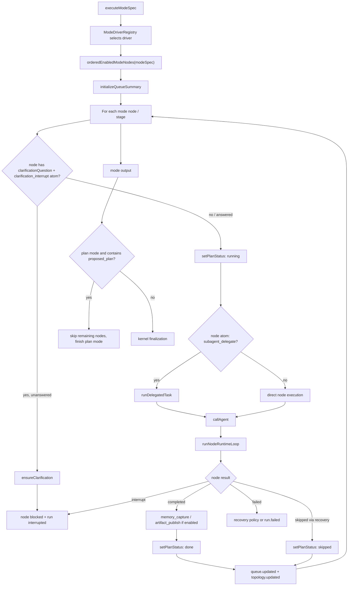
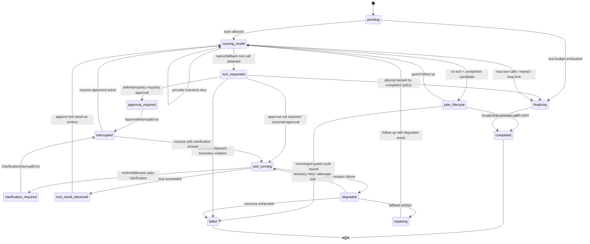

# Ora

简体中文 | [English](README.en.md)

Ora 是一个桌面端 AI 工作台。它把模式、智能体、技能和模型提供商放在同一个界面里，让你先选怎么跑，再交给对应的智能体。

当前项目仍在早期开发阶段，面向想在本地组织 AI 工作流、调试多智能体协作，或接入不同模型服务和消息渠道的用户与开发者。

## Ora 解决什么问题

大多数 AI 工具只有一个聊天入口，简单问答、代码生成、多步骤研究、团队协作全用同一种方式处理。但实际工作中，不同任务需要不同的协作深度和决策路径。

Ora 把它做成一个工作台：先选怎么跑，再交给对应的智能体。同一个任务可以用单智能体快速处理、生成-验证、编排调度或团队协作，每种模式搭配不同的智能体、技能和权限。简单的事不用绕远路，复杂的事不会塞进一个对话框。

对普通用户，Ora 减少了在聊天工具、代码编辑器、模型控制台之间来回切窗口的麻烦。对开发者，它把多智能体工作流从 prompt 工程变成一个可观测、可调优、可回放的运行时。

## 核心能力

- 组合式工作流：按任务选择协调模式，再搭配智能体和技能。
- 可视化编排：支持生成-验证、编排调度、团队协作等拓扑，也可以自己设计节点和连线。
- 多模型提供方：内置 OpenAI、Anthropic、OpenRouter，也支持 OpenAI-compatible 和 Anthropic-compatible 服务。
- 运行记录与复盘：保留 run state、events、checkpoints、trails，方便查看任务如何推进。
- 权限与审批：把工具调用按风险分层，支持默认策略、只读策略和完全信任策略。
- 自我迭代：分析运行记录和项目线索，提出可审阅的改进建议。
- 多渠道入口：运行时包含 HTTP webhook、Slack、飞书、微信、企业微信、Telegram、Discord、钉钉等 channel adapter。
- 本地优先的桌面体验：Tauri 桌面壳负责应用窗口和 sidecar，React 前端负责工作台界面，TypeScript runtime 负责执行。

## 技术结构

```text
.
├── apps
│   ├── desktop          # Tauri + React + Vite 桌面端
│   └── runtime          # TypeScript runtime sidecar
├── packages
│   └── shared           # 跨端共享的类型、schema、模式、能力和 RPC 定义
├── scripts              # 本地开发、构建和版本同步脚本
└── skills               # Ora 技能目录
```

桌面端通过 Tauri 启动 runtime sidecar。前端和 sidecar 之间使用 shared 包里的 JSON-RPC 合约通信，运行时负责模型调用、工具执行、channel 事件、存储、评测和 trace。

## 图数据模型

Ora 将智能体和工作流统一建模为**有向图**，整个框架自研，不依赖 LangGraph、Dagre 等外部图库。

### 拓扑节点与边

图由两种基础元素构成（`packages/shared/src/topology.ts`）：

**节点（TopologyNode）** 是图中的执行单元，有五种类型：

| kind | 含义 |
| --- | --- |
| `run` | 运行入口节点 |
| `agent` | 智能体节点，通过 `agentId` 绑定 AgentProfile |
| `capability` | 运行时能力节点（共享黑板、事件主题、检查点等） |
| `checkpoint` | 快照检查点 |
| `artifact` | 产物节点 |

每个节点有独立的状态机：`idle` → `running` → `done` / `blocked` / `failed`。

**边（TopologyEdge）** 定义节点间关系，有五种类型：

| kind | 含义 |
| --- | --- |
| `control` | 控制流，表示执行顺序 |
| `delegation` | 委派，任务分发 |
| `verification` | 验证，检查 / 评审关系 |
| `memory` | 记忆读写 |
| `artifact` | 产物传递 |

### 模式即图

每个工作模式（ModeSpec）本质是一个可编辑的有向图：

- **节点（ModeNodeSpec）**：从 17 种模板（draft、verify、research、build、check、handoff 等）中选择，绑定到具体的 AgentProfile
- **边（ModeEdgeSpec）**：定义节点间的执行顺序和数据流向
- **运行时原子（Runtime Atoms）**：15 种可插拔的运行时能力（memory_capture、subagent_delegate、clarification_interrupt 等），按需注入为 capability 节点

用户可以在 Mode Studio 中可视化编辑节点和连线，自定义工作流拓扑。

### 五大协调模式

Ora 内置五种协调模式（CoordinationPattern），每种都是一个预定义的拓扑蓝图（PatternDefinition），包含完整的节点、边、AgentProfile 列表和执行模板：

| 模式 | 协调方式 | 状态模型 | 默认智能体 | 适用场景 |
| --- | --- | --- | --- | --- |
| Orchestrator-Subagent | 层级委派 | 临时 | orchestrator, researcher, reviewer | 可分解任务，需可审查的委派链路 |
| Generator-Verifier | 循环验证 | 临时 | generator, verifier | 有明确验收标准的任务 |
| Agent Teams | 团队协作 | 持久 Worker | team_lead, builder, reviewer | Worker 需跨任务保持身份和记忆 |
| Message Bus | 事件路由 | 事件驱动 | router, researcher, responder | 事件驱动的可扩展管线 |
| Shared State | 共享黑板 | 共享状态 | orchestrator, researcher, reviewer | 智能体需近实时基于彼此发现协作 |

运行时内核根据选定模式实例化拓扑图，按节点顺序驱动智能体执行。完整说明见 [docs/ora-graph-framework.md](docs/ora-graph-framework.md)。

## Runtime loop 结构

Ora 的 runtime loop 由三层嵌套组成。外层负责 run 生命周期和持久投影，`LocalRunStore` 保持兼容 facade；中层 mode 编排按节点和阶段推进 agent 调用；内层 node loop 处理模型调用、工具调用、审批、澄清和恢复。

### 外层 run lifecycle



### Mode 编排层



### 单个 node 的 model-tool loop



## 快速开始

先准备这些工具：

- Node.js
- pnpm 10.11.0
- Rust 和 Cargo，Tauri 本地构建需要

安装依赖：

```bash
pnpm install
```

启动桌面开发环境：

```bash
pnpm dev:desktop
```

这个脚本会清理旧的 Ora 开发进程，按需安装依赖，打包 runtime sidecar，然后启动 Tauri dev。

只启动 Vite 前端：

```bash
pnpm dev
```

只启动 runtime：

```bash
pnpm dev:runtime
```

运行 runtime smoke：

```bash
pnpm --filter @ora/runtime smoke
```

## 配置模型

第一次打开 Ora 时，onboarding 会引导你选择模型提供商。你可以从 OpenRouter 等免费模型入口开始，也可以填入自己的 OpenAI、Anthropic 或兼容服务 API key。

API key 可以在应用内配置。搜索和 Langfuse trace 这类可选能力可以参考 `.env.example`，按需在 shell 环境里设置：

```bash
ORA_LANGFUSE_ENABLED=false
ORA_SEARCH_PROVIDER=brave
BRAVE_SEARCH_API_KEY=...
```

如果要使用自定义 provider base URL，runtime 会要求显式设置：

```bash
ORA_ALLOW_CUSTOM_PROVIDER_BASE_URLS=true
```

## 常用命令

```bash
pnpm test
pnpm typecheck
pnpm build
pnpm lint
pnpm version:check
```

构建桌面应用：

```bash
./scripts/build-desktop.sh
```

构建完成后，产物会出现在 `apps/desktop/src-tauri/target/release/bundle` 下。

## 开发说明

- `apps/desktop` 负责界面、设置、onboarding、工作台状态展示和 Tauri 命令调用。
- `apps/runtime` 负责 run orchestration、provider registry、channel service、search providers、evaluation、memory、feedback loop 和 persistence。
- `packages/shared` 是前端与 runtime 的协议边界。新增跨端数据结构时，优先从这里定义 schema 和类型。
- `scripts/dev-desktop.sh` 会打包 runtime sidecar，并检查 Langfuse 资源是否存在。
- `.ora/runtime.db` 是默认的本地 runtime 存储路径，可通过 `ORA_RUNTIME_STORE_DIR` 覆盖。

## 项目状态

Ora 目前更适合本地开发和内部试用。渠道接入、搜索、Langfuse trace 等功能需要额外配置密钥或外部服务。

## 许可证

本项目使用 MIT License，见 [LICENSE](LICENSE)。
