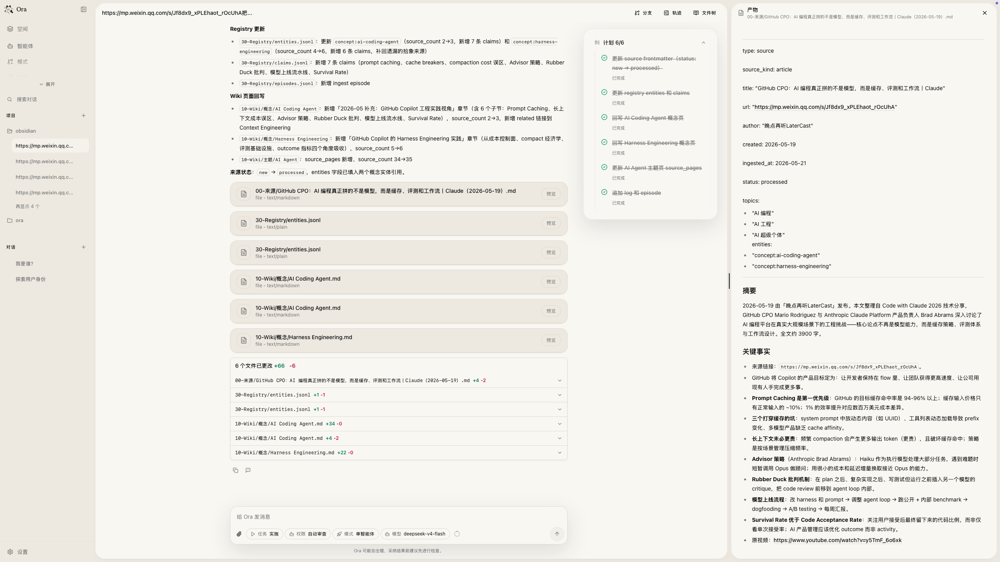

# Ora

<p align="center">
  
</p>

简体中文 | [English](README.en.md)

**Ora 是一个可解释的 Agent 工作台。**

大多数 AI 工具能给出结果，但过程常常散在模型回复、工具日志和临时状态里。你能看到 Agent 回了什么，却很难追清它为什么先追问、为什么去搜索、为什么调用这个工具、为什么在那个时刻停下。

在 Ora 里，Agent 的决策、工具调用、暂停恢复、协作过程和最终结果会落在同一条可追踪链路里。你可以看答案，也可以回看它怎么形成、哪里做过取舍、哪一步需要你确认。

实现上，Ora 用因果决策约束 Agent 的下一步，用事件溯源模型保存运行事实，用可编辑的模式图组织多 Agent 协作，再把对话结果沉淀成能继续修改的组件。想看具体实现，可以从 [因果决策系统](docs/ora-causal-decision.md)、[Gate 与恢复](docs/ora-gates-and-resume.md)、[工具系统](docs/ora-tool-system.md) 和 [Snapshot 与 Trails](docs/ora-snapshot-projection-trails.md) 开始。

<p align="center">
  
</p>

## 三个核心差异

### 决策过程能回放

Agent 在直接回答、追问澄清、搜索、读上下文、调用工具、规划和请求审批之间切换时，会先经过结构化的因果判断。这个判断会结合目标清晰度、事实风险、上下文缺口和行动风险，决定下一步更适合做什么。

- 目标不清时会先追问，事实风险高时会先搜索，上下文不足时会先读文件
- 低风险操作可以直接执行，高风险操作会进入审批门控
- 每次关键决策都能回放，能看到它选择这条路径的依据
- 评估层以任务结果为先，再结合干预质量和成本，支持 `record_only`、`advisory`、`enforcing` 三档策略的 three-way comparison，并把失败归因为语义状态问题或干预选择问题
- 详见 [因果决策系统评测报告v1](evaluation/reports/因果决策系统评测报告v1.md)

详见 [因果决策系统](docs/ora-causal-decision.md)。

### 运行事实可追溯

Ora 用 Ledger 按顺序记录运行事实：运行启动、工具结果、gate 开闭、计划决议、handoff 消费、上下文压缩都会进入同一条事件链。掉电、重启或切换客户端后，界面可以从这条链路重建到正确状态。

- 投影系统从 Ledger 重建 Session 摘要、Turn 列表、Gate 状态和 Attention
- 掉电、重启、切换客户端后，UI 状态从持久投影恢复，不依赖内存猜测
- Clarification、Approval 和 Plan Decision 都有明确的 gate 语义，暂停后能回到正确的恢复点
- accepted plan 现在可以直接回到原 run 继续执行，兼容路径里仍然保留 handoff 给下一次 implement run 消费
- 分支模型支持在同一 Session 中分叉出多个 candidate run，选择最佳结果 adopt

详见 [Ledger 模型](docs/ora-ledger-model.md)、[Gate 与恢复](docs/ora-gates-and-resume.md)。

### 模式是可编辑的图

每个 Ora 模式都是一张可编辑的有向图。你可以决定这次任务是单 Agent、委派、验证循环，还是团队协作。

- 内置模式覆盖单 Agent、orchestrator + subagent、generator-verifier、agent team、message bus、shared state 这些常见协作结构
- 节点可以挂不同 Agent、工具面和运行时能力，不用为每种模式重写一套执行器
- Mode Studio 可视化编辑节点和连线，保存前自动校验拓扑合法性
- 每种模式 family 都有明确能力边界，运行时会按边界选择合适的执行方式

详见 [图框架](docs/ora-graph-framework.md)、[Mode 创作与 Studio](docs/ora-mode-authoring-and-studio.md)。

## 产品形态

**桌面应用**：Tauri + React + Vite，本地优先，API key 留在本地。TypeScript runtime sidecar 负责模型调用、工具执行、持久化和评估。两者通过 shared 包的 JSON-RPC 合约通信。

**Widget Dashboard**：对话成果不只是聊天记录。Ora 把对话沉淀为三种结构化组件：

| 组件 | 用途 | 特点 |
| --- | --- | --- |
| **Artifact** | 文章、摘要、Prompt、研究结果 | 可编辑、可导出、可版本回滚 |
| **Todo** | 待办事项、截止日期、提醒 | 勾选不触发版本快照，可关联 Automation |
| **Feed** | 定时刷新外部信息（热点、GitHub、关键词） | 按 cron/interval 调度刷新 |

组件跨 Session 存在，关闭对话后继续存活。可通过 Builder Session 继续用自然语言修改。当前选中 Todo widget 后，普通对话已经可以真实写入待办项，不再只是提示词里“看起来知道”目标。

详见 [Widget 系统](docs/ora-widget-system.md)。

## 关键技术能力

**工具治理链**：每次工具调用都会经过 `policy → approval → action → execution → ledger → snapshot → projection` 这条治理链。现在 `agent.spawn` 已支持职责型工具面，`agent.wait` 可以显式做 fan-in，选中 widget 后也能走真实 runtime tool，不再只靠 prompt 假装成功。详见 [工具系统](docs/ora-tool-system.md)。

**Memory 系统**：围绕持久事实、检索注入、短期信号、知识编译和信号晋升组织记忆链路。支持确定性准入和 Provider 驱动准入两种模式。详见 [Memory 系统](docs/ora-memory-system.md)。

**多模型提供方**：内置 OpenAI、Anthropic、OpenRouter，也支持 OpenAI-compatible 和 Anthropic-compatible 服务。

**多渠道入口**：HTTP webhook、Slack、飞书、微信、企业微信、Telegram、Discord、钉钉等外部消息入口都会先统一转换成内部 session/run，再进入同一套 runtime 主链。详见 [Channel 连接器](docs/ora-channel-connectors.md)。

**Self-Iteration 闭环**：运行信号、评估结果和失败归因会继续回流到 prompt、mode、skill 和策略迭代里，形成持续收敛的改进链路。详见 [Self-Iteration](docs/ora-self-iteration-loop.md)。

**可观测性**：Trails 面板把运行快照、持久投影和时间线串起来。正文区只显示父 Agent 的最终叙事，协作区单独展示子 Agent 的生命周期、结果回流和卡住状态。切换 session 时，desktop 会保留每个活跃会话的最新运行状态，避免切回去再整块补内容。详见 [Snapshot 与 Trails](docs/ora-snapshot-projection-trails.md)。

## 技术结构

```text
.
├── apps
│   ├── desktop          # Tauri + React + Vite 桌面端
│   └── runtime          # TypeScript runtime sidecar
├── packages
│   └── shared           # 跨端共享类型、schema、模式定义、RPC 合约
├── scripts              # 本地开发、构建和版本同步脚本
└── skills               # Ora 技能目录
```

## 安装

### macOS（Apple Silicon）

从 [GitHub Releases](https://github.com/cemeworm/Ora/releases) 下载最新 DMG 安装包：

[下载 Ora](https://github.com/cemeworm/Ora/releases/latest)

打开 `Ora_*.dmg`，将 Ora 拖入 Applications 文件夹完成安装。首次打开时，macOS 可能提示"无法验证开发者"，在**系统设置 → 隐私与安全性**中点击"仍要打开"即可。

### 从源码构建

需要 Node.js、pnpm 10.11.0、Rust 和 Cargo。

```bash
pnpm install
pnpm dev:desktop
```

仅启动前端或 runtime：

```bash
pnpm dev           # Vite 前端
pnpm dev:runtime   # Runtime sidecar
```

运行 runtime smoke：

```bash
pnpm --filter @ora/runtime smoke
```

常用命令：

```bash
pnpm test && pnpm typecheck && pnpm build && pnpm lint
```

## 项目状态

Ora 当前面向本地开发和内部试用。渠道接入、搜索、Langfuse trace 等功能需要额外配置密钥或外部服务。

## 许可证

MIT License，见 [LICENSE](LICENSE)。
