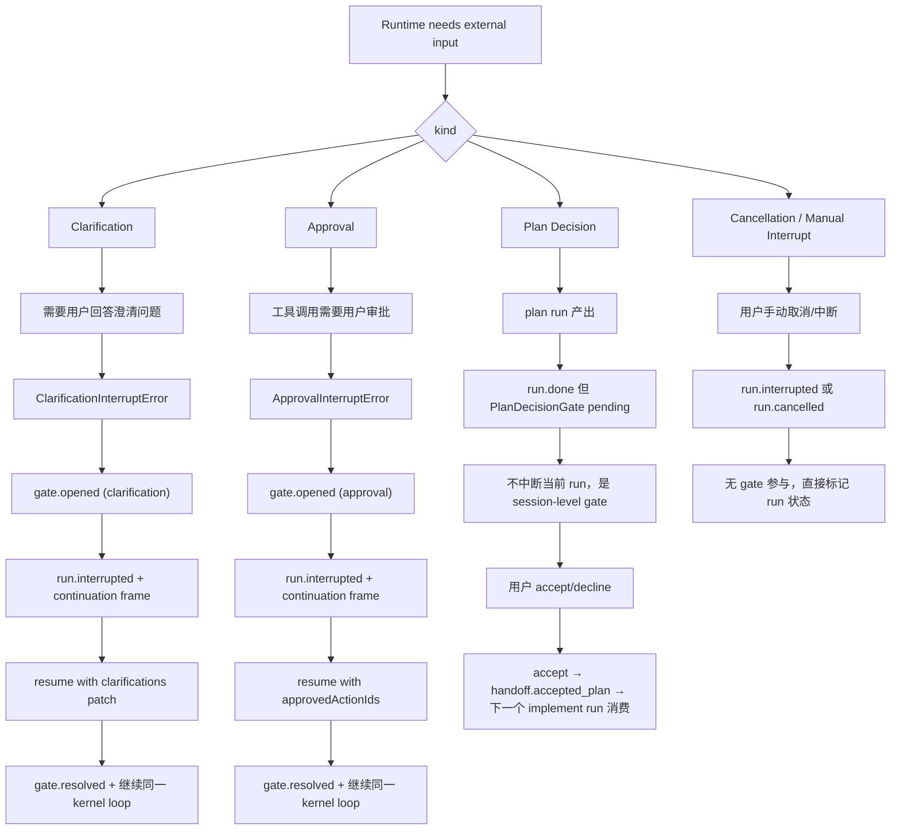
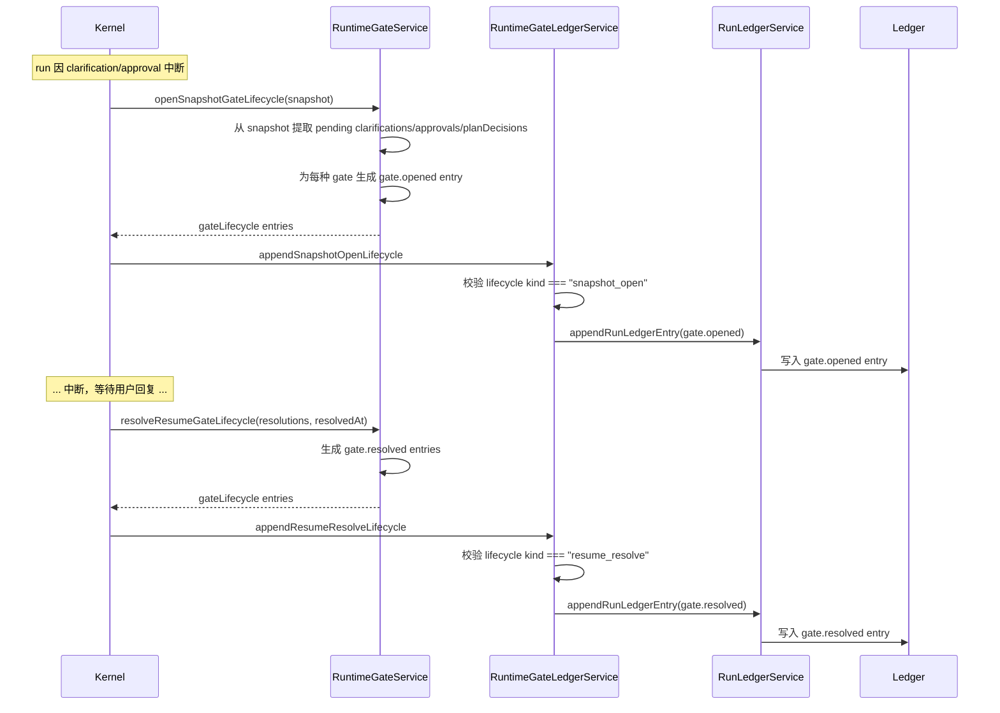
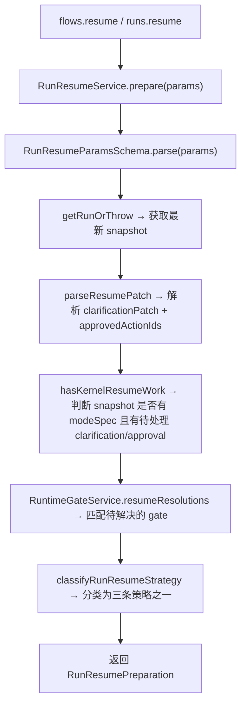
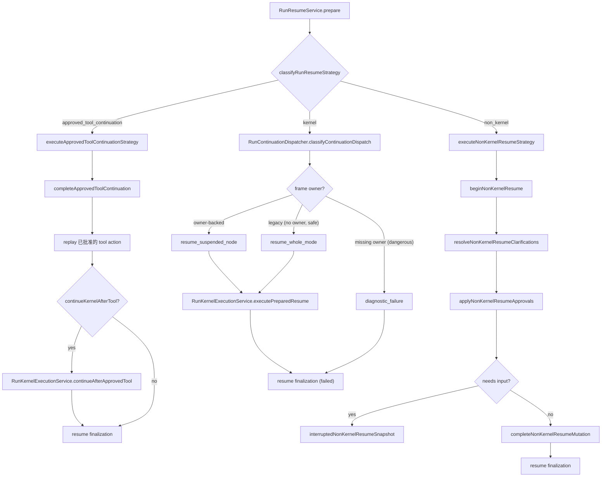
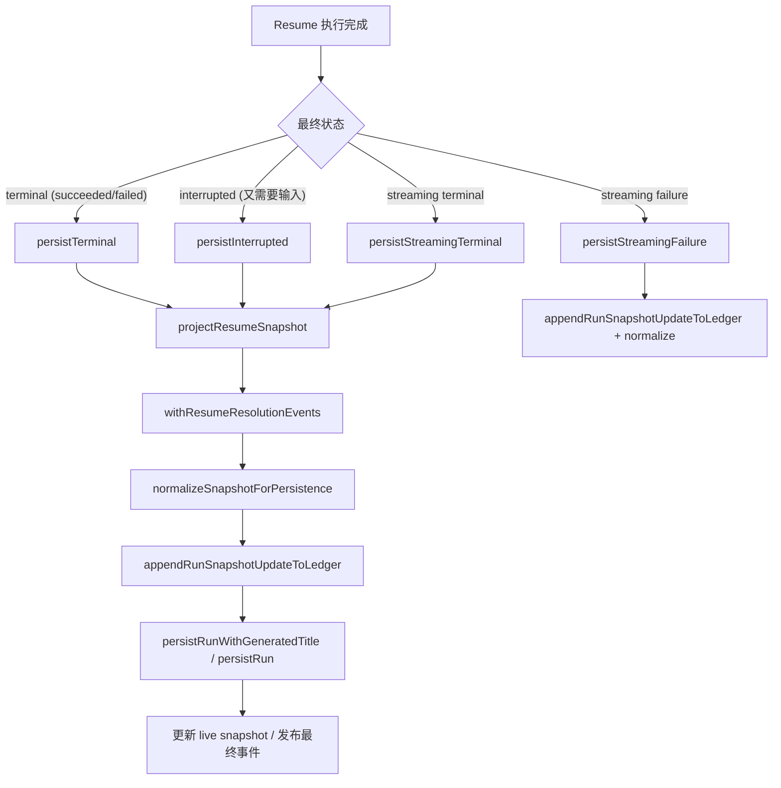
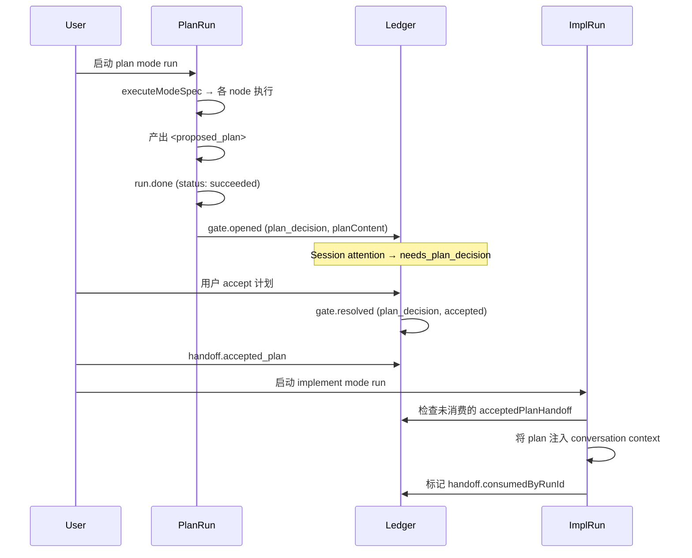
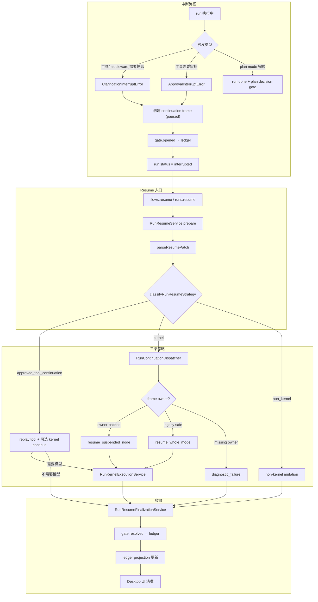

# Ora Gate、Continuation、Resume 机制

本文描述 Ora 的中断-恢复机制：gate 如何打开与解决、continuation frame 如何记录暂停点、resume 如何分类与派发。读完本文，应能理解三种 gate 的本质区别、resume 的三条策略路径，以及为什么 approved tool continuation 不由 dispatcher 直接执行。

## 阅读地图

| 关注点 | 对应章节 |
| --- | --- |
| 四种中断类型及其区别 | [1. 中断类型：Clarification / Approval / Plan Decision / Cancellation](#1-中断类型clarification--approval--plan-decision--cancellation) |
| Gate 如何进入 ledger 并耐久化 | [2. Gate 生命周期：从快照到 ledger](#2-gate-生命周期从快照到-ledger) |
| Continuation frame 的结构与语义 | [3. Continuation Frame：暂停点的结构化记录](#3-continuation-frame暂停点的结构化记录) |
| Resume patch 的解析与 strategy 分类 | [4. Resume 入口：RunResumeService](#4-resume-入口runresumeservice) |
| 三条 resume 策略的执行路径 | [5. Resume 三条策略](#5-resume-三条策略) |
| Continuation dispatcher 的派发逻辑 | [6. Continuation 派发：RunContinuationDispatcher](#6-continuation-派发runcontinuationdispatcher) |
| Kernel 如何执行 resume | [7. Kernel 执行边界：RunKernelExecutionService](#7-kernel-执行边界runkernelexecutionservice) |
| Resume 如何收敛到最终状态 | [8. Resume 收敛：RunResumeFinalizationService](#8-resume-收敛runresumefinalizationservice) |
| Plan decision 为什么不是普通 interrupt | [9. Plan Decision 的特殊性](#9-plan-decision-的特殊性) |
| Gate 决议如何影响 session attention | [10. Gate 与 Session Attention](#10-gate-与-session-attention) |
| 容易误解的点 | [11. 常见误解与边界](#11-常见误解与边界) |
| 当前实现边界与可演进方向 | [12. 实现边界与演进方向](#12-实现边界与演进方向) |

核心源码文件：

| 文件 | 职责 |
| --- | --- |
| `apps/runtime/src/run-resume-service.ts` | Resume 入口：解析 patch、分类 strategy、编排三条 resume 路径 |
| `apps/runtime/src/run-continuation-dispatcher.ts` | Continuation 派发：基于 frame ownership 判断 suspended-node / whole-mode / diagnostic |
| `apps/runtime/src/run-kernel-execution-service.ts` | Kernel 执行边界：start/resume 进入 kernel、suspended-node resume snapshot 准备 |
| `apps/runtime/src/run-resume-finalization-service.ts` | Resume 最终化：terminal/interrupted/streaming failure 的 snapshot、ledger、persistence 收敛 |
| `apps/runtime/src/runtime-gate-service.ts` | Gate 生命周期管理：open/resolve entry 的生成逻辑 |
| `apps/runtime/src/runtime-gate-ledger-service.ts` | Gate entry 写入 ledger 的适配层 |
| `apps/runtime/src/run-orchestration.ts` | Resume patch 解析、approved actions 匹配、hasKernelResumeWork 判断 |
| `apps/runtime/src/harness/runtime-interrupts.ts` | Interrupt 错误类型与 resume approval 匹配器 |
| `apps/runtime/src/approved-file-write-resume.ts` | Approved tool continuation 的完整执行流程 |
| `apps/runtime/src/run-kernel-lifecycle.ts` | Kernel 生命周期：traced kernel run / resume 入口 |
| `packages/shared/src/runtime.ts` | `RunContinuationFrame`、`RunContinuation`、`PlanDecisionGate` 等 shared contract |
| `packages/shared/src/runtime-ledger.ts` | Ledger 类型、投影衍生、attention 推导 |

## 1. 中断类型：Clarification / Approval / Plan Decision / Cancellation

Ora 有四种需要外部输入的中断类型，它们有本质区别：



关键区别：

| 维度 | Clarification | Approval | Plan Decision | Cancellation |
| --- | --- | --- | --- | --- |
| **中断 run？** | 是，抛 `ClarificationInterruptError` | 是，抛 `ApprovalInterruptError` | 否，run 可以是 `succeeded` | 是，直接标记状态 |
| **需要 resume？** | 是，同一 kernel loop 恢复 | 是，同一 kernel loop 恢复 | 否，是下一个 implement run 消费 | 取决于取消后是否恢复 |
| **Gate 类型** | `gate.opened` (clarification) | `gate.opened` (approval) | `gate.opened` (plan_decision) | 无 gate |
| **触发时机** | 工具/middleware 调用 `ensureClarification` | 工具 action 进入审批 gate | plan mode 产出完整 `<proposed_plan>` | 用户或系统主动发起 |
| **Resume 方式** | `flows.resume` + clarifications patch | `flows.resume` + approvedActionIds | 不需要 resume；新 run 消费 handoff | 可选 `flows.resume` |
| **Kernel 参与？** | 是，kernel resume | 是，kernel resume 或 approved tool continuation | 否 | 取决于恢复策略 |

### 1.1 Clarification 的触发路径

工具或 middleware 在需要用户补充信息时，通过 `ensureClarification(s)` 抛出 `ClarificationInterruptError`。这个错误被 node loop 捕获后，node 进入 `interrupted` 状态，kernel 将 run 标记为 `interrupted` 并创建 continuation frame。

```typescript
// runtime-interrupts.ts
export class ClarificationInterruptError extends Error {
  public readonly clarifications: PendingClarification[];
  // ...
}
```

### 1.2 Approval 的触发路径

工具调用在经过 risk/approval policy 判定后，如果需要审批，action 状态变为 `approval_required`。当 node loop 检测到有 approval_required 的 action 且未被批准时，抛出 `ApprovalInterruptError`。

```typescript
// runtime-interrupts.ts
export class ApprovalInterruptError extends Error {
  constructor(public readonly actionId: string) {
    super("Waiting for your approval before continuing.");
  }
}
```

### 1.3 Plan Decision 为什么不是普通 run interrupt

Plan decision 与其他两类 gate 有三个本质差异：

1. **不中断 run**：plan run 在输出 `<proposed_plan>` 后自然结束（`status: "succeeded"`），同时存在一个 pending `PlanDecisionGate`。run 不需要 resume，下一个 implement run 直接消费 handoff。
2. **跨 run 交接**：clarification/approval 在同一个 run 内 resolve，plan decision 的决议传递给 **下一个 run**。
3. **session-level gate**：它是 session attention 层的阻塞状态 (`needs_plan_decision`)，不是 kernel loop 内的阻塞。

## 2. Gate 生命周期：从快照到 ledger

Gate 的完整生命周期由两个服务协作完成：`RuntimeGateService` 生成 gate entry，`RuntimeGateLedgerService` 将它们写入 ledger。



### 2.1 三类 Gate 的 entry 生成

**Clarification Gate**：gateId = `clarification.id`（如 `clar-1`），每个 pending clarification 生成独立的 `gate.opened` entry。

```json
{
  "type": "gate.opened",
  "id": "run-1:gate:clar-1",
  "payload": {
    "gateId": "clar-1",
    "kind": "clarification",
    "pendingClarificationIds": ["clar-1"],
    "clarification": { "id": "clar-1", "question": "...", "key": "target_path", ... }
  }
}
```

**Approval Gate**：gateId = `${runId}:approval`（如 `run-1:approval`），所有待审批的 action 共享一个 approval gate entry。

```json
{
  "type": "gate.opened",
  "id": "run-1:gate:approval",
  "payload": {
    "gateId": "run-1:approval",
    "kind": "approval",
    "pendingActionIds": ["action-1", "action-2"],
    "pendingToolCallIds": ["tc-1", "tc-2"]
  }
}
```

**Plan Decision Gate**：gateId = `decision.id`，只对 `status === "pending"` 的 decision 生成 entry。

```json
{
  "type": "gate.opened",
  "id": "run-1:gate:decision-1",
  "payload": {
    "gateId": "decision-1",
    "kind": "plan_decision",
    "planDecision": { "id": "decision-1", "status": "pending", "planContent": "## Plan\n..." }
  }
}
```

### 2.2 Gate 去重：existingEntryIds

`RuntimeGateService.openedEntries` 接受可选的 `existingEntryIds` 参数。如果某个 gate 的 entry id 已存在于 ledger 中（例如 replay 或多次 flush），则跳过生成。这保证了 gate entry 的幂等性。

### 2.3 Gate 在 ledger 投影中的生命周期

在 `deriveSessionProjection` 的 `applyEntryToProjection` 中：

- **`gate.opened`**：创建新的 `RuntimeGateProjection`（status = `open`）。但如果 gateId 已存在且 `status === "resolved"`，则忽略 — 防止 replay 时重新打开已解决的 gate。
- **`gate.resolved`**：更新 gate 的 status 为 `resolved`，设置 `resolvedAt`。同时更新关联的 `planDecision.status`。

这是 gate 幂等性的投影层保证：即使 ledger 中同时存在 `gate.opened` 和 `gate.resolved`，replay 时也只会得到一个 resolved gate，不会出现重复打开。

## 3. Continuation Frame：暂停点的结构化记录

当 run 因 clarification 或 approval 中断时，kernel 创建一个 `RunContinuationFrame`，记录足够的信息以便 resume 时精确恢复到暂停点。

### 3.1 Frame 结构

```typescript
// packages/shared/src/runtime.ts
RunContinuationFrameSchema = {
  id: string;                        // frame 唯一标识
  runId: string;
  status: "paused" | "awaiting_model" | "resolved";
  reason: "clarification_required" | "approval_required" | "manual_interrupt" | "tool_interrupted";

  // Owner metadata（恢复目标定位）
  agentId?: string;                  // 发起中断的 agent
  nodeId?: string;                   // 发起中断的 node
  planItemId?: string;               // 关联的 plan step

  // 暂停点快照
  modelIteration?: number;           // 模型调用次数
  conversationCursor: number;        // 对话游标位置

  // 待处理项
  pendingActionIds: string[];        // 等待审批的 action ids
  pendingToolCallIds: string[];      // 等待审批的 tool call ids
  pendingClarificationIds: string[]; // 等待回答的 clarification ids

  // Resume 追踪
  approvedActionIds: string[];       // 已被批准的 action ids
  resolvedClarificationIds: string[]; // 已解决的 clarification ids
  resumedFromFrameId?: string;       // 从哪个 frame 恢复

  // Node checkpoint（跨 node 的执行状态）
  nodeCheckpoint?: {
    modeId?: string;
    agentId?: string;
    nodeId?: string;
    planItemId?: string;
    eventSeq?: number;
    conversationCursor?: number;
    bag: Record<string, unknown>;    // 模式驱动的自定义状态
  };

  createdAt: number;
  updatedAt: number;
}
```

### 3.2 Frame 的 owner 概念

Frame 的 `agentId` 和 `nodeId` 合称 owner metadata。Owner 决定了 resume 时应该恢复到哪个 agent/node：

- **有 owner（owner-backed）**：frame 记录了明确的 `agentId`，resume 时可以精确恢复到暂停的 node。
- **无 owner（ownerless）**：frame 缺失 `agentId`。如果 reason 是 `approval_required` 或 `clarification_required`（legacy frame），退回 whole-mode resume。如果 reason 是 `manual_interrupt` 或 `tool_interrupted`（危险 frame），进入 diagnostic failure。

### 3.3 Frame 的状态变迁

```
paused → (resume 准备) → awaiting_model → (kernel 执行完成) → resolved
```

`continuationFrameAwaitingModel` 函数在 resume 进入 kernel 前将 frame 状态从 `paused` 切换为 `awaiting_model`，标记该 frame 已进入恢复流程。

## 4. Resume 入口：RunResumeService

`RunResumeService` 是 resume 的统一入口。它不执行 resume 本身，而是完成前置准备和 strategy 分类。

### 4.1 prepare 流程



### 4.2 parseResumePatch 的解析逻辑

```typescript
// run-orchestration.ts
function parseResumePatch(patch: unknown): ParsedResumePatch {
  // 1. 提取 clarificationPatch: patch.clarifications
  // 2. 提取 approvedActionIds: patch.approvedActionIds (去空字符串)
  return { patchRecord, clarificationPatch, approvedActionIds };
}
```

Resume patch 的两种信息：
- **clarificationPatch**：`{ clarifications: { "clar-1": "answer", ... } }` — 用户对澄清问题的回答
- **approvedActionIds**：`{ approvedActionIds: ["action-1", "action-2"] }` — 用户批准的工具 action ids

### 4.3 classifyRunResumeStrategy 的分类逻辑

```typescript
// run-resume-service.ts
function classifyRunResumeStrategy(params): RunResumeStrategy {
  // 1. approved tool continuation: snapshot 中有匹配的 pending approval actions
  const continuationActions = approvedToolContinuationActions(snapshot, approvedActionIds);
  if (continuationActions.length > 0) {
    return {
      kind: "approved_tool_continuation",
      continueKernelAfterTool: hasKernelWork, // 执行完工具后是否还需要模型
    };
  }
  // 2. kernel resume: snapshot 有 modeSpec 且 pending clarification/approval
  if (hasKernelWork) {
    return { kind: "kernel" };
  }
  // 3. non-kernel resume: 没有 kernel 工作，直接做 mutation
  return { kind: "non_kernel" };
}
```

优先级：`approved_tool_continuation` > `kernel` > `non_kernel`。

### 4.4 hasKernelResumeWork 的判断

```typescript
function hasKernelResumeWork(snapshot: StateSnapshot): boolean {
  return snapshot.modeSpec !== undefined
    && (
      currentPendingClarifications(snapshot).length > 0 ||
      currentPendingApprovalActionIds(snapshot).length > 0
    );
}
```

核心条件：snapshot 有 `modeSpec`（说明是 kernel-backed run），并且有 pending 的 clarification 或 approval。没有 modeSpec 的 run（如 non-kernel mutation run）不会进入 kernel resume 路径。

## 5. Resume 三条策略



### 5.1 Approved Tool Continuation

这是最特殊的一条路径。当用户批准了工具调用后，resume 不是直接让模型继续工作，而是先 **replay 已批准的工具 action/tool**。

**为什么不由 dispatcher 直接执行？**

因为 approved tool continuation 的核心工作是 **执行工具**（如 `file.write`），不是恢复模型推理。这条路径：
1. Replay 已批准的 action/tool（如真的写入文件）
2. 检查 `continueKernelAfterTool`：如果 snapshot 中还有 pending 的 clarification 或其他 approval，需要继续让模型工作
3. 如果需要模型继续，通过 `RunKernelExecutionService.continueAfterApprovedTool` 回到 owner node

这意味着 approved tool continuation 是 **action execution** 路径，dispatcher 是 **model continuation** 路径，两者职责不同。

### 5.2 Kernel Resume

有 `modeSpec` 且有 kernel 工作需要恢复。由 `RunContinuationDispatcher` 决定具体恢复方式（详见第 6 章）。

### 5.3 Non-Kernel Resume

没有 modeSpec 或没有 kernel 工作（例如某些 mutation run）。直接在 snapshot 上做 mutation：
- 解决 clarifications
- 应用 approvals
- 如果所有工作完成，标记 run 完成
- 如果还需要输入，返回 interrupted 状态

## 6. Continuation 派发：RunContinuationDispatcher

`RunContinuationDispatcher.classifyContinuationDispatch` 是 kernel resume 路径的派发决策函数。它只处理一个核心问题：**根据 continuation frame 的 ownership 决定如何恢复**。

### 6.1 派发决策逻辑

```typescript
// run-continuation-dispatcher.ts
const OWNER_BACKED_REASONS = new Set([
  "approval_required",
  "clarification_required",
  "manual_interrupt",
  "tool_interrupted",
]);

function classifyContinuationDispatch(snapshot): ContinuationDispatchDecision {
  const frame = snapshot.continuation.frames.find(f => f.id === activeFrameId);

  // 1. 没有 active frame → 退回 whole-mode
  if (!frame) {
    return { kind: "resume_whole_mode", reason: "no_active_frame" };
  }

  // 2. frame 状态不是 paused/awaiting_model → 退回 whole-mode
  if (frame.status !== "paused" && frame.status !== "awaiting_model") {
    return { kind: "resume_whole_mode", reason: "frame_not_paused" };
  }

  // 3. frame reason 不在 owner-backed 集合中 → 退回 whole-mode
  if (!OWNER_BACKED_REASONS.has(frame.reason)) {
    return { kind: "resume_whole_mode", reason: "unsupported_frame_reason" };
  }

  // 4. 提取 owner metadata（agentId + nodeId）
  const agentId = frame.agentId ?? frame.nodeCheckpoint?.agentId;
  const nodeId = frame.nodeId ?? frame.nodeCheckpoint?.nodeId
    ?? frame.planItemId ?? frame.nodeCheckpoint?.planItemId;

  // 5. 没有 agentId →
  //    - legacy approval/clarification → whole-mode fallback
  //    - manual_interrupt/tool_interrupted → diagnostic failure
  if (!agentId) {
    if (frame.reason === "approval_required" || frame.reason === "clarification_required") {
      return { kind: "resume_whole_mode", reason: "unsupported_frame_reason" };
    }
    return { kind: "diagnostic_failure", reason: "missing_owner_metadata" };
  }

  // 6. 有 owner → suspended-node resume
  return { kind: "resume_suspended_node", agentId, nodeId: nodeId ?? agentId };
}
```

### 6.2 三种派发结果

| 结果 | 条件 | 行为 |
| --- | --- | --- |
| `resume_suspended_node` | frame 有 owner metadata（agentId） | 恢复到暂停的 agent/node，带上 clarification patch 和 approved actions |
| `resume_whole_mode` | 无 active frame / frame 状态不对 / reason 不识别 / legacy 无 owner | 退回到 mode 入口重新执行（whole-mode restart） |
| `diagnostic_failure` | 有 frame 但缺失必需 owner（manual_interrupt / tool_interrupted） | 以可见的 diagnostic 错误结束，不尝试不安全恢复 |

### 6.3 Owner metadata 的提取策略

提取 agentId/nodeId 有 fallback 链：

```
frame.agentId ?? frame.nodeCheckpoint?.agentId
frame.nodeId ?? frame.nodeCheckpoint?.nodeId ?? frame.planItemId ?? frame.nodeCheckpoint?.planItemId
```

这允许 frame 在缺少直接字段时从 `nodeCheckpoint` 中恢复 owner 信息。`nodeCheckpoint` 是 mode driver 在 node 执行时记录的 bag 状态，包含 agent/node/planItem 的标识。

### 6.4 为什么要区分 diagnostic failure 和 whole-mode fallback？

关键判断是 **恢复的安全性**：

- Legacy approval/clarification frame（无 agentId）→ 退回 whole-mode 是安全的，因为 mode 重新执行不会造成损害（工具还没执行）。
- Manual/tool interrupted frame（无 agentId）→ 退回 whole-mode **不安全**，因为工具可能已经部分执行。此时以 diagnostic failure 结束，要求用户介入。

## 7. Kernel 执行边界：RunKernelExecutionService

`RunKernelExecutionService` 是 run start 和 resume 进入 kernel 的服务边界。它负责准备 kernel 执行所需的所有上下文（mode、conversation、skills 等），并通过 `executeTracedKernelRun` / `executeTracedKernelResume` 进入真正的 kernel loop。

### 7.1 executePreparedRun

新 run 的入口：
1. 组装 `kernelDeps`（skill/mode/selfIteration/automation registries、agent overlays）
2. 调用 `executeTracedKernelRun` 进入 kernel loop

### 7.2 executePreparedResume

Resume 的 kernel 入口：
1. 校验 snapshot 有 `modeSpec` 和 `sessionId`
2. 调用 `resumedInputWithClarifications` 将 clarification 答案合并进 input
3. 通过 `suspendedFrameResumeSnapshot` 准备 resume snapshot（切换 frame 状态为 `awaiting_model`）
4. 构建 resume conversation messages
5. 调用 `executeTracedKernelResume` 进入 kernel loop

### 7.3 continueAfterApprovedTool

Approved tool continuation 后需要模型继续工作时的路径：
1. 以 continuation snapshot 为基础，构建包含原始 conversation + continuation 中新消息的 conversation
2. 调用 `executePreparedResume` 恢复 owner node
3. 合并 resume 产生的事件到原始 snapshot

### 7.4 suspendedFrameResumeSnapshot

```typescript
function suspendedFrameResumeSnapshot(snapshot: StateSnapshot): StateSnapshot | undefined {
  const decision = classifyContinuationDispatch(snapshot);
  if (decision.kind === "diagnostic_failure") {
    throw new OraRuntimeError(decision.message); // 直接失败
  }
  if (decision.kind !== "resume_suspended_node" || decision.frame.status !== "paused") {
    return undefined; // whole-mode fallback，不需要特殊 snapshot
  }
  // suspended-node resume：将 frame 状态切换为 awaiting_model
  return continuationFrameAwaitingModel(snapshot, decision.frame.id, snapshot.updatedAt);
}
```

## 8. Resume 收敛：RunResumeFinalizationService

无论走哪条 resume 路径，最终都需要通过 `RunResumeFinalizationService` 将结果收敛到持久状态。



`projectResumeSnapshot` 的三步 pipeline：
1. **withResumeResolutionEvents**：将 gate 决议反向投影为事件（如 `clarification.resolved`、`approval.resolved`），让 UI 能消费 resume 结果
2. **normalizeSnapshotForPersistence**：标准化 snapshot 以写入持久存储
3. **appendRunSnapshotUpdateToLedger**：将 snapshot 作为 ledger entry 追加

## 9. Plan Decision 的特殊性

Plan decision 是最特殊的 gate 类型，它与 clarification/approval 的 resume 机制完全不同。

### 9.1 Plan run 的正常流程



### 9.2 为什么不用 resume

Plan run 在产出 `<proposed_plan>` 后 **已完成**（`status: "succeeded"`）。它不需要 resume 因为：

1. 没有 continuation frame 需要恢复
2. plan run 的全部工作就是「产出计划」，现在已经完成了
3. 计划执行是 **下一个 run** 的工作，不是当前 run 的延续

这与 clarification/approval 的「中断-继续同一 run」模式完全不同。

### 9.3 Plan handoff 的跨 run 交接

Plan handoff 是 plan run 和 implement run 之间的契约：

1. Snapshot 归一化时生成 pending `PlanDecisionGate`
2. 用户 accept → `gate.resolved` + `handoff.accepted_plan` 写入 ledger
3. 下一个 `taskIntent: "implement"` 的 run 启动时，检查 `acceptedPlanHandoffs` 中未被消费的记录
4. 将 plan content 注入 implement run 的 conversation context
5. 标记 `consumedByRunId` 防止重复消费
6. 如果没有未消费的 handoff，implement run 使用默认的 plan-stub

## 10. Gate 与 Session Attention

Session attention 是 UI/会话层看到的阻塞状态。它从 ledger-backed projection 推导，不依赖 UI 本地状态。

### 10.1 Attention 推导优先级

在 `deriveLedgerRunAttention`（`packages/shared/src/runtime-ledger.ts`）中：

```typescript
function deriveLedgerRunAttention(run):
  // 1. 有 open 的 clarification gate → needs_clarification (blocking)
  // 2. 有 open 的 approval gate → needs_approval (blocking)
  // 3. 有 open 的 plan_decision gate → needs_plan_decision (blocking)
  // 4. status = queued/running → running
  // 5. status = interrupted
  //    - 有 resolved gate 但没有后续 manual interrupt → failed (不完整 resume)
  //    - 有 manual interrupt → paused
  // 6. status = failed → failed
  // 7. status = cancelled → cancelled
  // 8. otherwise → idle
```

### 10.2 优先级是严格序

这个优先级列表是严格有序的。当 snapshot 中同时存在多个状态线索时（如同时有 pending clarification 和 running 状态），attention 总是返回最高优先级的阻塞状态。这保证了 attention 推导的一致性，不依赖各字段的检查顺序。

### 10.3 Gate 决议如何改变 attention

- Clarification gate resolved → attention 从 `needs_clarification` 变为 `running`（如果 run 恢复）或 `idle`
- Approval gate resolved → attention 从 `needs_approval` 变为 `running`（如果工具执行后继续）或 `idle`
- Plan decision gate resolved（accepted）→ attention 从 `needs_plan_decision` 变为 `idle`，等待下一个 run
- Plan decision gate resolved（declined）→ attention 变为 `idle`，没有 handoff

### 10.4 Desktop UI 的消费方式

Desktop 不直接读取 gate projection。它消费 `deriveSessionProjection` 产生的：
- **SessionAttention**：决定 sidebar 中的状态图标
- **RunInteraction**：决定 chat view 中的交互 UI（clarification 表单、approval 按钮、plan decision 卡片）
- **FlowGate**：决定 Flow 视图中的 gate 状态

这些全部从 ledger projection 推导，desktop 不做本地状态推断。

## 11. 常见误解与边界

### 11.1 "Resume 就是重新跑一遍 mode"

**不是。** Owner-backed resume 恢复到暂停的 **具体 node**，不是从 mode 入口重新执行。只有 legacy 无 owner frame 或 frame 缺失时才退回 whole-mode。这个设计避免了 mode 中已完成的 node 被重复执行。

### 11.2 "Approved tool continuation 由 dispatcher 处理"

**不是。** Dispatcher 只处理 model continuation（决定恢复到哪个 agent/node）。Approved tool continuation 是 **action execution** 路径，由 `executeApprovedToolContinuationStrategy` 处理。这两条路径是平行的，不是从属关系。

### 11.3 "Plan decision 是 run interrupt"

**不是。** Plan decision 不中断 run。Plan run 在产出 `<proposed_plan>` 后自然结束（succeeded），plan decision gate 是 session-level 的阻塞状态。下一个 implement run 是新 run，不是 resume。

### 11.4 "Gate 在内存中管理，只是 UI 概念"

**不是。** Gate 是 durable fact。`gate.opened` 和 `gate.resolved` 都是 ledger entry，掉电不丢。Desktop UI 消费的是 ledger-backed gate projection，不是内存中的临时状态。

### 11.5 "Resume 应该信 continuation frame 中的所有细节"

**信 frame 的 owner metadata 做派发决策，信 gate ledger 做最终状态判断。** Continuation frame 告诉 dispatcher 恢复到哪个 agent/node，但 gate 的决议状态（resolved/accepted/declined）以 ledger 上的 `gate.resolved` entry 为准，不以 frame 中的 `approvedActionIds` 或 `resolvedClarificationIds` 为准。

### 11.6 "Non-kernel resume 是特例，不常见"

**常见。** 当 run 没有 modeSpec 时（如某些 mutation 或旧格式 run），resume 就走 non-kernel 路径。它不做模型推理，直接在 snapshot 上做 mutation，是一种 fallback 但也是正常路径。

### 11.7 "Resume 后 gate 自动 resolve"

**不是。** Gate 的 resolve 需要 explicit 的决议动作。Clarification 需要用户提供答案，approval 需要用户明确批准 action ids，plan decision 需要用户选择 accept 或 decline。Resume 只是将这些决议应用到 run 状态。

## 12. 实现边界与演进方向

### 12.1 当前实现边界

| 方面 | 当前状态 | 保守边界 |
| --- | --- | --- |
| Continuation frame | 单 frame 模型（`activeFrameId`） | 不支持嵌套 frame。如果 resume 后又 interrupt，之前的 frame 会 resolve 并创建新 frame |
| Gate 去重 | `existingEntryIds` 按 entry id 去重 | 依赖 entry id 稳定不变，不支持同一个 gate 在不同时间点重新打开 |
| Owner 提取 | fallback 链从 frame 直接字段到 nodeCheckpoint | nodeCheckpoint 的内容由 mode driver 决定，缺少标准化 schema |
| Approved tool continuation | 通过 `ApprovedToolContinuationHandler` registry 查找可 replay 工具 | file.write/file.patch 有 artifact handler；shell/skills/mcp/package 有通用 replay handler；新工具类型仍需注册 handler 才能走 approved continuation |
| Whole-mode fallback | 安全的降级策略 | 会重新执行已完成的 node，依赖 node 实现的幂等性 |
| Diagnostic failure | 可见的错误状态 | 用户无法自我修复，需要手动介入 |
| Plan handoff | 单次消费，`consumedByRunId` 标记 | 不支持 revise plan（重新生成计划后再次交接） |
| Attention 推导 | 严格优先级序 | 不支持同时存在多种 blocking attention（如同时需要 clarification 和 approval） |

### 12.2 可演进方向

1. **嵌套/链式 Gate**：当 resume 后再次触发 gate 时，当前模型只创建新 frame。未来可以支持 gate 的链式追踪，保留 gate 历史。
2. **Owner metadata schema 标准化**：`nodeCheckpoint.bag` 当前是 `Record<string, unknown>`。标准化关键字段（agentId、nodeId、planItemId）的写入规范，让 dispatcher 的提取更可靠。
3. **Approved tool continuation handler 扩展**：当前已抽象出 `ApprovedToolContinuationHandler` registry。后续重点是为更多工具族补专用 artifact/result preview/continue 策略，而不是回退到文件专用逻辑。
4. **Gate 重开**：当前 gate resolved 后不可重开。如果用户修改了答案或撤销了审批，需要支持 gate 的 re-open 语义。
5. **Plan handoff 修订**：支持 revise plan → 重新 handoff，保留 handoff 的版本链。
6. **Multi-gate attention**：当前 attention 严格互斥。支持同时展示多种 blocking 状态（如同时需要回答 clarification 和审批 tool）。
7. **Frame 持久化审计**：frame 的创建、状态变更、resolve 可以进入专门的 audit log，用于调试复杂的 resume 流程。

---

## 附录 A：主流程图



## 附录 B：核心类型速查

| 类型 | 定义位置 | 说明 |
| --- | --- | --- |
| `RunResumeStrategy` | `run-resume-service.ts` | 三种 resume 策略的联合类型 |
| `RunResumePreparation` | `run-resume-service.ts` | resume 准备阶段的完整输出 |
| `ContinuationDispatchDecision` | `run-continuation-dispatcher.ts` | dispatcher 的三种派发结果 |
| `RunContinuationFrame` | `packages/shared/src/runtime.ts` | 暂停点的结构化记录 |
| `RunContinuation` | `packages/shared/src/runtime.ts` | `{ activeFrameId, frames }` |
| `RuntimeGateResolution` | `runtime-gate-service.ts` | gate 决议的联合类型 |
| `RuntimeGateLifecycleResult` | `runtime-gate-service.ts` | gate 生命周期操作的输出 |
| `ParsedResumePatch` | `run-orchestration.ts` | resume patch 的解析结果 |
| `ApprovedResumeAction` | `run-orchestration.ts` | 已批准的 resume action |
| `PlanDecisionGate` | `packages/shared/src/runtime.ts` | plan decision gate 的结构 |
| `ClarificationInterruptError` | `runtime-interrupts.ts` | clarification 中断错误 |
| `ApprovalInterruptError` | `runtime-interrupts.ts` | approval 中断错误 |

---

> **核心判断**：Gate 和 Resume 是 Ora 中断-恢复机制的两面。Gate 是「为什么停」的耐久事实，Continuation Frame 是「停在哪里」的结构记录，Resume 是「怎么继续」的策略派发。三者通过 ledger 投影串联，最终由 desktop UI 以 attention 和 interaction 的形式消费。
