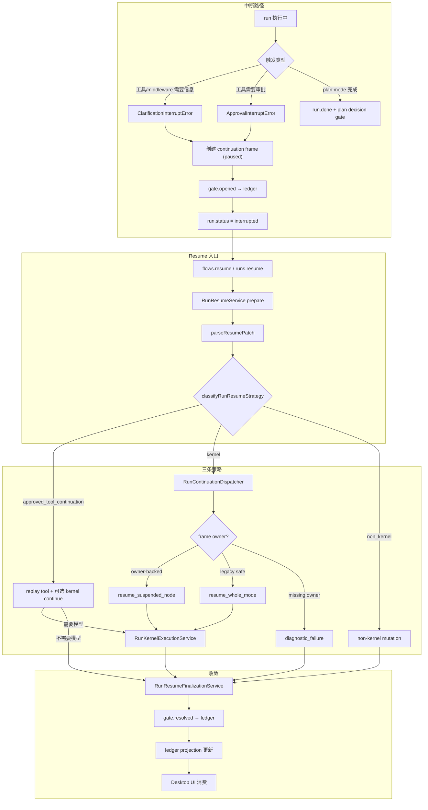

# Ora 的 Gate、Continuation 与 Resume

Ora 运行时面临一个核心矛盾：Agent 做事需要外部决策，但模型不能无限等。Agent 在执行过程中会遇到需要用户审批的工具调用、需要澄清的模糊指令、需要确认的执行计划 — 这些场景都要求 Agent 停下来，把控制权交还给用户，等用户给出回应后再从断点继续。

Ora 用三个概念解决这个矛盾：

- **Gate**：为什么停。一个持久化到 ledger 的事实，记录运行因为什么原因被阻塞。
- **Continuation Frame**：停在哪里。一个结构化的暂停点快照，记录恢复到断点所需的全部上下文。
- **Resume**：怎么继续。一套策略派发机制，根据 frame 的 ownership 和 pending 状态决定走哪条恢复路径。

这三个概念通过 ledger 投影串联，最终由 desktop UI 以 attention 和 interaction 的形式消费。下面从为什么需要这套机制开始，逐步深入到它如何运作、以及具体的实现细节。

## 为什么需要 Gate 和 Resume

### 四种中断场景

Ora 有四种需要停下来等外部输入的场景，它们有本质区别：

| 场景 | 触发条件 | Run 的状态 | 恢复方式 |
| --- | --- | --- | --- |
| **澄清问题** | 工具或 middleware 在执行中需要用户补充信息 | `interrupted`，抛出 `ClarificationInterruptError` | 用户提交答案后，同一 kernel loop 恢复 |
| **审批工具** | 工具调用经过 risk/approval 判定后需要用户批准 | `interrupted`，抛出 `ApprovalInterruptError` | 用户批准 action ids 后，先 replay 工具再恢复模型 |
| **计划决策** | Plan mode 产出完整的 `<proposed_plan>` | `succeeded`，但留下 pending `PlanDecisionGate` | 用户 accept 后可回到原 run 继续执行，也可以交给新 run 消费 |
| **手动取消** | 用户主动中断运行 | `cancelled` 或 `interrupted` | 无 gate 参与，直接标记 run 状态 |

前两种是"Run 中途被打断"的典型 interrupt：kernel loop 正在执行时抛出错误，run 进入 `interrupted`，创建 continuation frame 和 gate。取消则是直接的状态标记。

Plan decision 最特殊 — 它不是中断，run 可以先成功结束，但 gate 仍然未解决。这意味着一个已经 `succeeded` 的 run 可以因为用户的 accept 操作再次进入 kernel 执行。

### 关于中断错误的跨 Realm 健壮性

`ClarificationInterruptError` 和 `ApprovalInterruptError` 同时使用 `Symbol.for()` 全局标记和 `instanceof` 进行类型识别。原因是 `instanceof` 在跨模块/跨 realm 场景下可能失效（不同 package 的依赖实例各自有一份类定义）。

全仓库统一使用三个 helper 函数判断，不再直接依赖 `instanceof`：

```typescript
export function isApprovalInterruptError(error: unknown): error is ApprovalInterruptError { ... }
export function isClarificationInterruptError(error: unknown): error is ClarificationInterruptError { ... }
export function isAnyInterruptError(error: unknown): error is ApprovalInterruptError | ClarificationInterruptError { ... }
```

每个 helper 内部做双重检查：先试 `instanceof`，失败则回落 `Symbol.for()` 标记。这样保证了同一 realm 内的性能和跨 realm 场景的兼容性。

### 澄清问题的触发路径

工具或 middleware 在需要用户补充信息时，通过 `ensureClarification(s)` 抛出 `ClarificationInterruptError`。这个错误被 node loop 捕获后，node 进入 `interrupted` 状态，kernel 将 run 标记为 `interrupted` 并创建 continuation frame。

### 审批的触发路径

工具调用在经过 risk/approval policy 判定后，如果需要审批，action 状态变为 `approval_required`。当 node loop 检测到有 `approval_required` 的 action 且未被批准时，抛出 `ApprovalInterruptError`。

### 常见误解

在深入机制之前，先澄清几个容易误解的点：

**"Resume 就是重新跑一遍 mode"** — 不是。Owner-backed resume 恢复到暂停的具体 node，不是从 mode 入口重新执行。只有 legacy 无 owner frame 或 frame 缺失时才退回 whole-mode。

**"Approved tool continuation 由 dispatcher 处理"** — 不是。Dispatcher 只处理 model continuation（决定恢复到哪个 agent/node）。Approved tool continuation 是 action execution 路径，由 `executeApprovedToolContinuationStrategy` 处理。两条路径平行，不是从属关系。

**"Plan decision 一定不涉及 resume"** — 曾经是，但现在 accepted plan 可以通过 `planDecisionResolutions` 回到原 run 做 same-run resume。跨 run handoff 契约仍然保留，用于兼容旧数据和显式的新 run 入口。

**"Gate 只是 UI 概念，在内存中管理"** — 不是。Gate 是 durable fact。`gate.opened` 和 `gate.resolved` 都是 ledger entry，掉电不丢。Desktop UI 消费的是 ledger-backed gate projection。

**"Resume 后 gate 自动 resolve"** — 不是。Gate 的 resolve 需要显式的决议动作：澄清需要用户提供答案，审批需要用户明确批准 action ids，计划决策需要用户选择 accept 或 decline。Resume 只是将这些决议应用到 run 状态。

**"Non-kernel resume 是不常见的特例"** — 常见。当 run 没有 modeSpec 时（比如某些 mutation 或旧格式 run），resume 就走 non-kernel 路径。它不做模型推理，直接在 snapshot 上做 mutation。

## 机制如何运作

### 整体流程



### Gate 生命周期

Gate 从打开到解决，完整过程由两个服务协作完成：`RuntimeGateService` 生成 gate entry，`RuntimeGateLedgerService` 将 entry 写入 ledger。

当 run 因 clarification 或 approval 中断时，系统调用 `openSnapshotGateLifecycle`：从 snapshot 中提取 pending 的 clarifications/approvals/planDecisions，为每种 gate 生成 `gate.opened` entry，然后通过 `appendSnapshotOpenLifecycle` 写入 ledger。

当用户提交 resume 请求后，系统调用 `resolveResumeGateLifecycle`：根据决议内容生成 `gate.resolved` entry，通过 `appendResumeResolveLifecycle` 写入 ledger。

#### 三类 Gate 的 entry 形态

**Clarification Gate**：gateId 使用 `clarification.id`（如 `clar-1`），每个 pending clarification 生成独立的 `gate.opened` entry，payload 中包含澄清问题的完整信息。

**Approval Gate**：gateId 使用 `${runId}:approval`（如 `run-1:approval`），所有待审批的 action 共享一个 approval gate entry，payload 中列出 `pendingActionIds` 和 `pendingToolCallIds`。

**Plan Decision Gate**：gateId 使用 `decision.id`（如 `decision-1`），只对 `status === "pending"` 的 decision 生成 entry，payload 中包含完整的计划内容。

#### 去重、重开与幂等

Gate entry 的生成不是无状态的。`RuntimeGateService.openedEntries` 接受 `existingEntryIds` 参数（由调用点从 ledger 自动提取），如果某个 gate 的 entry id 已存在（比如 replay 或多次 flush），则跳过生成。这保证了 gate entry 的幂等性。

Ora 支持同一 gate 的重新打开：当第二次审批触发时，系统生成新的 `gate.opened` entry，entry ID 包含时间戳以区别于首次打开。Ledger 投影层使用 `Map.set` 语义 — 如果 `gateId` 已存在，新 entry 覆盖旧 entry，gate 状态从 `resolved` 回到 `open`。

在 ledger 投影中，幂等性由投影层再次保证：
- `gate.opened`：创建新的 gate projection（status = `open`）。但如果 gateId 已存在且 `status === "resolved"`，则忽略 — 防止 replay 时重新打开已解决的 gate。
- `gate.resolved`：更新 gate 的 status 为 `resolved`，设置 `resolvedAt`，同时更新关联的 `planDecision.status`。

### Continuation Frame：暂停点的结构化记录

当 run 因 clarification 或 approval 中断时，kernel 创建一个 `RunContinuationFrame`，记录恢复到暂停点所需的全部信息。

Frame 的核心字段分几组：
- **Owner metadata**（`agentId`、`nodeId`、`planItemId`）：决定 resume 时应该恢复到哪个 agent/node
- **暂停点快照**（`modelIteration`、`conversationCursor`）：记录模型执行到了哪里
- **待处理项**（`pendingActionIds`、`pendingToolCallIds`、`pendingClarificationIds`）：记录哪些事项在等待外部输入
- **Resume 追踪**（`approvedActionIds`、`resolvedClarificationIds`、`resumedFromFrameId`）：记录恢复进展
- **Node checkpoint**（`nodeCheckpoint`）：mode driver 在 node 执行时记录的自定义状态，包含 agent/node/planItem 标识和模式驱动的 `bag`

#### Frame 的 owner 概念

Owner 决定了 resume 的恢复粒度：
- **有 owner（owner-backed）**：frame 记录了明确的 `agentId`，resume 时可以精确恢复到暂停的 node
- **无 owner（ownerless）**：frame 缺失 `agentId`。如果 reason 是 `approval_required` 或 `clarification_required`（legacy frame），退回 whole-mode resume。如果 reason 是 `manual_interrupt` 或 `tool_interrupted`（危险 frame），进入 diagnostic failure

#### Frame 的状态变迁与链语义

Frame 的状态变迁路径：`paused` → `awaiting_model`（resume 进入 kernel 前）→ `resolved`（kernel 执行完成）。

当 run 经历多次中断-恢复时，会形成 frame 链。`resumedFromFrameId` 指向直接父 frame（不是根 frame），完整祖先链需要通过回溯逐级重建。当前实现为单 frame 模型（`activeFrameId`），每次 resume 后前一个 frame resolve，新中断创建新 frame。

### Resume 的派发逻辑

`RunResumeService` 是 resume 的统一入口。它不做执行，只做前置准备和 strategy 分类。

#### 准备阶段

`prepare` 流程依次完成：解析 patch（提取 `clarificationPatch` 和 `approvedActionIds`）、获取最新 snapshot、判断 `hasKernelResumeWork`（snapshot 有 modeSpec 且有待处理的 clarification 或 approval）、匹配待解决的 gate、分类 strategy。

#### 三条策略的决策

`classifyRunResumeStrategy` 按优先级判定：

1. **approved_tool_continuation**：snapshot 中有匹配的 pending approval actions。这条路径先 replay 已批准的工具（如真的写入文件），再根据是否还有 kernel 工作需要决定是否回到模型。
2. **kernel**：snapshot 有 modeSpec 且有 pending clarification 或 approval。由 `RunContinuationDispatcher` 进一步决定恢复方式。
3. **non_kernel**：没有 modeSpec 或没有 kernel 工作。直接在 snapshot 上做 mutation。

优先级是 `approved_tool_continuation` > `kernel` > `non_kernel`。当用户在一次 resume 中同时提交了 `approvedActionIds` 和 `clarifications`（复合 patch），系统优先走 approved tool continuation 路径。工具 replay 后如果还有 pending clarification，模型恢复时会将澄清答案合并进 conversation。

#### Approved Tool Continuation 为什么独立于 Dispatcher

这条路径的核心工作是执行工具，不是恢复模型推理。Dispatcher 是 model continuation 路径（决定恢复到哪个 agent/node），approved tool continuation 是 action execution 路径（replay 工具 → 可选 kernel continue）。两者职责不同，平行运行。

工具执行失败时，系统保留上下文而非立即发出 `run.failed`：失败结果被追加到 `toolResults` 数组，模型可以在后续对话中看到失败信息并修正策略。仅当所有 approved tools 都失败时，才在 follow-up 中明确通知模型。这避免了"工具失败 → 重新审批 → 工具再次失败"的死循环。

#### Continuation Dispatcher 的派发决策

`RunContinuationDispatcher.classifyContinuationDispatch` 是 kernel resume 路径的派发决策函数。它根据 frame 的 ownership 决定三种结果：

| 结果 | 条件 | 行为 |
| --- | --- | --- |
| `resume_suspended_node` | frame 有 owner metadata（agentId） | 恢复到暂停的 agent/node，带上 clarification patch 和 approved actions |
| `resume_whole_mode` | 无 active frame / frame 状态不对 / reason 不识别 / legacy 无 owner | 退回到 mode 入口重新执行 |
| `diagnostic_failure` | 有 frame 但缺失必需 owner（manual_interrupt / tool_interrupted） | 以可见的 diagnostic 错误结束，不尝试不安全恢复 |

区分 diagnostic failure 和 whole-mode fallback 的关键是恢复的安全性：legacy approval/clarification frame（无 agentId）退回 whole-mode 是安全的，因为工具还没执行；manual/tool interrupted frame（无 agentId）退回 whole-mode 不安全，因为工具可能已经部分执行。

提取 owner metadata 有 fallback 链：

```
frame.agentId ?? frame.nodeCheckpoint?.agentId
frame.nodeId ?? frame.nodeCheckpoint?.nodeId ?? frame.planItemId ?? frame.nodeCheckpoint?.planItemId
```

这使得 frame 在缺少直接字段时可以从 `nodeCheckpoint` 中恢复 owner 信息。

### Kernel 执行边界

`RunKernelExecutionService` 是进入 kernel 的服务边界。它负责准备 kernel 执行所需的所有上下文（mode、conversation、skills 等），并通过 `executeTracedKernelRun` / `executeTracedKernelResume` 进入 kernel loop。

新 run 的入口（`executePreparedRun`）组装 kernelDeps 后调用 `executeTracedKernelRun`。

Resume 的入口（`executePreparedResume`）校验 snapshot 有 modeSpec 和 sessionId，将 clarification 答案合并进 conversation，通过 `suspendedFrameResumeSnapshot` 准备 resume snapshot，然后调用 `executeTracedKernelResume`。

`runtime-kernel.ts` 中的 `resumeSuspendedFrameIfNeeded()` 是 kernel 入口的第一道门。它恢复 suspended frame，如果恢复过程中抛出 `ApprovalInterruptError` 或 `ClarificationInterruptError`，不传播到上层导致 run 进入 `failed`，而是发出 `run.interrupted` 事件并返回 `status: "interrupted"` 的 snapshot。

### 最终收敛：ResumeFinalizationService

无论走哪条 resume 路径，最终都需要通过 `RunResumeFinalizationService` 将结果收敛到持久状态。所有写入 `run.done` / `run.failed` 的路径均经由 `assertRunCanBecomeTerminal()` 守卫：检查无 open gate、无 pending approval/clarification、无 unresolved action/tool call、无 active continuation frame。

`projectResumeSnapshot` 的四步 pipeline 按固定顺序执行：

1. **withResumeResolutionEvents**：将 gate 决议反向投影为事件（如 `clarification.resolved`、`approval.resolved`），让 UI 能消费 resume 结果
2. **materializeResumeContinuationClosure**：把 resume 已解决的 clarification/approval continuation 在 snapshot 上收口，关闭对应 frame、清理已完成的 pending ids，完成后清除 `continuation.activeFrameId`
3. **normalizeSnapshotForPersistence**：标准化 snapshot 以写入持久存储
4. **appendRunSnapshotUpdateToLedger**：将 snapshot 作为 ledger entry 追加

顺序很关键：先 materialize resolution 与 continuation closure，再做 terminal assertion。顺序反了会导致"事实上已解决、但尚未从 continuation projection 收口"的 clarification/approval 被误判成终态非法残留。

### Gate 如何驱动 UI

Gate 状态最终体现为 UI 层的阻塞状态（session attention），由 ledger-backed projection 推导，不依赖 UI 本地状态。

#### Attention 推导的严格优先级

在 `deriveLedgerRunAttention` 中，attention 按严格优先级序推导：

1. **Terminal state invariant**（最高优先级）：若 status 为 succeeded/failed/cancelled 但仍有 open gate → 降级为 failed
2. 有 open 的 clarification gate → `needs_clarification`
3. 有 open 的 approval gate → `needs_approval`
4. 有 open 的 plan_decision gate → `needs_plan_decision`
5. status = queued/running → `running`
6. status = interrupted → `paused` 或 `failed`
7. status = failed/cancelled → 对应状态
8. 其他 → `idle`

Terminal state invariant 在 gate 检查之前执行，防止 auto_review 权限模式切换等场景产生的半解决状态被渲染为成功。此 invariant 在 runtime 层（`assertRunCanBecomeTerminal`）和 projection 层（`deriveLedgerRunAttention`）两处同时实施。

#### GateProjection：统一的 UI 消费接口

`GateProjection` 是 shared 层提供的统一 gate 投影类型。`deriveSnapshotGateProjection(snapshot, options?)` 是 **所有 UI 表面消费 gate 状态的唯一真相源** — sidebar、Trails、composer、diagnostics 全部接入此函数。

Source 字段有五种来源，按优先级排列：`attention`（权威，从 `deriveLedgerRunAttention` 推导）→ `continuation`（active continuation frame）→ `pending_clarifications`/`pending_approvals`（raw fallback，标记 staleRisk）。当 attention 漂移（如 `idle` 但 plan decision 未决）时，raw fallback 路径保证 gate 状态仍然可见。

#### 未选中会话的状态保真

当会话在 sidebar 中处于未选中状态时，desktop 仅消费 `SessionSummary` 而非完整的 live snapshot。为保证 gate 状态正确显示，`SessionSummary` 携带 `interactionGate` 字段（compact gate projection），由 runtime 端在持久化摘要时写入，desktop 端在本地摘要覆盖时同样写入。Sidebar 行状态优先使用 `interactionGate`，fallback 到 live snapshot 的 `deriveSnapshotGateProjection()`。

## Plan Decision 的特殊性

Plan decision 是四种 gate 中最特殊的一个：它处理的场景不是"Run 中途被打断"，而是"Run 成功产出计划后需要用户确认"。当前实现把它分成两层：

1. **Gate 层**：pending `PlanDecisionGate` 以 session interaction truth 存在。
2. **Runtime 层**：若用户 accept，`RunResumeService` 会把 `planDecisionResolutions` 识别为 kernel work，把原 run 切到 implement 语义继续执行。
3. **Compat 层**：accepted-plan handoff 仍保留，供旧链路和明确的新 implement run 消费。

### 完整流程

Plan mode run 产出 `<proposed_plan>` 后，run 以 `succeeded` 收束，同时 ledger 中写入 `gate.opened (plan_decision)`，session attention 变为 `needs_plan_decision`。

用户选择 accept 后，runtime 可以直接 same-run resume：通过 `flows.resume(planDecisionResolutions)` 注入 accepted-plan context，将 taskIntent 切到 implement，继续同一 run 执行。兼容路径下，调用方也可以写入 `handoff.accepted_plan`，由下一个 `taskIntent: "implement"` 的 run 启动时消费（检查 `acceptedPlanHandoffs` 中未被消费的记录，注入 plan content 到 conversation context，标记 `consumedByRunId`）。

用户选择 decline 后，gate resolve，desktop 默认恢复 composer，等待用户输入下一条真实消息。

### 为什么是 hybrid

Plan run 在产出计划后通常已经 `succeeded`，但这不等价于"绝不 resume"。和 clarification/approval 的差异在于"起点常常是已成功结束的 run"，而不是"永远跨 run、永远不 resume"。这个 hybrid 设计让 accepted plan 可以选择最自然的执行路径（原 run 继续），同时兼容旧的跨 run handoff 链路。

## 实现边界与演进方向

### 当前约束

| 方面 | 当前状态 |
| --- | --- |
| Continuation frame | 单 frame 模型，不支持嵌套 frame |
| Gate 去重与重开 | 按 entry id 去重；支持同一 gateId 的重新打开（entry ID 含时间戳区分） |
| Owner 提取 | fallback 链从 frame 直接字段到 nodeCheckpoint，nodeCheckpoint 内容由 mode driver 决定 |
| Approved tool continuation | 通过 registry 查找可 replay 工具；file.write/file.patch 有 artifact handler，shell/skills/mcp/package 有通用 handler |
| Whole-mode fallback | 安全的降级策略，但会重新执行已完成的 node，依赖 node 实现的幂等性 |
| Diagnostic failure | 可见的错误状态，用户无法自我修复 |
| Plan handoff | same-run accepted plan 是主路径；cross-run handoff 用于兼容旧数据和显式新 run 入口 |
| Attention 推导 | 严格优先级序，不支持同时存在多种 blocking attention |
| 中断错误识别 | `Symbol.for()` + `instanceof` 双重检查，3 个 helper 函数统一入口 |
| GateProjection | `deriveSnapshotGateProjection()` 为所有 UI 表面的单一真相源 |
| SessionSummary gate | `interactionGate` 携带 compact gate projection，desktop 端覆盖写入 |

### 可演进方向

- **嵌套/链式 Gate**：当 resume 后再次触发 gate 时，当前只创建新 frame。未来可以支持 gate 的链式追踪，保留 gate 历史。
- **Owner metadata 标准化**：`nodeCheckpoint.bag` 当前是 `Record<string, unknown>`。标准化关键字段的写入规范，让 dispatcher 的提取更可靠。
- **Approved tool continuation handler 扩展**：为更多工具族补专用 handler，而非回退到文件专用逻辑。
- **Plan handoff 修订**：支持 revise plan → 重新 handoff，保留 handoff 的版本链。
- **Multi-gate attention**：支持同时展示多种 blocking 状态（如同时需要回答澄清和审批工具）。
- **Frame 持久化审计**：frame 的创建、状态变更、resolve 可以进入专门的 audit log。
- **跨 run Gate 重开**：同一 run 内 gate 重开已支持，多 run 间的 gate 重开仍待实现。

### diagnostic_failure 恢复流程

当 frame 缺失 agentId 且 reason 为 `manual_interrupt` 或 `tool_interrupted` 时，系统进入不可自动恢复的错误状态。Run 状态标记为 `failed`，Desktop UI 应展示错误原因、完整对话历史（只读）、一键重建按钮（使用原始 run 的 input 和 mode 创建新 run）、以及导出 snapshot 按钮（导出 JSON 供离线排查）。

改进方向包括：在检测到 `diagnostic_failure` 前自动保存 recovery checkpoint snapshot；对 `tool_interrupted` 且无 agentId 的情况，检查 action 状态 — 如果 action 为 `pending`（工具实际未执行），可以安全回退到 `resume_whole_mode`；允许用户在 resume 时选择"强制 whole-mode 回退"。

## 附录 A：核心类型速查

| 类型 | 定义位置 | 说明 |
| --- | --- | --- |
| `RunResumeStrategy` | `run-resume-service.ts` | 三种 resume 策略的联合类型 |
| `RunResumePreparation` | `run-resume-service.ts` | resume 准备阶段的完整输出 |
| `ContinuationDispatchDecision` | `run-continuation-dispatcher.ts` | dispatcher 的三种派发结果 |
| `RunContinuationFrame` | `packages/shared/src/runtime.ts` | 暂停点的结构化记录 |
| `RunContinuation` | `packages/shared/src/runtime.ts` | `{ activeFrameId, frames }` |
| `RuntimeGateResolution` | `runtime-gate-service.ts` | gate 决议的联合类型 |
| `RuntimeGateLifecycleResult` | `runtime-gate-service.ts` | gate 生命周期操作的输出 |
| `ParsedResumePatch` | `run-orchestration.ts` | resume patch 的解析结果 |
| `ApprovedResumeAction` | `run-orchestration.ts` | 已批准的 resume action |
| `PlanDecisionGate` | `packages/shared/src/runtime.ts` | plan decision gate 的结构 |
| `ClarificationInterruptError` | `runtime-interrupts.ts` | clarification 中断错误 |
| `ApprovalInterruptError` | `runtime-interrupts.ts` | approval 中断错误 |

## 附录 B：核心源码文件

| 文件 | 职责 |
| --- | --- |
| `apps/runtime/src/run-resume-service.ts` | Resume 入口：解析 patch、分类 strategy、编排三条 resume 路径 |
| `apps/runtime/src/run-continuation-dispatcher.ts` | Continuation 派发：基于 frame ownership 判断 suspended-node / whole-mode / diagnostic |
| `apps/runtime/src/run-kernel-execution-service.ts` | Kernel 执行边界：start/resume 进入 kernel、suspended-node resume snapshot 准备 |
| `apps/runtime/src/run-resume-finalization-service.ts` | Resume 最终化：terminal/interrupted/streaming failure 的 snapshot、ledger、persistence 收敛 |
| `apps/runtime/src/runtime-gate-service.ts` | Gate 生命周期管理：open/resolve entry 的生成逻辑 |
| `apps/runtime/src/runtime-gate-ledger-service.ts` | Gate entry 写入 ledger 的适配层 |
| `apps/runtime/src/run-orchestration.ts` | Resume patch 解析、approved actions 匹配、hasKernelResumeWork 判断 |
| `apps/runtime/src/harness/runtime-interrupts.ts` | Interrupt 错误类型、Symbol.for() 双重识别、resume approval 匹配器 |
| `apps/runtime/src/approved-file-write-resume.ts` | Approved tool continuation 的完整执行流程 |
| `apps/runtime/src/harness/runtime-kernel.ts` | Kernel 主循环，含 `resumeSuspendedFrameIfNeeded` 中断处理 |
| `apps/runtime/src/run-kernel-lifecycle.ts` | Kernel 生命周期：traced kernel run / resume 入口 |
| `packages/shared/src/runtime.ts` | `RunContinuationFrame`、`GateProjection`、`deriveSnapshotGateProjection()`、`SessionSummary.interactionGate` 等 shared contract |
| `packages/shared/src/runtime-ledger.ts` | Ledger 类型、投影衍生、attention 推导、gate 重开支持 |
