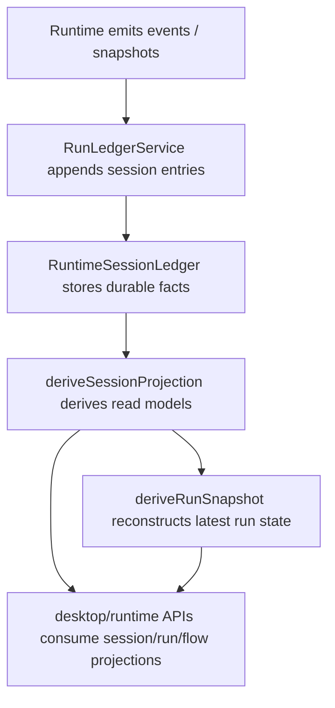
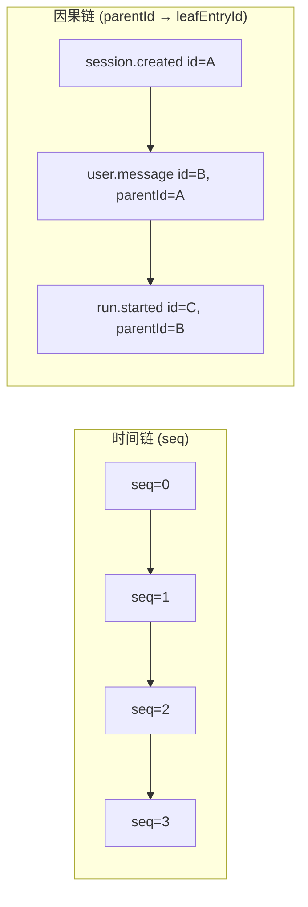
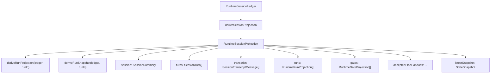
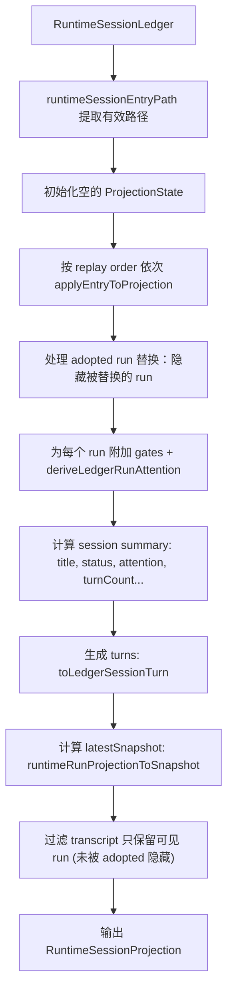
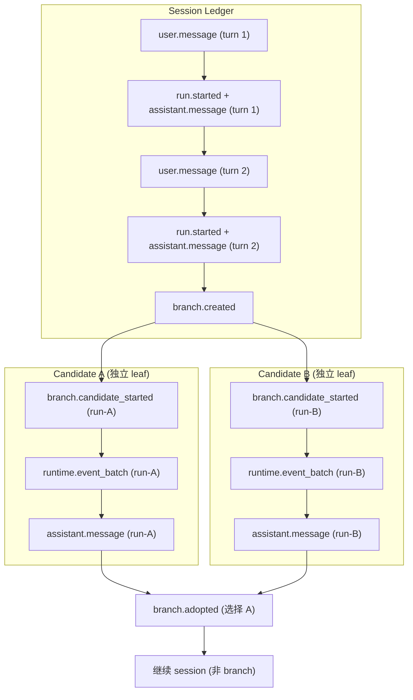
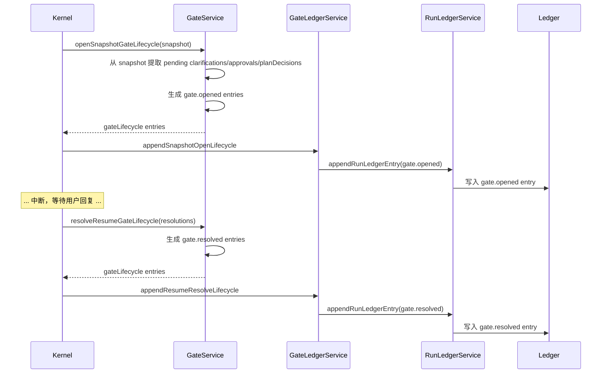
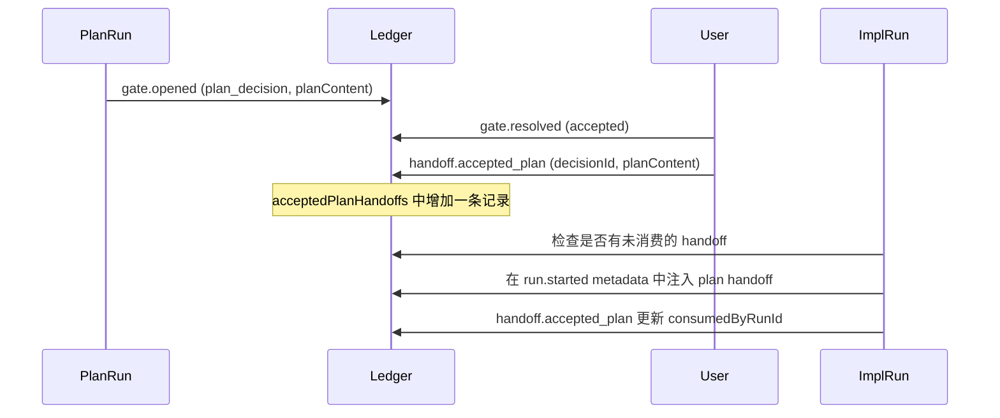
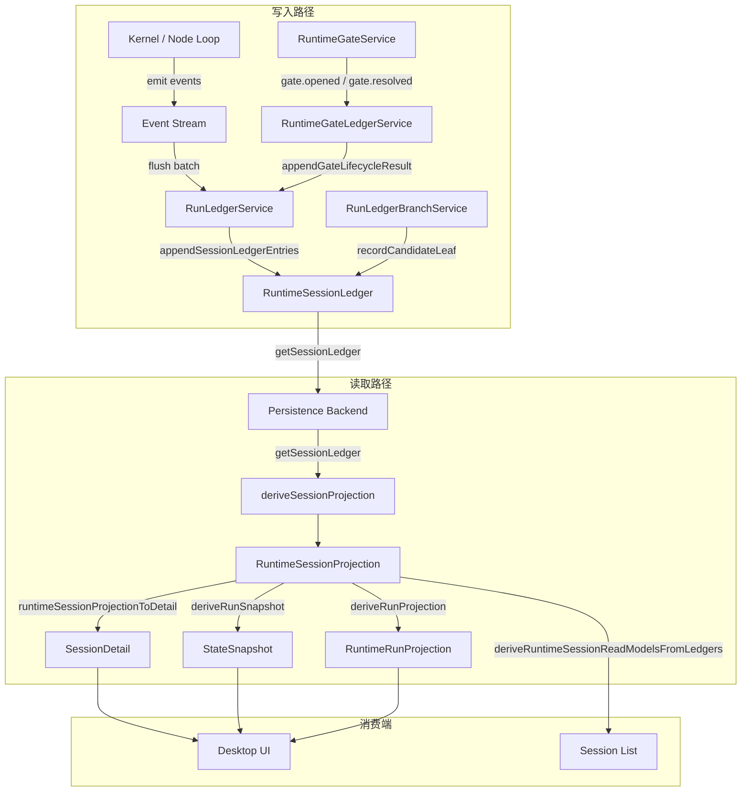

# Ora Ledger：从运行事实到会话投影

本文描述 Ora 的 **Ledger 事实层** — 它不只是一份运行时日志，而是 Ora 的事件溯源、状态投影与恢复事实的 source of truth。读完本文，对 Ora 的架构理解会从「流程图」升级到「状态模型」。

## 阅读地图

| 关注点 | 对应章节 |
| --- | --- |
| Ledger 是什么、为什么需要它 | [1. 定位：Ledger 在 Ora 中的角色](#1-定位ledger-在-ora-中的角色) |
| entry 类型体系与链式结构 | [2. RuntimeSessionLedger 的结构](#2-runtimesessionledger-的结构) |
| 每个 entry 类型的 payload 与语义 | [3. Entry 类型详解](#3-entry-类型详解) |
| 如何从 entry 链衍生 session/run projection | [4. 投影系统：从 entry 到 read model](#4-投影系统从-entry-到-read-model) |
| branch、candidate、adopted run 如何落在 ledger | [5. 分支模型：Branch 如何在 ledger 上工作](#5-分支模型branch-如何在-ledger-上工作) |
| gate 生命周期如何变成 durable facts | [6. Gate 的耐久化](#6-gate-的耐久化) |
| plan handoff 的 ledger 路径 | [7. Plan Handoff 的 ledger 事实](#7-plan-handoff-的-ledger-事实) |
| compaction 如何进入 ledger | [8. Compaction 的 ledger 事实](#8-compaction-的-ledger-事实) |
| live snapshot vs ledger projection 的边界 | [9. Live Snapshot 与 Ledger Projection 的边界](#9-live-snapshot-与-ledger-projection-的边界) |
| slim event batch 如何保持重建能力 | [10. Event Batch Slim 与 Projection 可重建性](#10-event-batch-slim-与-projection-可重建性) |
| 容易误解的点 | [11. 常见误解与边界](#11-常见误解与边界) |
| 当前实现边界与可演进方向 | [12. 实现边界与演进方向](#12-实现边界与演进方向) |

核心源码文件：

| 文件 | 职责 |
| --- | --- |
| `packages/shared/src/runtime-ledger.ts` | Ledger 类型定义、entry 排序、投影衍生、attention 推导（shared contract） |
| `apps/runtime/src/run-ledger-service.ts` | 运行时 ledger 写入服务，管理 entry 追加、seq、leaf 更新 |
| `apps/runtime/src/run-ledger-branch-service.ts` | 分支 ledger 管理：candidate run 的独立 leaf 追踪 |
| `apps/runtime/src/runtime-gate-service.ts` | Gate 生命周期管理：open/resolve entry 的生成逻辑 |
| `apps/runtime/src/runtime-gate-ledger-service.ts` | Gate entry 写入 ledger 的适配层 |
| `apps/runtime/src/persistence/session-ledger-projections.ts` | 批量 ledger → read model 的持久化投影入口 |

## 1. 定位：Ledger 在 Ora 中的角色

Ora 的运行时会产生大量事件和状态变更：run 开始/结束、模型输出、工具调用、gate 打开/解决、计划决策、分支操作等。Ledger 是这些事实的**耐久存储**，采用 append-only 的事件溯源模型。



**Ledger 解决的核心问题**：

| 问题 | 没有 Ledger 时 | 有 Ledger 时 |
| --- | --- | --- |
| resume 应该信什么状态？ | 不清楚信 continuation frame、live snapshot 还是内存状态 | 所有事实都可从 ledger replay 重建，projection 是唯一权威的 read model |
| gate 何时变成 durable fact？ | gate 可能在内存中丢失 | `gate.opened` / `gate.resolved` 都是 ledger entry，掉电不丢 |
| plan mode 的 decision 落在哪里？ | 不确定 decision gate 和 accepted handoff 该存哪里 | `gate.opened` (plan_decision) + `handoff.accepted_plan` 都是 ledger entry |
| branch 的 candidate run 为什么不能直接更新 session leaf？ | 可能污染主会话链 | candidate run 有独立 ledger leaf，只在被 adopt 后才合并进主链 |
| desktop 应该消费什么？ | UI 可能本地猜测状态 | desktop 消费 projection，projection 来自 ledger replay |
| event batch slim 后如何重建？ | 可能丢失事件历史 | slim 只去掉 events 数组，投影可从 entry payload 重建 |

## 2. RuntimeSessionLedger 的结构

### 2.1 顶层模型

```typescript
// RuntimeSessionLedger — 一个 session 的完整事实账本
{
  sessionId: string;           // 所属会话
  leafEntryId?: string;        // 当前链的叶子 entry id
  entries: RuntimeSessionEntry[];  // 所有 entry，append-only
}
```

每个 session 有且只有一个 `RuntimeSessionLedger`。它不是 session 的「附加日志」，而是 session **本身的事实载体** — session 列表、session detail、run 状态、gate 状态、transcript 等全部通过投影（projection）从 ledger 衍生，不得从 UI 本地状态或内存快照推断。

### 2.2 Entry 的链式结构：parentId → leafEntryId → seq

每个 entry 同时参与两条链：



- **`seq`**：单调递增的全局序号。所有 entry 按 `seq` 排序即得到事件发生的时间顺序。`seq` 由 `RunLedgerService.appendSessionLedgerEntries` 在写入时分配：`maxSeq + index + 1`。
- **`parentId`**：指向因果上的前一个 entry。新 entry 默认从当前 `leafEntryId` 继承 parent。
- **`leafEntryId`**：当前会话链的最新节点。写入新 entry 时，`leafEntryId` 会更新为新 entry 的 id（除非显式传入 `updateLeaf: false`）。

**`runtimeSessionEntryPath` 函数** 从 `leafEntryId` 沿 `parentId` 反向回溯，构建出从根到叶的 entry 路径。如果中途某个 entry 因 lazy-load 被过滤掉（如 slim 后的 event batch），回溯会在此停止，不会 crash。

### 2.3 replay order：不只是 seq 排序

entry 可能在一个 `seq` 点上批量写入多个，此时需要 **replay order** 来决定投影时的应用顺序：

```typescript
function runtimeSessionEntryReplayOrder(entry): number {
  // session.created (0) → session.info (10) → branch.created (20)
  // → branch.candidate_started (30) → user.message (40)
  // → run.started (50) → runtime.event_batch (60)
  // → assistant.checkpoint (70) → tool.result (80)
  // → gate.opened (90) → gate.resolved (100)
  // → handoff.accepted_plan (110) → compaction.summary (120)
  // → assistant.message (130) → branch.adopted (140) → branch.dismissed (150)
}
```

排序优先级：`seq` → `replayOrder` → `createdAt` → `id`。

### 2.4 Entry 类型全集

`RuntimeSessionEntryType` 的 16 种类型：

| 类型 | 含义 | 触发时机 |
| --- | --- | --- |
| `session.created` | 会话创建 | 新建 session |
| `session.info` | 会话元信息更新 | 修改标题、归档等 |
| `user.message` | 用户消息 | 用户发送消息 |
| `run.started` | Run 启动 | 开始执行一个 run |
| `runtime.event_batch` | 运行时事件批量写入 | 流式事件定期 flush |
| `assistant.checkpoint` | 助手检查点 | agent 内部创建 checkpoint |
| `assistant.message` | 助手最终消息 | run 完成/中断时输出最终回答 |
| `tool.result` | 工具执行结果 | 工具调用完成 |
| `gate.opened` | Gate 开启 | 需要 clarification/approval/plan_decision |
| `gate.resolved` | Gate 解决 | 用户回答 clarification / 批准 action / 决定计划 |
| `handoff.accepted_plan` | 计划交接被接受 | 用户接受 plan mode 输出的计划 |
| `compaction.summary` | 上下文压缩摘要 | 对话历史被 compact |
| `branch.created` | 分支组创建 | 用户发起 branch 操作 |
| `branch.candidate_started` | 候选 run 启动 | branch 中的某个 candidate 开始执行 |
| `branch.adopted` | 分支被采纳 | 用户选择 adopt 某个 candidate |
| `branch.dismissed` | 分支被关闭 | 用户或系统关闭分支组 |

## 3. Entry 类型详解

### 3.1 `session.created`

```json
{
  "type": "session.created",
  "payload": {
    "title": "New Chat",      // 可选
    "projectId": "proj-123"   // 可选
  }
}
```

会话的第一个 entry。设置 session 标题和所属项目。投影中此为 `state.createdAt` 的来源。

### 3.2 `session.info`

```json
{
  "type": "session.info",
  "payload": {
    "title": "Renamed Chat",
    "archivedAt": 1715000000000
  }
}
```

更新会话元信息。与 `session.created` 的区别是它不会设置 `createdAt`。

### 3.3 `user.message`

```json
{
  "type": "user.message",
  "payload": {
    "content": "帮我写一个 React 组件"
  }
}
```

用户消息。如果 entry 带有 `runId`，会被加入 `transcript` 数组。

### 3.4 `run.started`

```json
{
  "type": "run.started",
  "payload": {
    "input": { "prompt": "...", "context": {} },
    "config": { "pattern": "orchestrator_subagent", ... },
    "modeId": "code_development",
    "status": "running"
  }
}
```

Run 的出生证明。投影中初始化一个 `RuntimeRunProjection`，状态为 `running`。

### 3.5 `runtime.event_batch`

```json
{
  "type": "runtime.event_batch",
  "payload": {
    "events": [ /* OraEventEnvelope[] */ ],
    "eventCount": 42,
    "status": "running",
    "output": { "text": "partial..." }
    // snapshot 字段在高频 :events- 批次中省略；
    // 仅在低频 :update- 批次（即 durable boundary：run.done、
    // run.failed、checkpoint.created 等时刻）携带 compact snapshot。
  }
}
```

这是最核心、也是 payload 最重的 entry 类型。运行时流式事件不会逐条写 ledger，而是批量 flush 到此 entry 中。`events` 数组存储增量事件。

> **分层 compaction 策略**：event batch 现在有两档写入频率：
>
> - **高频 `:events-` batch**：流式运行期间定期 flush。`events` 被 slim 为 `[]`，**且不写入 `snapshot` 字段**，仅保留 `eventCount`、`status`、`output`、`error`。
> - **低频 `:update-` batch**：在 durable boundary（`run.done`、`run.failed`、`checkpoint.created` 等）写入，携带 compact `snapshot`。
>
> 投影可从最近的 `:update-` snapshot 结合 gate/tool result 等独立 entry 重建必要状态。详见[第 10 章](#10-event-batch-slim-与-projection-可重建性)。

### 3.6 `assistant.checkpoint`

```json
{
  "type": "assistant.checkpoint",
  "payload": {
    "checkpoint": { "id": "ckpt-1", "label": "after_code_review", ... }
  }
}
```

Agent 执行过程中创建的 checkpoint。投影中追加到 `run.checkpoints`。

### 3.7 `assistant.message`

```json
{
  "type": "assistant.message",
  "payload": {
    "content": "这是完整的最终回答...",
    "status": "succeeded",
    "output": { "text": "..." },
    "snapshot": { /* StateSnapshot */ }
  }
}
```

助手的最终回答消息。如果有非空 `content`，会被加入 `transcript`。这是与流式 `runtime.event_batch` 的区别：`assistant.message` 是终态的、面向用户的最终消息，而非流式增量。

### 3.8 `tool.result`

```json
{
  "type": "tool.result",
  "payload": {
    "result": {
      "key": "file.write:/src/App.tsx",
      "toolId": "file.write",
      "argsDigest": "{...}",
      "resultToolCallId": "tc-123",
      "status": "succeeded",
      "output": { ... },
      "createdAt": 1715000000000,
      "updatedAt": 1715000000000
    }
  }
}
```

工具执行结果的耐久记录，存储为 `RuntimeToolResultLedgerEntry`。投影中追加到 `run.toolResults`。与 snapshot 中的 `toolResults` 不同，ledger entry 提供了跨 compaction 的工具结果溯源。

### 3.9 `gate.opened`

```json
{
  "type": "gate.opened",
  "payload": {
    "gateId": "run-1:clarification-1",
    "kind": "clarification",           // "clarification" | "approval" | "plan_decision"
    "pendingActionIds": [],
    "pendingToolCallIds": [],
    "pendingClarificationIds": ["clarification-1"],
    "clarification": { /* PendingClarification */ },   // 仅 clarification
    "planDecision": { /* PlanDecisionGate */ }         // 仅 plan_decision
  }
}
```

Gate 开启的耐久事实。三种 kind：
- **`clarification`**：需要用户回答澄清问题
- **`approval`**：有工具调用需要用户审批
- **`plan_decision`**：有生成的计划等待用户决定

`gateId` 生成规则：
- clarification：`${runId}:gate:${clarification.id}`
- approval：`${runId}:approval`
- plan_decision：`${runId}:gate:${decision.id}`

详见[第 6 章](#6-gate-的耐久化)。

### 3.10 `gate.resolved`

```json
{
  "type": "gate.resolved",
  "payload": {
    "gateId": "run-1:approval",
    "status": "accepted",                // "accepted" | "declined" | "resolved"
    "resolvedAt": 1715000005000
  }
}
```

Gate 被解决的耐久事实。`status` 的含义因 gate kind 而异：
- clarification：`resolved`（已回答）
- approval：`accepted`（已批准）
- plan_decision：`accepted` 或 `declined`

gate 从 open 到 resolved 的投影会更新 `RuntimeGateProjection.status`。如果 gate 已 resolved，再次收到 `gate.opened` 会被忽略（防止 replay 时重复打开已解决的 gate）。

### 3.11 `handoff.accepted_plan`

```json
{
  "type": "handoff.accepted_plan",
  "payload": {
    "decisionId": "decision-1",
    "sourceRunId": "run-plan-1",
    "planContent": "## Plan\n1. ...",
    "acceptedAt": 1715000010000,
    "consumedByRunId": "run-impl-1"   // 可选，被实施 run 消费后设置
  }
}
```

计划被接受的交接记录。投影中被收集到 `acceptedPlanHandoffs` 数组。下一次 `taskIntent: "implement"` 的 run 会消费它并将 `consumedByRunId` 标记为已消费。

详见[第 7 章](#7-plan-handoff-的-ledger-事实)。

### 3.12 `compaction.summary`

```json
{
  "type": "compaction.summary",
  "payload": {
    "contextState": {
      "activeTokenUsage": { "inputTokens": 50000, "outputTokens": 8000, "totalTokens": 58000 },
      "compactedHistory": [ /* RuntimeConversationEntry[] */ ],
      "compactedThroughTurnIndex": 5,
      "compactionCount": 1,
      "lastCompactedAt": 1715000020000
    }
  }
}
```

上下文压缩后的状态快照。投影中直接替换 `state.contextState`。这确保了 session projection 始终包含最新的上下文状态，包括 compaction 后的精简历史和 token 统计。

### 3.13 分支相关 entry

```json
// branch.created / branch.candidate_started / branch.adopted / branch.dismissed
{
  "type": "branch.adopted",        // 或其他 branch.* 类型
  "payload": {
    "branchGroupId": "bg-1",
    "target": "replace_latest",
    "supersededRunId": "run-old-1",
    "adoptedRunId": "run-new-1",
    "notifiedCandidateRunIds": ["run-cand-1", "run-cand-2"],
    "dismissedRunIds": ["run-cand-1"]
  }
}
```

分支操作的四种 entry 共享 `BranchGroupPayloadSchema`。详见[第 5 章](#5-分支模型branch-如何在-ledger-上工作)。

## 4. 投影系统：从 entry 到 read model

投影是 Ora 从 ledger entry 重建可消费状态的核心机制。不是对 entry 做简单 map，而是按 replay order **逐步应用**（fold）entry 到投影状态，最终产出结构化的 read model。

### 4.1 三个核心投影函数



| 函数 | 输入 | 输出 | 用途 |
| --- | --- | --- | --- |
| `deriveSessionProjection` | `ledger`, `leafEntryId?` | `RuntimeSessionProjection` | 重建 session 的完整 read model |
| `deriveRunProjection` | `ledger`, `runId`, `leafEntryId?` | `RuntimeRunProjection \| undefined` | 重建单个 run 的 read model |
| `deriveRunSnapshot` | `ledger`, `runId`, `leafEntryId?`, `projection?` | `StateSnapshot \| undefined` | 重建单个 run 的 StateSnapshot |

### 4.2 deriveSessionProjection 的内部流程



### 4.3 applyEntryToProjection 的核心逻辑

每种 entry type 在投影状态上的效果：

| Entry Type | 投影效果 |
| --- | --- |
| `session.created` | 设置 `title`、`projectId`、`createdAt` |
| `session.info` | 更新 `title`、`projectId`、`archivedAt` |
| `user.message` | 如有 `runId`，追加到 `transcript` |
| `run.started` | 创建新的 `RuntimeRunProjection` 并加入 `runs` |
| `runtime.event_batch` | 合并 events、status、output、error、snapshot 到 run |
| `assistant.checkpoint` | 追加 checkpoint 到 run |
| `assistant.message` | 更新 run 状态、output、snapshot；如有内容追加到 transcript |
| `tool.result` | 追加 tool result 到 run.toolResults |
| `gate.opened` | 创建或更新 `RuntimeGateProjection`；upsert plan decision |
| `gate.resolved` | 更新 gate 状态为 resolved；更新关联的 plan decision |
| `handoff.accepted_plan` | 追加到 `acceptedPlanHandoffs` |
| `compaction.summary` | 替换 `contextState` |
| `branch.*` | 管理 `branchGroups`；处理 adopted/dismissed 的 run metadata |

### 4.4 Attention 推导

`deriveLedgerRunAttention` 从 projection 推导当前 run 的 attention 状态，**优先级顺序严格**：

```typescript
function deriveLedgerRunAttention(run):
  // 1. 有 open 的 clarification gate → needs_clarification (blocking)
  // 2. 有 open 的 approval gate → needs_approval (blocking)
  // 3. 有 open 的 plan_decision gate → needs_plan_decision (blocking)
  // 4. status = queued/running → running
  // 5. status = interrupted
  //    - 有 resolved gate 但没有后续 manual interrupt → failed (不完整 resume)
  //    - 有 manual interrupt → paused
  // 6. status = failed → failed
  // 7. status = cancelled → cancelled
  // 8. otherwise → idle
```

这种优先级确保了 attention 推导的一致性：即使 snapshot 中有多个状态线索（如同时有 pending approval 和 pending clarification），attention 总是按固定优先级返回最高优先级的阻塞状态。

### 4.5 snapshot 重建与 reconciliation

`runtimeRunProjectionToSnapshot` 优先使用 run 的 `finalSnapshot`（来自最后一次 `assistant.message` 或 `runtime.event_batch`），然后用 ledger 中最新的 run 投影字段补充：

- `status`、`attention`、`planDecisions` 等运行时字段以 projection 为准，覆盖 finalSnapshot
- `pendingClarifications` / `pendingApprovals` 从 gates 中提取
- `toolResults` 优先使用 ledger projection 中的 `tool.result` entries，避免只依赖 live `toolCalls` envelope
- 返回的 `StateSnapshot.snapshotSource` 标记为 `"ledger"`，供 runtime/desktop 明确区分权威 read model 与 streaming live view
- 如果没有 finalSnapshot，从 run projection 构建最小 snapshot

`reconcileSnapshotRuntimeFields` 做更细粒度的修复：
- 将 gate 决议反向投影为事件（如 `clarification.resolved`、`approval.resolved`、`tool.called`）
- 将 resolved approval 的 action 标记为 succeeded
- 去重并清理重复的 approved tool call

## 5. 分支模型：Branch 如何在 ledger 上工作

Branch 是 Ora 的「平行宇宙」机制：允许在同一个 session 中分叉出多个 candidate run，用户选择最好的一个 adopt。

### 5.1 关键概念



### 5.2 Candidate run 的独立 ledger leaf

Candidate run 在 append entry 时，**不会更新 session 的 `leafEntryId`**。`RunLedgerService.appendRunLedgerEntry` 检测到 `config.metadata.branchRole === "candidate"` 时：

1. 通过 `RunLedgerBranchService.candidateLedgerLeaf` 找到该 candidate 自己的最近 entry
2. 以该 entry 为 `parentId` 写入新 entry
3. 传入 `updateLeaf: false`，不更新 session leaf
4. 通过 `branchService.recordCandidateLeaf` 缓存该 candidate 的 leaf

这意味着：
- **主会话链不受 candidate run 的中间事件污染**
- 用户看到的主时间线仍然是 adoption 前的最后一条消息
- 每个 candidate 在自己的子链上独立运行

### 5.3 BranchGroup 的四种 entry

| Entry | 含义 | 对投影的影响 |
| --- | --- | --- |
| `branch.created` | 分支组创建 | 创建 `SessionBranchGroup`，状态 `running` |
| `branch.candidate_started` | 候选 run 启动 | 将 candidate run 加入 branchGroup 的 `candidateRunIds` |
| `branch.adopted` | 采纳某个 candidate | 更新 branchGroup 状态为 `adopted`；标记 superseded run；通知其他 candidate |
| `branch.dismissed` | 关闭分支组 | 更新 branchGroup 状态为 `dismissed`；标记被 dismiss 的 candidate run |

### 5.4 Adopted run 的替换与隐藏

当 branch 被 adopt（`target: "replace_latest"`）时：

1. `branch.adopted` entry 记录 `supersededRunId`（被替换的旧 run id）
2. 投影中标记旧 run 的 metadata：`supersededByRunId`、`supersededAt`
3. `deriveSessionProjection` 收集所有 `target === "replace_latest"` 且 `status === "adopted"` 的 `replaceRunId`，以及所有 `metadata.branchRole === "adopted"` 的 `branchReplaceRunId`，形成 `hiddenRunIds`
4. 最终 `runs` 输出过滤掉 `hiddenRunIds`

**被替换的 run 不会从 ledger 删除**，只是不在投影中呈现。这保证了事实不可篡改。

### 5.5 从 StateSnapshot 反向推导 BranchGroup

`deriveSessionBranchGroupsForSession` 函数可以从一组 `StateSnapshot` 反向构建 `SessionBranchGroup`，用于不通过 ledger 直接消费的场景。它从 `config.metadata` 中提取 `branchGroupId`、`branchTarget`、`branchRole` 等字段。

## 6. Gate 的耐久化

Gate 是 Ora 中断-恢复机制的核心。三种 gate — clarification、approval、plan_decision — 都有完整的 ledger 生命周期。

### 6.1 Gate 的完整生命周期



### 6.2 Gate 的投影生命周期

`RuntimeGateProjection` 维护 gate 的当前投影状态：

```typescript
{
  gateId: "run-1:approval",
  kind: "approval",
  runId: "run-1",
  sessionId: "sess-1",
  status: "open" | "resolved",
  openedAt: 1715000000000,
  resolvedAt: 1715000005000,   // 仅 resolved
  pendingActionIds: ["action-1"],
  pendingToolCallIds: ["tc-1"],
  pendingClarificationIds: [],
  planDecisionId: undefined,    // 仅 plan_decision
  clarification: undefined,     // 仅 clarification
  planDecision: undefined       // 仅 plan_decision
}
```

投影应用规则：
- `gate.opened`：创建新 gate（status = `open`）。如果 gateId 已存在且为 resolved，忽略（防止 replay 覆盖已完成的决议）。
- `gate.resolved`：更新 status 为 `resolved`，设置 `resolvedAt`。同时更新关联的 `planDecision.status`。

### 6.3 Plan Decision Gate 的特殊性

Plan decision gate 与 approval/clarification 有两个关键区别：

1. **不中断 run**：plan run 可以是 `succeeded`，但同时存在 pending plan_decision gate。这与 approval（中断为 `interrupted`）不同。
2. **跨 run 交接**：plan decision gate 解析后的 `handoff.accepted_plan` 可以被下一个 implement run 消费。

## 7. Plan Handoff 的 ledger 事实

Plan handoff 是 plan mode 和 implement mode 之间的契约桥梁。



`RuntimeAcceptedPlanHandoff` 结构：

```typescript
{
  decisionId: "decision-1",          // 关联的 plan_decision gate id
  sourceRunId: "run-plan-1",         // 产生计划的 run
  planContent: "## Plan\n1. ...",    // 完整计划内容
  acceptedAt: 1715000010000,
  consumedByRunId: "run-impl-1"      // 被哪个 implement run 消费（可选）
}
```

投影中 `upsertAcceptedPlanHandoff` 按 `decisionId + sourceRunId` 去重，保留最新的。

## 8. Compaction 的 ledger 事实

当对话历史超过 token 限制时，Ora 会进行上下文压缩（compaction）。压缩后的状态通过 `compaction.summary` entry 耐久化：

```json
{
  "type": "compaction.summary",
  "payload": {
    "contextState": {
      "activeTokenUsage": { ... },
      "compactedHistory": [ /* 压缩后的精简对话历史 */ ],
      "compactedThroughTurnIndex": 5,
      "compactionCount": 2,
      "lastCompactedAt": 1715000020000
    }
  }
}
```

投影中直接替换 `state.contextState`。后续 run 在构建 conversation context 时可以从 `contextState.compactedHistory` 获取精简后的历史，而不需要重放全部 ledger entry。

## 9. Live Snapshot 与 Ledger Projection 的边界

这是最容易混淆的边界之一。

| 维度 | Live Snapshot | Ledger Projection |
| --- | --- | --- |
| **来源** | 内存中的 `StateSnapshot`，由 kernel 流式 push | 从 `RuntimeSessionLedger` entry replay 重建 |
| **时效性** | 实时（流式过程中更新） | 最终一致（写入后可用） |
| **存储** | 不持久（内存或临时存储） | 耐久存储（ledger entries） |
| **完整性** | 包含所有运行时字段 | 可能因 slim 丢失部分事件细节 |
| **用途** | 流式 UI 更新、kernel 内部状态 | session detail、session list、desktop sidebar、Trails |
| **标记** | `snapshotSource: "live"` | `snapshotSource: "ledger"` |

**关键原则**：

1. **Desktop UI 应该消费 ledger projection，而不是 live snapshot。** `deriveSessionProjection` / `deriveRunSnapshot` 是 read model 的唯一权威来源。
2. **Live snapshot 是 viewing 用途，不是 source of truth。** streaming 期间的 UI 可以消费 live snapshot，但最终状态（session detail、Trails、attention）必须来自 ledger projection。
3. **Attention 推导不依赖 UI 猜测。** `deriveLedgerRunAttention` 完全从 ledger-backed gate projection 计算，不参考 UI 本地缓存的「上一个状态」。
4. **Handoff 必须显式。** live snapshot 工厂会标记 `"live"`；ledger projection 会标记 `"ledger"`；desktop 的 interaction state 通过 `shouldSwitchToLedgerSnapshot` 在终态/ hydrate 后优先切到 ledger-backed state。

### 9.1 哪些状态来自 live snapshot

- 流式事件（`message.delta`、`token.delta` 等）的实时展示
- 流式过程中的工具调用进度
- 流式过程中的 plan/todo 状态

### 9.2 哪些状态必须来自 ledger projection

- Session detail（session 摘要、turn 列表、transcript）
- Session 列表（标题、最新状态、attention）
- Run attention（blocking/clarification/approval 判断）
- Run 的最终 status、output、error
- Branch group 状态
- Accepted plan handoff

### 9.3 投影一致性保证

`deriveSessionProjection` 从 `leafEntryId` 开始回溯，只处理该路径上的 entry。这意味着：
- 如果 candidate run 未被 adopt，它的中间事件不会出现在主投影中
- 如果 branch 被 adopt 并替换了旧 run，旧 run 被 `hiddenRunIds` 过滤
- 所有 gate 决议都是幂等的（已 resolved 的 gate 不会被重新打开）

## 10. Event Batch Slim 与 Projection 可重建性

`runtime.event_batch` 的 `events` 数组可能非常庞大（包含所有流式增量事件如 `message.delta`）。`buildVisibleLedger` 函数将其 slim 化：

```typescript
// 原始 entry
{ type: "runtime.event_batch", payload: { events: [/* 数百个 event */], status: "running", snapshot: {...} } }

// slim 后
{ type: "runtime.event_batch", payload: { events: [], eventCount: 42, status: "running", snapshot: {...} } }
```

**Slim 不会丢失投影所需的关键信息**，因为：

1. **`payload.snapshot` 保留了完整快照** — 包含 status、attention、planDecisions、toolCalls、conversation 等所有结构字段
2. **`payload.status` 保留** — run 状态变化可追踪
3. **`payload.output` 保留** — 输出内容不丢失
4. **`payload.error` 保留** — 错误信息保留
5. **独立的 entry 补充信息** — `tool.result`、`gate.opened`、`gate.resolved`、`assistant.message` 等 entry 提供了比流式事件更结构化的信息

`runtimeRunProjectionToSnapshot` 在重建 snapshot 时：
- 优先使用 `finalSnapshot`
- 用 projection 中的最新 `gate`、`toolResult`、`planDecision` 状态覆盖
- 通过 `reconcileSnapshotRuntimeFields` 将 gate 决议反向投影为 events

**可删除的 events**：纯流式展示用的事件（如 `message.delta`、`token.delta`）在 slim 后可以安全移除，因为最终内容已保留在 `assistant.message` 或 snapshot 的 output 中。

**不可删除的信息**：gate 状态、tool result、checkpoint、plan decision 等结构性事实，它们不以 raw event 形式依赖，而是通过独立的 ledger entry 类型保证耐久性。

## 11. 常见误解与边界

### 11.1 "Ledger 就是日志"

**不是。** Ledger 是事件溯源模型中的 **事实源**（source of truth），不是运维日志。它的 entry 严格类型化，projection 从中派生所有 read model。日志可以丢、可以截断，但 ledger entry 一旦写入就是永久事实（除非通过 branch adopt 从投影中隐藏，但从不删除）。

### 11.2 "Live snapshot 和 ledger projection 可以互相替代"

**不可以。** Live snapshot 是瞬时的、流式的、不完整的（某些字段在 streaming 期间为占位值）。Ledger projection 是最终的、完整的、经过 reconciliation 的状态。Desktop UI 在 run 完成后必须切换到 ledger projection。

### 11.3 "resume 应该信 continuation frame 的细节"

**不完全正确。** resume 依赖 continuation frame 判断恢复策略，但最终状态必须与 ledger projection 对齐。如果 continuation frame 和 gate ledger projection 冲突，gate projection 是权威来源（因为 gate 决议在 ledger 上有独立的 `gate.resolved` entry）。

### 11.4 "candidate run 的 entry 会出现在 session 投影中"

**默认不会。** 只有当 candidate run 被 adopt 后，它的 entry 才会通过 `leafEntryId` 路径进入主投影。未被 adopt 的 candidate run 的 entry 存在于 `entries` 数组中，但不在 `runtimeSessionEntryPath` 返回的路径上（因为 `leafEntryId` 不指向它们）。

### 11.5 "gate.resolved 后再次 gate.opened 会创建新 gate"

**不会。** 投影中检查：如果 gateId 已存在且 `status === "resolved"`，则忽略新的 `gate.opened` entry。这是幂等性保证。

### 11.6 "slim 后的 ledger 无法重建完整的 run 状态"

**可以重建。** Slim 只移除流式事件（`message.delta` 等），但保留所有结构性信息（snapshot、status、output、error）和独立的结构化 entry（tool result、gate 决议、checkpoint 等）。`reconcileSnapshotRuntimeFields` 甚至可以从 gate 决议反向生成缺失的事件。

## 12. 实现边界与演进方向

### 12.1 当前实现边界

| 方面 | 当前状态 | 保守边界 |
| --- | --- | --- |
| Ledger 存储 | 通过 `RuntimePersistenceBackend` 抽象，支持 SQLite / JSON 文件 | 未实现 ledger 分片或归档，大 session 的完整 replay 可能影响性能 |
| Slim 策略 | `buildVisibleLedger` 移除 event batch 的 events 数组 | 仅移除 events，其他字段保留。未来可能需要更激进的 compaction（如移除中间 snapshot） |
| Branch 投影 | 通过 `hiddenRunIds` 过滤被替换的 run | 被替换的 run 仍在 `entries` 中，只是不在投影中。长期运行可能导致 ledger 膨胀 |
| Gate 幂等 | `gate.opened` 在 resolved 后忽略 | 依赖 gateId 不变，不支持 gate 重开 |
| Event 反向投影 | `reconcileSnapshotRuntimeFields` 从 gate 决议生成事件 | 反向投影的事件标记为 `ledger-projected` 来源，但不回到 ledger 存储 |
| Live/Ledger handoff | `StateSnapshot` / `FlowRunDetail` / desktop interaction state 携带 `snapshotSource` | 仍保留 streaming live path；不能把每个 per-token delta 都改成 ledger replay |
| 跨 session 能力 | 不支持 | Ledger 是 session-scoped。如果需要跨 session 的 run 关系（如 fork/replay 溯源），需要额外机制 |

### 12.2 可演进方向

1. **Ledger 归档与分层存储**：对历史 session 的完整 ledger 做冷存储，仅保留 projection 用于列表和搜索。
2. **增量投影**：当前 `deriveSessionProjection` 每次从头 replay 所有 entry。可以缓存中间 projection state，只对新 entry 做增量 fold。
3. **跨 session 事实层**：当前 ledger 是 session-scoped。如果需要跨 session 的因果链（如 fork 溯源、自动化 run 链），需要引入 session 间的引用机制。
4. **Ledger 审计能力**：当前 ledger 提供事件溯源，但没有内置的审计/验证机制（如 entry hash 链）。
5. **Projection 物化视图**：将常用的 projection 查询（如 session list attention）物化为持久化的视图，避免每次请求都做 full replay。

---

## 附录：主流程图



---

> **核心判断**：Ledger 文档写完后，Ora 的架构理解会从「流程图」升级到「状态模型」。Ledger 不是基础设施细节，而是 Ora 的 **架构脊柱** — 所有运行事实的耐久化、状态投影、恢复机制、分支管理和 UI 消费都围绕它组织。
