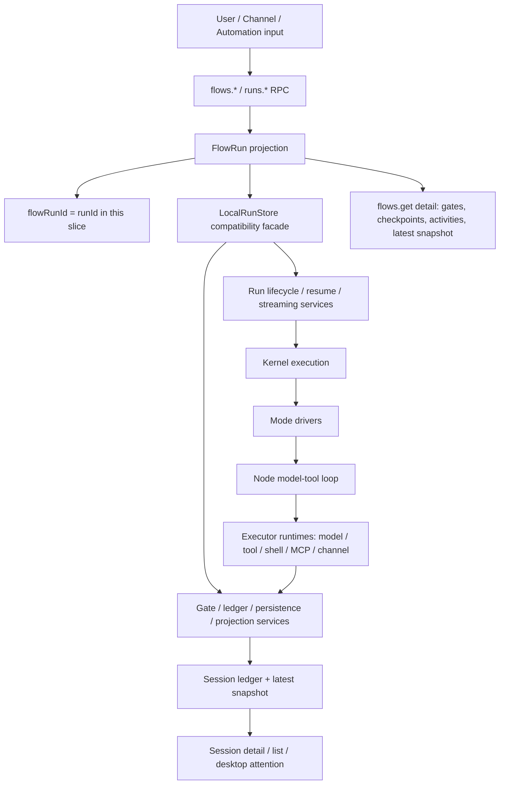
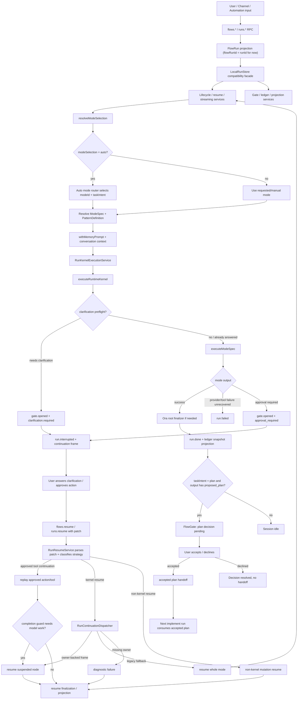
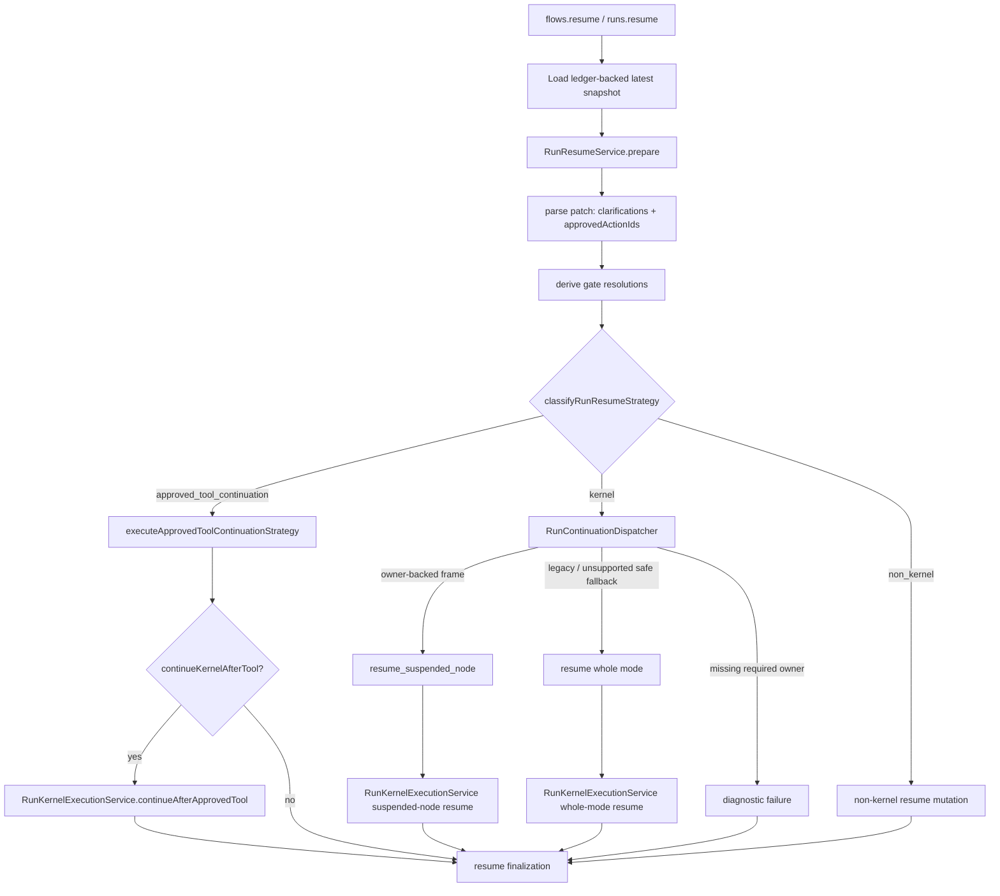
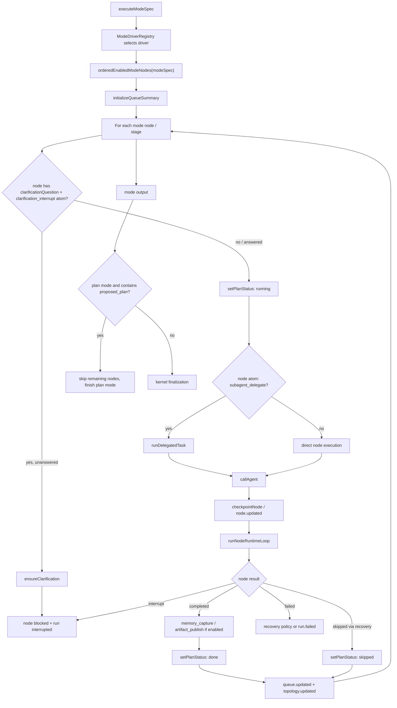
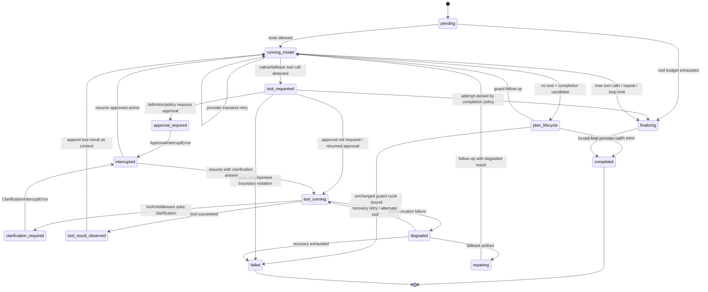
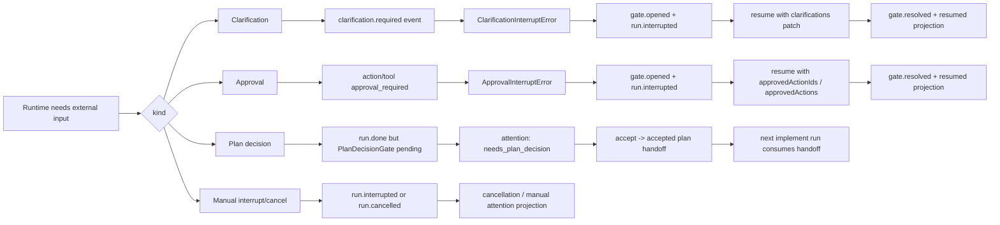
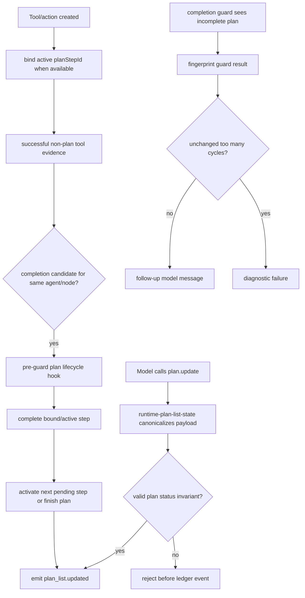
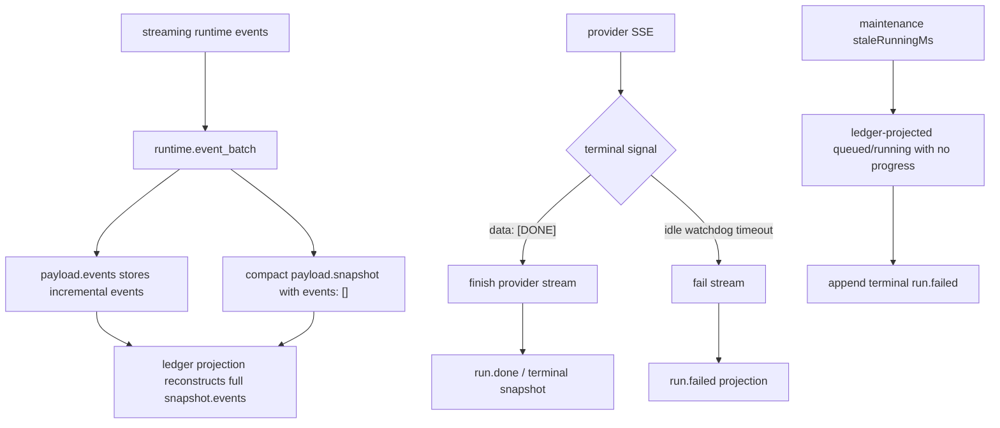

# Ora runtime loop 结构图

本文描述当前 Ora runtime loop 的主结构：Task Flow 兼容层、run 外层生命周期、continuation dispatcher、mode 编排层、单个 node 内部的 model-tool loop，以及 plan list、gate、streaming finalization 如何进入持久 projection。

## 阅读地图

Ora 的 runtime loop 不是单一循环，而是几层边界叠在一起：

1. **Task Flow 兼容层**：`flows.*` 是 `runs.*` 上的 orchestration alias，`flowRunId` 当前等于 `runId`，不引入第二套持久状态。
2. **Run 生命周期层**：`LocalRunStore` 保持 public API facade，生命周期、resume、streaming、gate、ledger、projection 等服务负责具体边界。
3. **Resume / Continuation 层**：`RunResumeService` 先解析 resume patch、gate resolution 和 resume strategy；`RunContinuationDispatcher` 只负责根据 ledger-backed continuation frame 判断恢复 suspended node、whole-mode fallback，或给出 missing-owner diagnostic。approved tool continuation 的 replay 是 resume strategy 的一条路径，不是 dispatcher 自己执行。
4. **Mode 编排层**：`executeModeSpec` 按 mode nodes/stages 推进 agent 调用，并同步 plan、todo、queue、topology。
5. **Node 执行层**：`runNodeRuntimeLoop` 在单个 agent/node 内做模型调用、工具调用、审批、澄清、plan-list lifecycle、恢复和强制 finalization。

主要源码入口：

- `/apps/runtime/src/json-rpc.ts`：`flows.*` / `runs.*` RPC 入口。
- `/apps/runtime/src/run-store.ts`：兼容 facade，串起 start、resume、streaming、ledger、projection、session 更新。
- `/apps/runtime/src/run-start-service.ts`：run start 前置准备，包括 session、mode selection、memory prompt、runId、turnIndex。
- `/apps/runtime/src/run-resume-service.ts`：resume patch 解析、gate resolution、resume strategy 分类。
- `/apps/runtime/src/run-streaming-service.ts`：streaming live snapshot、event flush、AbortController 管理。
- `/apps/runtime/src/run-projections.ts`：Run / Flow projection，当前 `flowRunId = runId`。
- `/apps/runtime/src/run-continuation-dispatcher.ts`：基于 continuation frame 判断 suspended-node resume、whole-mode fallback 或 diagnostic failure。
- `/apps/runtime/src/run-kernel-execution-service.ts`：start / resume 进入 kernel 的服务边界，包含 suspended-node resume snapshot 准备。
- `/apps/runtime/src/run-resume-finalization-service.ts`：resume 后 terminal / interrupted / streaming failure 的 snapshot、ledger、persistence 收敛。
- `/apps/runtime/src/runtime-gate-service.ts`
- `/apps/runtime/src/runtime-gate-ledger-service.ts`
- `/apps/runtime/src/run-kernel-lifecycle.ts`
- `/apps/runtime/src/harness/runtime-kernel.ts`
- `/apps/runtime/src/harness/runtime-kernel-runner.ts`
- `/apps/runtime/src/harness/runtime-root-agent.ts`
- `/apps/runtime/src/harness/node-runtime-loop.ts`
- `/apps/runtime/src/harness/node-loop-transitions.ts`
- `/apps/runtime/src/harness/runtime-tool-call-service.ts`
- `/apps/runtime/src/harness/runtime-tool-recovery-service.ts`
- `/apps/runtime/src/harness/runtime-clarifications.ts`
- `/apps/runtime/src/harness/runtime-interrupts.ts`
- `/apps/runtime/src/patterns/driver-registry.ts`
- `/apps/runtime/src/patterns/mode-driver-registry.ts`
- `/apps/runtime/src/patterns/generic-node-executor.ts`
- `/apps/runtime/src/patterns/mode-driver-helpers.ts`
- `/packages/shared/src/actions.ts`
- `/packages/shared/src/runtime.ts`
- `/packages/shared/src/assistantTextProjection.ts`
- `/packages/shared/src/runtime-ledger.ts`
- `/packages/shared/src/runtime-timeline.ts`

## 0. Task Flow、Run、Session 的边界

这一层的重点是所有 flow 概念都先映射到现有 run 基础设施。`FlowRun` 是当前 `StateSnapshot` 和 run projection 的编排视角，`FlowGate` 来自现有 clarification、approval、plan decision 和 cancellation projection。Session 仍然是用户看到的对话容器，flow/run 是持久执行身份。

## 1. 外层 run lifecycle

外层循环的关键点：

- `flows.*` 是当前 `runs.*` 的兼容 alias。它暴露 flow vocabulary，但不改变 `runId`、session UX 或持久格式。
- `LocalRunStore` 现在更像兼容 facade。kernel 执行、resume finalization、gate lifecycle、ledger append、persistence 和 projection 已经拆到更窄的服务边界。
- `resolveModeSelection` 先把输入解析成确定的 `ModeSpec`、`PatternDefinition` 和完整 `RunConfig`。
- `modeSelection: "auto"` 会调用 auto mode router，选择 `modeId`，并在 `taskIntentMode: "auto"` 时推断 `taskIntent`。
- 普通 start 由 `RunStartService` 准备 session、mode、memory prompt、runId 和 turnIndex，再通过 `RunKernelExecutionService` 进入 `executeRuntimeKernel`。
- resume 先由 `RunResumeService` 解析 patch、clarification、approved actions 和 gate resolution，并分类为 kernel resume、approved tool continuation 或 non-kernel resume。
- kernel resume 会通过 kernel execution 边界进入 `executeRuntimeKernel`，额外带入 clarification patch、approved action ids、approved actions 和上一轮 resume state。
- kernel 捕获 `ClarificationInterruptError` 和 `ApprovalInterruptError` 后，把 run 标记为 `interrupted`，写入 `continuation` frame，并通过 gate ledger 写入 durable gate facts。
- resume 不再默认等同于 broad mode restart。`RunContinuationDispatcher` 只处理 continuation ownership：owner-backed frame 优先恢复记录的 agent/node；legacy approval/clarification frame 可以 whole-mode fallback；缺少 owner metadata 的危险 frame 会进入 diagnostic failure。
- approved tool continuation 不由 dispatcher 执行。当前路径是 `RunResumeService.classifyRunResumeStrategy` 识别 approved continuation action，`executeApprovedToolContinuationStrategy` replay action/tool，必要时再由 `RunKernelExecutionService.continueAfterApprovedTool` 继续恢复 owner node。
- plan 模式输出完整 `<proposed_plan>` 后，run 本身可以是 `succeeded`，但 session attention 会变成 `needs_plan_decision`，等待用户接受或拒绝计划。

## 1.1 Resume strategy 和 continuation dispatcher

Resume 分两层看更准确。`RunResumeService` 是 strategy 边界，负责解析 patch、找出 gate resolution，并判断这次 resume 是 kernel work、approved tool continuation，还是 non-kernel mutation。`RunContinuationDispatcher` 只处理 kernel resume 里的 continuation ownership：它读取 `continuation.activeFrameId`，根据 frame 的 `agentId`、`nodeId`、`planItemId`、pending action/tool/clarification ids、conversation cursor 和 node checkpoint metadata，决定恢复暂停的 agent/node、退回 whole-mode resume，或给出 missing-owner diagnostic。

Owner-backed frame 能恢复到暂停的 agent/node；ownerless legacy approval/clarification frame 可以走 whole-mode fallback；ownerless manual/tool-interrupted frame 不能安全恢复，会以可见 diagnostic failure 结束。Approved tool continuation 是另一条 strategy：先 replay 已批准的 action/tool，如果 completion guard 仍然需要模型工作，再回到 owner node。

## 2. Mode 编排层

Mode 编排影响 loop 的方式：

- mode 决定 `nodes`、`profiles`、`stages`、`runtimeAtoms`、tool/skill scope、默认 budget、completion policy 和 recovery policy。
- `ModeDriverRegistry` 当前注册的 built-in family 包括 `generator_verifier`、`orchestrator_subagent`、`agent_teams`、`message_bus`、`shared_state`。staged transcript 是 `orchestrator_subagent` driver 内部的一条执行形态，不是独立 family。
- 每个 node 进入 `runGenericModeNode` 时会更新 plan/todo/queue 状态，运行结束后再同步 topology 和 queue。
- built-in pattern drivers 通过 `runGenericModeNode` 记录 node-level bag checkpoint。Continuation resume 可以用这些 checkpoint 判断如何恢复 owner-backed suspended node，而不是从 mode 入口重新跑旧节点。
- 带 `clarification_interrupt` atom 的 mode/node 可以在执行前或执行中主动挂起，等待用户补充信息。
- 带 `subagent_delegate` atom 的 node 会通过 delegated task 事件显式标记任务委派。
- 带 `dynamic_delegation` atom 的 `orchestrator_subagent` mode 会让 decompose 节点输出 `<delegation_plan>`，driver 解析后用 `skipNodeIds` 跳过不需要的 research/review 节点，并把 `research_focus` / `review_focus` 注入对应 subagent 的 system prompt。解析失败时安全回退为所有节点正常执行。
- `dynamic_orchestrator` 是基于 `orchestrator_subagent` family 的系统预设 mode，不是新 family。它保留固定节点的 owner/risk/approval 边界，只把“是否执行该 subagent、执行时聚焦什么”交给 runtime delegation plan。
- plan 模式中一旦产出完整 `<proposed_plan>`，后续 node 可以被跳过，避免计划已经完备后继续跑无关阶段。

## 3. 单个 node 的 model-tool loop

`NodeRuntimeLoopState` 当前包括：

- `pending`
- `running_model`
- `tool_requested`
- `tool_running`
- `tool_result_observed`
- `repairing`
- `finalizing`
- `completed`
- `degraded`
- `interrupted`
- `failed`

状态转换不只是散落在 emit 里。`node-loop-transitions.ts` 里的 `NodeLoopController` / reducer 会校验核心转换路径，非法转换会发 `node_loop_transition` runtime diagnostic，默认在关键路径上抛错。图里的 `plan_lifecycle` 是 completion guard 前的概念性 hook，不是 `NodeRuntimeLoopState` 的持久状态值。源码里的状态转换仍然从 `running_model` 进入 `completed`、`running_model` follow-up 或 `failed`。

内层循环的关键点：

- provider 支持 native tools 时优先走 native tool call；否则从文本里解析 JSON fallback tool call。
- 每次工具调用都会注册 completion attempt，用于限制重复调用、工具预算、loop safety limit。
- 工具执行走 definition-first registry。`RuntimeToolCallService` 负责普通工具调用 orchestration，definition 和 policy hook 决定风险、审批 copy 和执行行为。
- 高风险、manual approval 或 policy hook 要求审批时，工具 action 会进入 approval gate；未批准时抛 `ApprovalInterruptError`。
- 工具或 middleware 需要用户信息时，通过 `ensureClarification(s)` 抛 `ClarificationInterruptError`。
- 工具成功后，结果会被写回 messages，然后继续下一次模型调用。
- 自然完成候选进入 completion guard 前，runtime 会先运行 plan-list lifecycle hook。它只基于当前 agent/node 的 successful non-plan tool evidence 推进 active step，不从纯文本语义猜测完成状态。
- completion guard 会对 unchanged `plan_list.incomplete` 结果做 fingerprint 计数，重复无进展超过边界后失败，避免无限发出同一条继续运行提示。
- 工具执行失败后进入 `RuntimeToolRecoveryService`：可 retry、alternate tool、fallback artifact，或最终 fail。这个 recovery surface 只允许从 `tool_running` 进入 `degraded`。
- 工具结果已经记录后，follow-up model/provider 的 transient 或 busy failure 留在 `running_model` phase，由 provider recovery 重试同一个 model request，不会重跑已经成功的工具。
- 如果非 tool-running phase 错误进入 tool recovery boundary，runtime 会发 `tool_recovery_boundary` diagnostic 并停止这条错误恢复路径，不会放宽成 `running_model -> degraded`。
- 当工具预算耗尽、重复调用被拦截或 runtime loop limit 到达时，进入 forced final answer，禁止继续调用工具。

## 中断、澄清、审批、决策的区别

Important distinction:

- **Clarification/approval** 会中断当前 kernel run，并依赖 `flows.resume` / `runs.resume` 回到同一个 kernel loop。
- **Plan decision** 不一定中断 run；它通常发生在 plan run 成功之后，是 session-level gate。
- **Attention** 是 UI/会话层看到的阻塞状态。当前实现从 ledger-backed snapshot 和 gate projection 推导 attention，再供 session detail、session list、latest snapshot、desktop sidebar/chat/timeline 使用。clarification、approval、plan decision 和 cancellation 都应该表现为 durable gate/projection 事实，不能只依赖 UI 本地状态。

## Mode 编排对 loop 的影响清单

| 机制 | 影响 |
| --- | --- |
| `modeSelection` | manual 直接使用请求模式；auto 先用 router 选择 mode 和 task intent。 |
| `taskIntent` | chat/plan/implement 会改变系统提示、是否允许修改、是否生成 plan decision、是否消费 accepted plan。 |
| `runtimeAtoms` | 开启 clarification interrupt、recovery policy、memory capture、artifact publish、delegation、dynamic delegation、message bus、shared state 等能力。 |
| `profiles` | 决定 agent 身份、工具集合、skill 集合和 system overlay。 |
| `nodes/stages` | 决定 mode 的执行顺序、handoff、stage transcript 和 plan/todo 进度。 |
| `capabilityFlags.toolIds` | 决定 agent 可用工具；部分 mode 会禁用默认 web tools 或启用特定工具。 |
| `completionPolicy` | 影响工具预算、重复调用限制、forced final answer。 |
| `approvalMode` | auto/high_risk_only/manual 决定 action 是否进入审批 gate。 |
| `recoveryPolicy` | provider failure 在 model phase 内 retry/fail；tool execution failure 才进入 retry、alternate tool、fallback artifact 或 fail。 |
| `memoryPolicy` | mode 含 long-term memory atom 时可注入 active memory，并在 run 后更新 memory。 |

## Plan list 生命周期

`plan.update` 的 wire shape 仍然是 `{ explanation?, plan: [{ id?, step, status }] }`。`id` 可选；缺失时 runtime 会按 step 和 index 生成稳定 id。事件进入 ledger 前会先验证和 canonicalize。未完成的 plan list 必须有且只有一个 `in_progress` step，全部完成时才允许没有 active step。

Runtime 也会给 plan step 生成稳定 id，并把新的 action/tool call 绑定到当前 active `planStepId`。Node loop 在 completion guard 前检查当前 agent/node 的 successful non-plan tool evidence；如果证据绑定到 plan step，就优先推进这个 step，否则只在存在单一 active step 时推进。这个 hook 不根据自然语言猜测任务完成，只处理已有工具生命周期证据。

## Scoped runtime events

Agent/tool context 里发出的 runtime event 应该带上执行上下文。`RuntimeToolCallService` 这类已知 `{ agentId, nodeId }` 的边界会用 scoped emitter 给缺失的 event metadata 补默认 attribution，同时保留调用方显式传入的 `agentId` / `nodeId`。

这条规则尤其影响 `plan.update`。模型调用 `plan.update` 后产生的 `plan_list.updated` 是执行 agent 的事件，不是 root/system 事件；desktop timeline 和 trail projection 应该消费 runtime 给出的 attribution，而不是靠前端推断上一条 agent。

## Root agent topology 和 Ora finalizer

多 agent mode 会显式注入 root agent topology：`runtime-root-agent.ts` 会把拓扑改成 `run -> ora -> handoffTarget`。Root agent 不是普通 worker，它承担入口、auto router、clarification owner、handoff parent、observer 和最终用户回复的职责。

当 selected mode 返回结果后，`runtime-kernel.ts` 里的 Ora finalizer 会把 mode output 改写成最终面向用户的回答。两个场景会跳过这一步：`single_agent` mode 直接返回 node output；`taskIntent = "plan"` 且 mode output 已包含完整 `<proposed_plan>` 时，直接保留计划输出，避免 finalizer 破坏计划协议。

## Ledger 和 streaming finalization

新的 streaming event batch 不再存累计的 `snapshot.events`，完整事件历史由 ledger `payload.events` 重建。旧的 full snapshot row 仍然兼容。Provider stream 会把 SSE `[DONE]` 当作 terminal signal，即使 transport 没有关闭也会结束；idle/no-progress stream 会失败，不再无限等待。`RunStreamingService` 还维护 per-run `AbortController`，`runs.interrupt` / `runs.cancel` 会 abort active controller，并把 signal 传给 kernel、node loop 和 provider request。Runtime maintenance 可以把超过 `staleRunningMs` 的 stale queued/running ledger projection 收敛成 terminal failed run。

最终 assistant text 的读取边界也在这一层收敛：终态 snapshot 的 `output.text` / string output 是权威最终文本；缺失时才通过 `packages/shared/src/assistantTextProjection.ts` 从 public `message.delta` 投影。投影 helper 同时处理 delta-sized chunk、cumulative content、重复片段和 internal/tool-protocol 文本过滤。runtime 的 session transcript/title/memory/feedback/channel outbound、shared 的 branch preview / proposed plan 提取、desktop fallback 都应复用这条规则，而不是各自扫描 `snapshot.events`。

## 特殊路径

### Code Development boundary

`code_development` mode 下，orchestrator 不能执行 mutation 类工具，例如：

- `file.write`
- `file.patch`
- `file.delete`
- `modes.applyDraft`
- `selfIteration.apply`
- `skills.create`
- `skills.update`
- `skills.setEnabled`
- 高风险 `shell.execute`

orchestrator 负责计划和协调，实际代码修改必须落到 builder 阶段。

### Dynamic orchestrator delegation

`dynamic_orchestrator` 预设复用 `orchestrator_subagent` family，并通过 mode-scope atom `dynamic_delegation` 改变 driver 执行策略：

1. decompose 节点 prompt 追加 `DELEGATION_PLAN_INSTRUCTION`，要求输出 `<delegation_plan>`。
2. `parseDelegationPlan` 解析 `research: enabled|disabled`、`review: enabled|disabled` 以及可选 focus。
3. driver 用 `skipNodeIds` 让 `runGenericModeNode` 跳过 disabled 的 subagent 节点。
4. enabled 的 research/review 节点会收到 `<orchestrator_focus>` system prompt overlay。
5. 如果 research 和 review 都被跳过，synthesize 节点直接基于原任务和 decompose 结果产出最终回答。
6. 解析失败或输出不完整时不跳过任何节点，保持原 orchestrator_subagent 的安全回退行为。

这条机制只影响 mode driver 的节点执行选择，不改变 node 的 `ownerAgentId`、`riskLevel`、`approvalMode`，也不新增 ledger entry 类型。跳过结果仍通过已有 plan/todo/queue/topology/snapshot 事实对外呈现。

### Accepted plan handoff

plan run 输出 `<proposed_plan>` 后：

1. snapshot 归一化时生成 pending `PlanDecisionGate`。
2. 用户 accept 后，session ledger 记录 `handoff.accepted_plan`。
3. 下一次 `taskIntent: "implement"` 的 run 会把 accepted plan 注入 conversation context。
4. implement run 启动后会把 handoff 标记为 consumed，避免重复消费。

### Resume continuation

当 run 因 clarification、approval、manual interrupt 或 tool interrupt 暂停：

1. kernel 创建 `continuation.activeFrameId`。
2. frame 记录 pending action/tool/clarification ids、agent、node、plan item、conversation cursor 和可用的 node checkpoint。
3. resume 时，`flows.resume` / `runs.resume` 把 clarification patch、approved actions 或 manual/tool continuation intent 交给 `RunResumeService`。
4. `RunResumeService` 先解析 patch、计算 gate resolutions，并分类为 kernel resume、approved tool continuation 或 non-kernel resume。
5. kernel resume 才进入 `RunContinuationDispatcher`，由它基于 frame reason、owner metadata、pending ids 和 checkpoint 判断 suspended-node resume、whole-mode fallback 或 diagnostic failure。
6. approved tool continuation 会先 replay action/tool；如果 replay 后仍需要模型继续工作，再通过 `RunKernelExecutionService.continueAfterApprovedTool` 回到 owner node。
7. gate ledger 记录 `gate.resolved`，resume finalization 负责最终 snapshot、ledger、persistence 和 session projection 收敛。

## 建议的文档呈现方式

推荐在架构文档或产品说明里分层画图，而不是合并为一张：

- Flow/Run/Session 边界图给产品和平台接口理解：为什么 flow 是持久执行身份，session 是用户对话容器。
- Run lifecycle 图给前端和 runtime 调用方理解：为什么有 running、interrupted、needs decision、resume。
- Mode 编排图给 mode 作者理解：mode spec 如何映射到 runtime 编排。
- Node loop 图给 runtime 工程理解：模型、工具、审批、澄清、恢复在一个 node 内如何循环。

如果要做交互式可视化，可以把边界映射成：

- **Flow lane**：flowRunId、linked sessions、gates、checkpoints、activities。
- **Run lane**：run status、attention、continuation frame、checkpoint、session ledger。
- **Mode lane**：node/stage、plan/todo、planStepId、queue/topology。
- **Agent lane**：model call、tool call、action approval、clarification、recovery。
