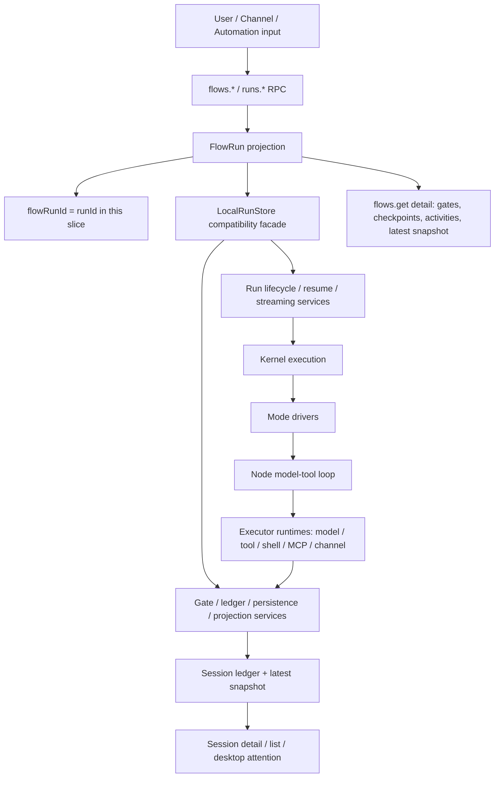
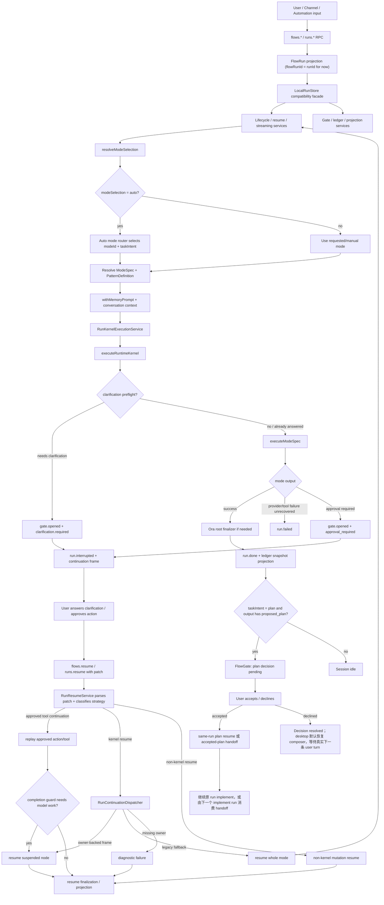
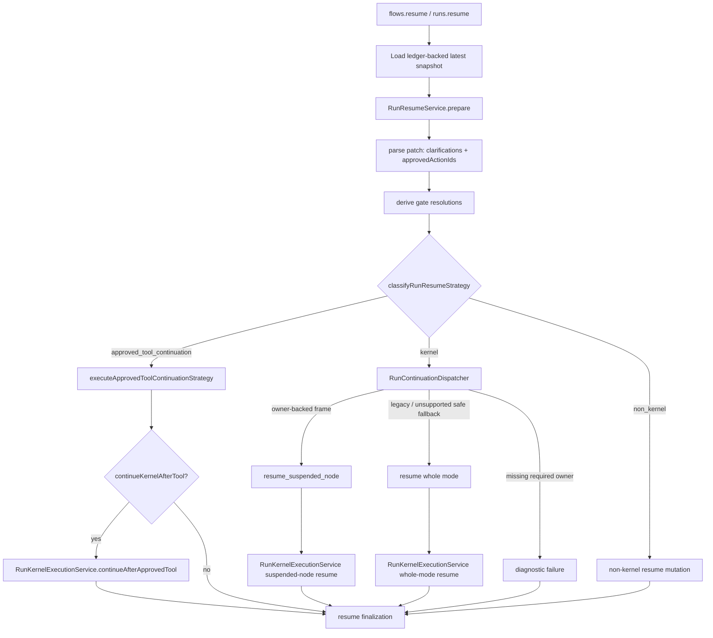
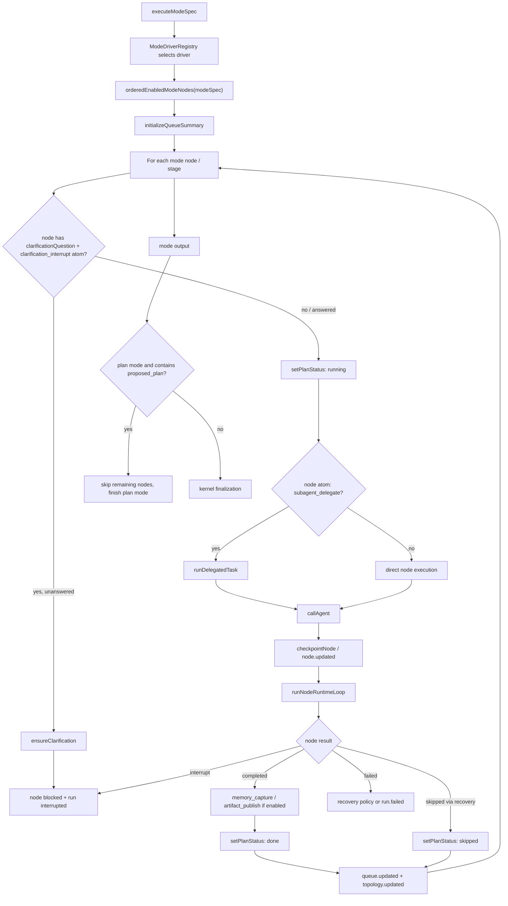
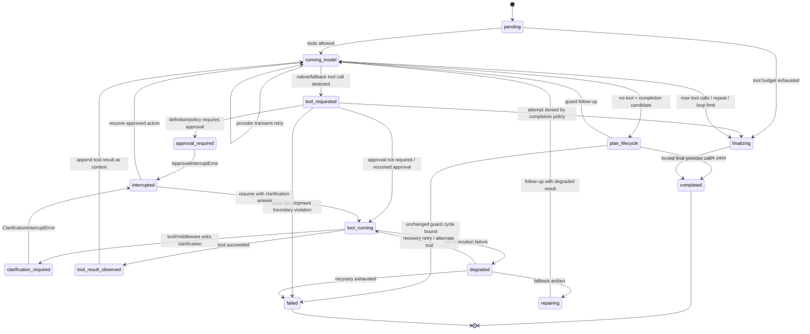
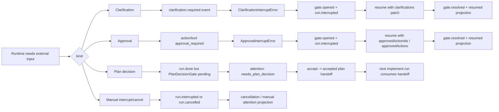
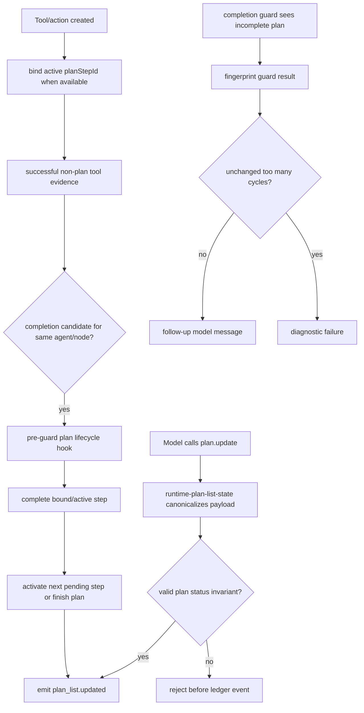

# Ora runtime loop 结构图

本文描述当前 Ora runtime loop 的主结构：Task Flow 兼容层、run 外层生命周期、continuation dispatcher、mode 编排层、单个 node 内部的 model-tool loop，以及 plan list、gate、streaming finalization 如何进入持久 projection。

> **最近更新 (2026-05-19)**：新增父/子协作状态投影（`childSessions` / `parentCoordination`）、background child lifecycle authority（`produced_output` / `awaiting_pickup` / `stalled`）、`agent.spawn` 的 tool bundle / result contract / `agent.wait`、child delta 协作面隔离，以及 `project_instructions` / 响应语言等 turn-local prompt 约束。

## 阅读地图

Ora 的 runtime loop 不是单一循环，而是几层边界叠在一起：

1. **Task Flow 兼容层**：`flows.*` 是 `runs.*` 上的 orchestration alias，`flowRunId` 当前等于 `runId`，不引入第二套持久状态。
2. **Run 生命周期层**：`LocalRunStore` 保持 public API facade，生命周期、resume、streaming、gate、ledger、projection 等服务负责具体边界。
3. **Resume / Continuation 层**：`RunResumeService` 先解析 resume patch、gate resolution 和 resume strategy；`RunContinuationDispatcher` 只负责根据 ledger-backed continuation frame 判断恢复 suspended node、whole-mode fallback，或给出 missing-owner diagnostic。approved tool continuation 的 replay 是 resume strategy 的一条路径，不是 dispatcher 自己执行。
4. **Mode 编排层**：`executeModeSpec` 按 mode nodes/stages 推进 agent 调用，并同步 plan、todo、queue、topology。
5. **Node 执行层**：`runNodeRuntimeLoop` 在单个 agent/node 内做模型调用、工具调用、审批、澄清、plan-list lifecycle、恢复和强制 finalization。

本轮实现还补上了一个新的可见性约束：

- 用户正文只消费父 Agent 的最终叙事。
- 子 Agent 的流式 delta 会被标记为 `audience/visibility = collaboration`，不再进入正文投影。
- 子 Agent 的低频结构事实通过 `child_session.updated` / `parent_coordination.updated` 进入 snapshot 与 ledger-backed projection，供 desktop 右侧协作区和 Trails 消费。

主要源码入口：

- `/apps/runtime/src/json-rpc.ts`：`flows.*` / `runs.*` RPC 入口。
- `/apps/runtime/src/run-store.ts`：兼容 facade，串起 start、resume、streaming、ledger、projection、session 更新。
- `/apps/runtime/src/run-start-service.ts`：run start 前置准备，包括 session、mode selection、memory prompt、runId、turnIndex。
- `/apps/runtime/src/run-resume-service.ts`：resume patch 解析、gate resolution、resume strategy 分类。
- `/apps/runtime/src/run-streaming-service.ts`：streaming live snapshot、event flush、AbortController 管理。
- `/apps/runtime/src/run-projections.ts`：Run / Flow projection，当前 `flowRunId = runId`。
- `/apps/runtime/src/run-continuation-dispatcher.ts`：基于 continuation frame 判断 suspended-node resume、whole-mode fallback 或 diagnostic failure。
- `/apps/runtime/src/run-kernel-execution-service.ts`：start / resume 进入 kernel 的服务边界，包含 suspended-node resume snapshot 准备。
- `/apps/runtime/src/run-resume-finalization-service.ts`：resume 后 terminal / interrupted / streaming failure 的 snapshot、ledger、persistence 收敛。
- `/apps/runtime/src/runtime-gate-service.ts`
- `/apps/runtime/src/runtime-gate-ledger-service.ts`
- `/apps/runtime/src/run-kernel-lifecycle.ts`
- `/apps/runtime/src/harness/runtime-kernel.ts`
- `/apps/runtime/src/harness/runtime-kernel-runner.ts`
- `/apps/runtime/src/harness/runtime-root-agent.ts`
- `/apps/runtime/src/harness/node-runtime-loop.ts`
- `/apps/runtime/src/harness/node-loop-transitions.ts`
- `/apps/runtime/src/harness/runtime-tool-call-service.ts`
- `/apps/runtime/src/harness/runtime-tool-recovery-service.ts`
- `/apps/runtime/src/harness/runtime-clarifications.ts`
- `/apps/runtime/src/harness/runtime-interrupts.ts`
- `/apps/runtime/src/patterns/driver-registry.ts`
- `/apps/runtime/src/patterns/mode-driver-registry.ts`
- `/apps/runtime/src/patterns/generic-node-executor.ts`
- `/apps/runtime/src/patterns/mode-driver-helpers.ts`
- `/packages/shared/src/actions.ts`
- `/packages/shared/src/runtime.ts`
- `/packages/shared/src/assistantTextProjection.ts`
- `/packages/shared/src/runtime-ledger.ts`
- `/packages/shared/src/runtime-timeline.ts`

## 0.1 Prompt / Cache 边界

从 2026-05-19 起，Ora 在 runtime loop 中把 prompt 上下文明确分成四层：

1. **Stable system prefix**
   - `project_instructions`
   - `agent_profile`
   - `operating_protocol`
   - `turn_local_metadata_guidance`
   - `tool_protocol` / `skills_guidance`
2. **Volatile system suffix**
   - 仍然必须走 system、但会变化的低频说明
3. **Append-only conversation history**
   - 历史 user / assistant / tool 消息
4. **Current-turn metadata**
   - 以 `<turn_local_metadata>` 形式前缀到当前 user message
   - 包含当前日期时间、时区、locale、clarifications、attachments 等高波动信息

这层拆分的目的不是“让 prompt 更好看”，而是让 DeepSeek / OpenAI-compatible provider 能在字节级 prefix cache 上尽量保持长前缀稳定。几个执行规则：

- 当前时间、当前用户消息 excerpt、当前轮附件摘要、clarifications 不再进入 system prompt。
- runtime 保存的 `input.prompt` 仍然是原始用户输入；模型可见的 `<turn_local_metadata>` 在当前轮装配时注入，并在 `run-store` 重建历史 context 时根据持久化的 `input.createdAt` / `input.context` 再生成相同字节。
- `node-runtime-loop` 会在每次 provider 请求前发出 `cache_diagnostics` 型 `node.updated`，记录 stable prefix / volatile suffix / turn metadata / tools 的 hash 和变化来源。
- `openai-compatible` / `openai` provider 在请求线上会把 `stableSystemPrefix` 与动态 system tail 拆成独立 developer/system message，避免逻辑层的 stablePrefix 停留在“只存在于中间对象里”。

## 0. Task Flow、Run、Session 的边界



这一层的重点是所有 flow 概念都先映射到现有 run 基础设施。`FlowRun` 是当前 `StateSnapshot` 和 run projection 的编排视角，`FlowGate` 来自现有 clarification、approval、plan decision 和 cancellation projection。Session 仍然是用户看到的对话容器，flow/run 是持久执行身份。

## 1. 外层 run lifecycle



外层循环的关键点：

- `flows.*` 是当前 `runs.*` 的兼容 alias。它暴露 flow vocabulary，但不改变 `runId`、session UX 或持久格式。
- `LocalRunStore` 现在更像兼容 facade。kernel 执行、resume finalization、gate lifecycle、ledger append、persistence 和 projection 已经拆到更窄的服务边界。
- `resolveModeSelection` 先把输入解析成确定的 `ModeSpec`、`PatternDefinition` 和完整 `RunConfig`。
- `modeSelection: "auto"` 会调用 auto mode router，选择 `modeId`，并在 `taskIntentMode: "auto"` 时推断 `taskIntent`。
- 普通 start 由 `RunStartService` 准备 session、mode、memory prompt、runId 和 turnIndex，再通过 `RunKernelExecutionService` 进入 `executeRuntimeKernel`。
- resume 先由 `RunResumeService` 解析 patch、clarification、approved actions 和 gate resolution，并分类为 kernel resume、approved tool continuation 或 non-kernel resume。
- kernel resume 会通过 kernel execution 边界进入 `executeRuntimeKernel`，额外带入 clarification patch、approved action ids、approved actions 和上一轮 resume state。
- kernel 捕获 `ClarificationInterruptError` 和 `ApprovalInterruptError` 后，把 run 标记为 `interrupted`，写入 `continuation` frame，并通过 gate ledger 写入 durable gate facts。
- resume 不再默认等同于 broad mode restart。`RunContinuationDispatcher` 只处理 continuation ownership：owner-backed frame 优先恢复记录的 agent/node；legacy approval/clarification frame 可以 whole-mode fallback；缺少 owner metadata 的危险 frame 会进入 diagnostic failure。
- approved tool continuation 不由 dispatcher 执行。当前路径是 `RunResumeService.classifyRunResumeStrategy` 识别 approved continuation action，`executeApprovedToolContinuationStrategy` replay action/tool，必要时再由 `RunKernelExecutionService.continueAfterApprovedTool` 继续恢复 owner node。
- plan 模式输出完整 `<proposed_plan>` 后，run 本身可以先是 `succeeded`，但 session attention 会变成 `needs_plan_decision`。accepted plan 现在可通过 `planDecisionResolutions` 回到原 run same-run resume；accepted-plan handoff 仍保留为兼容路径。

## 1.1 Resume strategy 和 continuation dispatcher



Resume 分两层看更准确。`RunResumeService` 是 strategy 边界，负责解析 patch、找出 gate resolution，并判断这次 resume 是 kernel work、approved tool continuation，还是 non-kernel mutation。`RunContinuationDispatcher` 只处理 kernel resume 里的 continuation ownership：它读取 `continuation.activeFrameId`，根据 frame 的 `agentId`、`nodeId`、`planItemId`、pending action/tool/clarification ids、conversation cursor 和 node checkpoint metadata，决定恢复暂停的 agent/node、退回 whole-mode resume，或给出 missing-owner diagnostic。

Owner-backed frame 能恢复到暂停的 agent/node；ownerless legacy approval/clarification frame 可以走 whole-mode fallback；ownerless manual/tool-interrupted frame 不能安全恢复，会以可见 diagnostic failure 结束。Approved tool continuation 是另一条 strategy：先 replay 已批准的 action/tool，如果 completion guard 仍然需要模型工作，再回到 owner node。

## 2. Mode 编排层



Mode 编排影响 loop 的方式：

- mode 决定 `nodes`、`profiles`、`stages`、`runtimeAtoms`、tool/skill scope、默认 budget、completion policy 和 recovery policy。
- `ModeDriverRegistry` 当前注册的 built-in family 包括 `generator_verifier`、`orchestrator_subagent`、`agent_teams`、`message_bus`、`shared_state`。staged transcript 是 `orchestrator_subagent` driver 内部的一条执行形态，不是独立 family。
- 每个 node 进入 `runGenericModeNode` 时会更新 plan/todo/queue 状态，运行结束后再同步 topology 和 queue。
- built-in pattern drivers 通过 `runGenericModeNode` 记录 node-level bag checkpoint。Continuation resume 可以用这些 checkpoint 判断如何恢复 owner-backed suspended node，而不是从 mode 入口重新跑旧节点。
- 带 `clarification_interrupt` atom 的 mode/node 可以在执行前或执行中主动挂起，等待用户补充信息。
- 带 `subagent_delegate` atom 的 node 会通过 delegated task 事件显式标记任务委派。
- 带 `dynamic_delegation` atom 的 `orchestrator_subagent` mode 会让 decompose 节点输出 `<delegation_plan>`，driver 解析后用 `skipNodeIds` 跳过不需要的 research/review 节点，并把 `research_focus` / `review_focus` 注入对应 subagent 的 system prompt。解析失败时安全回退为所有节点正常执行。
- `dynamic_orchestrator` 是基于 `orchestrator_subagent` family 的系统预设 mode，不是新 family。它保留固定节点的 owner/risk/approval 边界，只把“是否执行该 subagent、执行时聚焦什么”交给 runtime delegation plan。
- plan 模式中一旦产出完整 `<proposed_plan>`，后续 node 可以被跳过，避免计划已经完备后继续跑无关阶段。

## 3. 单个 node 的 model-tool loop



`NodeRuntimeLoopState` 当前包括：

- `pending`
- `running_model`
- `tool_requested`
- `tool_running`
- `tool_result_observed`
- `repairing`
- `finalizing`
- `completed`
- `degraded`
- `interrupted`
- `failed`

状态转换不只是散落在 emit 里。`node-loop-transitions.ts` 里的 `NodeLoopController` / reducer 会校验核心转换路径，非法转换会发 `node_loop_transition` runtime diagnostic，默认在关键路径上抛错。图里的 `plan_lifecycle` 是 completion guard 前的概念性 hook，不是 `NodeRuntimeLoopState` 的持久状态值。源码里的状态转换仍然从 `running_model` 进入 `completed`、`running_model` follow-up 或 `failed`。

内层循环的关键点：

- provider 支持 native tools 时优先走 native tool call；否则从文本里解析 JSON fallback tool call。
- 每次工具调用都会注册 completion attempt，用于限制重复调用、工具预算、loop safety limit。
- 工具执行走 definition-first registry。`RuntimeToolCallService` 负责普通工具调用 orchestration，definition 和 policy hook 决定风险、审批 copy 和执行行为。
- 高风险、manual approval 或 policy hook 要求审批时，工具 action 会进入 approval gate；未批准时抛 `ApprovalInterruptError`。
- 工具或 middleware 需要用户信息时，通过 `ensureClarification(s)` 抛 `ClarificationInterruptError`。
- 工具成功后，结果会被写回 messages，然后继续下一次模型调用。
- 自然完成候选进入 completion guard 前，runtime 会先运行 plan-list lifecycle hook。它只基于当前 agent/node 的 successful non-plan tool evidence 推进 active step，不从纯文本语义猜测完成状态。
- completion guard 会对 unchanged `plan_list.incomplete` 结果做 fingerprint 计数，重复无进展超过边界后失败，避免无限发出同一条继续运行提示。
- **Final output guard**：所有工作状态守卫通过后，`finalOutputGuard` 检查最终回答的文本是否为空。如果 post-tool 响应为空，runtime 触发恰好一次 no-tools 修复轮次；修复后仍为空则 fail。这防止了"工具已完成但最终回答丢失"的静默完成。
- **Terminal state integrity guard**：`assertRunCanBecomeTerminal()` 在所有写入 `run.done` / `run.failed` 的路径上检查不存在 open gate、pending approval、unresolved action/tool call 或 active continuation frame。违反时降级为 `run.failed` 并附加 `TerminalStateIntegrityError`。Ledger projection 层同步检测矛盾组合（如 `succeeded + open_approval_gate`），降级 attention 为 `failed` 并附带 integrity diagnostic。
- 工具执行失败后进入 `RuntimeToolRecoveryService`：可 retry、alternate tool、fallback artifact，或最终 fail。这个 recovery surface 只允许从 `tool_running` 进入 `degraded`。
- 工具结果已经记录后，follow-up model/provider 的 transient 或 busy failure 留在 `running_model` phase，由 provider recovery 重试同一个 model request，不会重跑已经成功的工具。
- 如果非 tool-running phase 错误进入 tool recovery boundary，runtime 会发 `tool_recovery_boundary` diagnostic 并停止这条错误恢复路径，不会放宽成 `running_model -> degraded`。
- 当工具预算耗尽、重复调用被拦截或 runtime loop limit 到达时，进入 forced final answer，禁止继续调用工具。

## 中断、澄清、审批、决策的区别



Important distinction:

- **Clarification/approval** 会中断当前 kernel run，并依赖 `flows.resume` / `runs.resume` 回到同一个 kernel loop。
- **Plan decision** 不一定中断 run；它通常发生在 plan run 成功之后，是 session-level gate。
- **Attention** 是 UI/会话层看到的阻塞状态。当前实现从 ledger-backed snapshot 和 gate projection 推导 attention，再供 session detail、session list、latest snapshot、desktop sidebar/chat/timeline 使用。clarification、approval、plan decision 和 cancellation 都应该表现为 durable gate/projection 事实，不能只依赖 UI 本地状态。

## Mode 编排对 loop 的影响清单

| 机制 | 影响 |
| --- | --- |
| `modeSelection` | manual 直接使用请求模式；auto 先用 router 选择 mode 和 task intent。 |
| `taskIntent` | chat/plan/implement 会改变系统提示、是否允许修改、是否生成 plan decision、是否消费 accepted plan。 |
| `runtimeAtoms` | 开启 clarification interrupt、recovery policy、memory capture、artifact publish、delegation、dynamic delegation、message bus、shared state 等能力。 |
| `profiles` | 决定 agent 身份、工具集合、skill 集合和 system overlay。 |
| `nodes/stages` | 决定 mode 的执行顺序、handoff、stage transcript 和 plan/todo 进度。 |
| `capabilityFlags.toolIds` | 决定 agent 可用工具；部分 mode 会禁用默认 web tools 或启用特定工具。 |
| `completionPolicy` | 影响工具预算、重复调用限制、forced final answer。 |
| `approvalMode` | auto/high_risk_only/manual 决定 action 是否进入审批 gate。 |
| `recoveryPolicy` | provider failure 在 model phase 内 retry/fail；tool execution failure 才进入 retry、alternate tool、fallback artifact 或 fail。 |
| `memoryPolicy` | mode 含 long-term memory atom 时可注入 active memory，并在 run 后更新 memory。 |

## Plan list 生命周期



`plan.update` 的 wire shape 仍然是 `{ explanation?, plan: [{ id?, step, status }] }`。`id` 可选；缺失时 runtime 会按 step 和 index 生成稳定 id。事件进入 ledger 前会先验证和 canonicalize。未完成的 plan list 必须有且只有一个 `in_progress` step，全部完成时才允许没有 active step。

Runtime 也会给 plan step 生成稳定 id，并把新的 action/tool call 绑定到当前 active `planStepId`。Node loop 在 completion guard 前检查当前 agent/node 的 successful non-plan tool evidence；如果证据绑定到 plan step，就优先推进这个 step，否则只在存在单一 active step 时推进。这个 hook 不根据自然语言猜测任务完成，只处理已有工具生命周期证据。

## Scoped runtime events

Agent/tool context 里发出的 runtime event 应该带上执行上下文。`RuntimeToolCallService` 这类已知 `{ agentId, nodeId }` 的边界会用 scoped emitter 给缺失的 event metadata 补默认 attribution，同时保留调用方显式传入的 `agentId` / `nodeId`。

这条规则尤其影响 `plan.update`。模型调用 `plan.update` 后产生的 `plan_list.updated` 是执行 agent 的事件，不是 root/system 事件；desktop timeline 和 trail projection 应该消费 runtime 给出的 attribution，而不是靠前端推断上一条 agent。

## Root agent topology 和 Ora finalizer

多 agent mode 会显式注入 root agent topology：`runtime-root-agent.ts` 会把拓扑改成 `run -> ora -> handoffTarget`。Root agent 不是普通 worker，它承担入口、auto router、clarification owner、handoff parent、observer 和最终用户回复的职责。

当 selected mode 返回结果后，`runtime-kernel.ts` 里的 Ora finalizer 会把 mode output 改写成最终面向用户的回答。两个场景会跳过这一步：`single_agent` mode 直接返回 node output；`taskIntent = "plan"` 且 mode output 已包含完整 `<proposed_plan>` 时，直接保留计划输出，避免 finalizer 破坏计划协议。

**Fast Solo 终态收敛**：`single_agent` mode（Fast Solo）复用 `orchestrator_subagent` family 是设计选择，但 terminal event（`run.done` / `run.failed` / `run.cancelled`）会显式清空 `activeAgents`、收敛 `queueSummary` 的 `pending`/`inProgress` 为 0。Ledger fallback 不再为 `single_agent` 硬编码 `activeAgents: ["orchestrator"]`，而是根据 run config/modeId 推导。这确保回答完成后 UI/Trails 不会残留 orchestrator 仍在运行的假象。

## Ledger 和 streaming finalization

### 事件分类三级模型

流式事件不再只有二元（delta / non-delta）区分，而是三级分类：

| 类别 | 描述 | flush 行为 | Zod parse | 典型事件 |
| --- | --- | --- | --- | --- |
| `delta` | 用户可见的增量内容 | publish-first | 否（直接拼接） | `message.delta`, `token.delta` |
| `passive_accumulation` | 无状态变更的累积更新 | 跳过 flush，仅累积在内存 | 否 | `node.updated`, `context.usage.updated`, `agent.message`（纯累积） |
| `durable_projection` | 影响 durability 的状态变更 | 即时 flush | 是（关键字段） | `tool_called`, `action.updated`, `run.done` |

**被动事件快路径**：`passive_accumulation` 类事件（如高频的 `node.updated`、`context.usage.updated`）完全不触发 Zod parse、ledger flush 或数组复制。它们仅在内存中累积状态更新，避免了 O(n) 的每事件投影开销。Desktop 端的 `APPLY_RUN_STREAM` reducer 对纯被动流事件也实施早期退出。

**Durable boundary 智能 flush**：`durable_projection` 类事件中，仅关键状态变更（`approval_required`、`completed`、`failed`）触发即时 flush。非关键 durable 事件按批次延迟 flush。

**每事件投影次数削减**：原先每个 work projection 事件执行 4 次 Zod parse，优化后降至 1 次（复用 parsed snapshot，仅在状态确实变更时重新 parse）。

### Event batch 分层与发布策略

`RunStreamingService` 还维护 per-run `AbortController`，`runs.interrupt` / `runs.cancel` 会 abort active controller，并把 signal 传给 kernel、node loop 和 provider request。Runtime maintenance 可以把超过 `staleRunningMs` 的 stale queued/running ledger projection 收敛成 terminal failed run。

### Completion Guards 与 Final Output

run 能否自然完成进入三阶段 completion guard 检查：

1. **Plan-list lifecycle**：基于当前 agent/node 的 successful non-plan tool evidence 推进 active step，不从纯文本语义猜测完成状态。
2. **Pending work guard**：验证无 pending action、approval、tool call、plan step 或 runtime work 残留。
3. **Final output guard**（`finalOutputGuard`）：验证最新模型回复在修剪后包含足够长度的用户可见文本。新增 `MIN_VISIBLE_CONTENT_LENGTH = 60` 字符阈值——短于 60 字符的响应即使非空也视为截断并触发一次修复轮次。若 post-tool 回复为空，触发 one-shot `toolChoice: "none"` repair turn；若 repair 同样返回空结果或仍短于阈值，run 以 `failed`/degraded 终止并附带具体错误。

Final output guard 为结构性检查，不依赖中文/英文的"未完成引言"短语匹配。同时，kernel 不再对空模型回复发出 `message.delta` / `token.delta`，避免把空响应误渲染为有意义的输出。注意：良性短回复（如"巴黎是法国的首都"）也会触发修复——这仅增加一次 API 调用，不会造成功能性损害。

### Terminal State Invariant

所有 terminal writer（kernel finalization、resume finalization、non-kernel resume）必须通过共享的 `assertRunCanBecomeTerminal()` 断言门。该门验证：状态为 terminal（`succeeded`/`failed`/`cancelled`）时，不得有 open gate、pending action/tool-call/clarification 残留。违反时抛出 `TerminalStateIntegrityError`，并降级为 `run.failed` 带诊断信息。

Ledger projection 层也有对应的非法状态处理：`deriveLedgerRunAttention` 在 terminal status 与 open gate 共存时，将 attention 降级为 `failed` 并附加 `terminal_run_with_open_gates:<status>` 诊断，防止 auto_review 权限模式切换等场景产生半解决状态但仍渲染为成功。

### 长任务输出治理

长任务（20+ 轮工具调用）后正文输出卡顿由三层问题叠加，治理方案也分三层：

| 层 | 根因 | 治理 |
| --- | --- | --- |
| 上下文膨胀 | 工具结果全量 JSON 入上下文，无截断 | `tool-result-truncation.ts`：按 2000-token 预算做 50/50 头尾截断，注入到 `runtime-tool-call-service.ts` |
| Mid-turn 无压缩 | `runtime-middleware.ts` 检测超限后跳过（仅 emit `compaction.skipped`） | `message-context-truncation.ts`：回溯截断历史工具结果（保留最近 3 条，其余按 800-token 预算截断） |
| 前端放大慢感 | 每 delta 触发全量 timeline 投影 + ReactMarkdown 全量重解析 | `viewModel.ts` 对 `deriveRuntimeTimelineProjection` 用 WeakMap 缓存；`MarkdownRenderer` 200ms 流式节流 + 段落/收尾即时刷新 |

最终 assistant text 的读取边界也在这一层收敛：终态 snapshot 的 `output.text` / string output 是权威最终文本；缺失时才通过 `packages/shared/src/assistantTextProjection.ts` 从 public `message.delta` 投影。投影 helper 同时处理 delta-sized chunk、cumulative content、重复片段和 internal/tool-protocol 文本过滤。runtime 的 session transcript/title/memory/feedback/channel outbound、shared 的 branch preview / proposed plan 提取、desktop fallback 都应复用这条规则，而不是各自扫描 `snapshot.events`。

## 特殊路径

### Code Development boundary

`code_development` mode 下，orchestrator 不能执行 mutation 类工具，例如：

- `file.write`
- `file.patch`
- `file.apply_patch`
- `file.delete`
- `modes.applyDraft`
- `selfIteration.apply`
- `skills.create`
- `skills.update`
- `skills.setEnabled`
- 高风险 `shell.execute`

orchestrator 负责计划和协调，实际代码修改必须落到 builder 阶段。

### Dynamic orchestrator delegation

`dynamic_orchestrator` 预设复用 `orchestrator_subagent` family，并通过 mode-scope atom `dynamic_delegation` 改变 driver 执行策略：

1. decompose 节点 prompt 追加 `DELEGATION_PLAN_INSTRUCTION`，要求输出 `<delegation_plan>`。
2. `parseDelegationPlan` 解析 `research: enabled|disabled`、`review: enabled|disabled` 以及可选 focus。
3. driver 用 `skipNodeIds` 让 `runGenericModeNode` 跳过 disabled 的 subagent 节点。
4. enabled 的 research/review 节点会收到 `<orchestrator_focus>` system prompt overlay。
5. 如果 research 和 review 都被跳过，synthesize 节点直接基于原任务和 decompose 结果产出最终回答。
6. 解析失败或输出不完整时不跳过任何节点，保持原 orchestrator_subagent 的安全回退行为。

这条机制只影响 mode driver 的节点执行选择，不改变 node 的 `ownerAgentId`、`riskLevel`、`approvalMode`，也不新增 ledger entry 类型。跳过结果仍通过已有 plan/todo/queue/topology/snapshot 事实对外呈现。

### Agent-as-Tool 动态 spawn

除了 mode driver 层面的 `subagent_delegate` 和 `dynamic_delegation`，Ora 支持 agent 在运行时通过 `agent.spawn` 工具动态创建子 agent：

- `agent.spawn` 是一个普通 Runtime Tool，agent 可以在 model-tool loop 中直接调用。
- 子 agent 复用现有 `callAgent()` / `runNodeRuntimeLoop()` 基础设施，与 mode driver 编排的 agent 使用相同的执行路径。
- 同步模式（默认）：父 agent 等待子 agent 完成，子 agent 的输出文本作为 tool result 返回。
- 异步模式（`run_in_background: true`）：父 agent 继续执行，子 agent 完成后通过通知注入。
- runtime 内部保留最大深度计数（`MAX_SPAWN_DEPTH = 3`），但当前 nested subagent 会受 `isNestedAgentSpawn` 工具边界约束，默认不能再次调用 `agent.spawn`。
- 子 agent 可选择注入父 agent 最近一次任务 prompt；并非自动继承父 agent 的完整对话。也可以通过内联 profile 定制工具集和 persona。
- Agent 间可通过 `message.send` 工具发送消息，实现通信协调。

这与 mode driver delegation 是互补关系：mode driver 提供模式级别的结构性编排，`agent.spawn` 提供运行时级别的动态灵活性。

### 动态 subagent 调用链路

这里需要区分两类 subagent：

- **mode driver 固定 subagent**：例如 `orchestrator_subagent` family 中的 `researcher` / `reviewer`，由 mode topology 和 node owner 预先定义。
- **runtime tool 动态 subagent**：由运行中的 agent 通过 `agent.spawn` 临时创建，属于 agent-as-tool delegation。

动态 spawn 的真实调用链是：

1. 父 agent 在 model-tool loop 中产出 `agent.spawn` tool call。
2. `runtime-tool-executor` 解析 `description`、`prompt`、`agent_type`、`run_in_background`、`inherit_context`、`system_prompt`、`tool_ids`、`tool_bundle`、`result_contract`。
3. `runtime-kernel.setSpawnAgent()` 校验 profile、分配 `effectiveAgentId`，并写入 `child_session.updated` / `parent_coordination.updated`。
4. 无论是 mode driver 固定 subagent，还是 `agent.spawn` 动态 subagent，最终都统一进入 `callAgent() -> runNodeRuntimeLoop()`。

子 agent 的“目标”不是独立 `goal` 字段，而是由以下输入共同表达：

- `description`：短标题，主要用于 child session / UI 展示。
- `prompt`：子任务主体，必须是自包含描述。
- `agent_type`：可选，指定复用现有 agent profile；未提供时会走 root profile 的 synthetic subagent。
- `system_prompt`：可选，覆盖默认 profile system prompt。
- `tool_ids`：可选，高级覆盖用；会收窄子 agent 可用工具。
- `tool_bundle`：首选的职责型工具面，映射到维护好的只读研究 / 取证 / review / builder 工具集合。
- `result_contract`：子结果契约，决定 runtime 如何验证 child 输出是否真的可消费。

上下文继承的当前实现也需要精确理解：

- 默认不会把父 agent 的完整 conversation 自动共享给子 agent。
- `inherit_context: true` 时，当前实现只会把父 agent 最近一次 `lastCallAgentPrompt` 包进 `<inherited-context>` 后再拼接到子任务 prompt 前面。
- `lastCallAgentSystem` 当前虽然会被记录，但不会一起注入子 agent；因此 `inherit_context` 的实际能力弱于字面文案。

回传路径现在分成四条：

- **同步回传**：子 agent 输出文本直接作为本次 `agent.spawn` 的 tool result 返回给父 agent。
- **异步回传**：`run_in_background: true` 时，后台结果先写入 async result 队列，并把 child session 投影到 `awaiting_pickup`。
- **显式 fan-in**：父 agent 可以后续调用 `agent.wait`，按全部 active child 或指定 child ids 收集结构化结果 envelope。
- **消息回传**：`message.send` 和 `emitAgentMessage` 都会把内容写入目标 agent 的消息队列，目标 agent 下次执行时注入 `<agent-messages>`。

```mermaid
sequenceDiagram
    participant Parent as Parent Agent
    participant Loop as Model / Tool Loop
    participant Spawn as agent.spawn
    participant Exec as Runtime Tool Executor
    participant Kernel as Runtime Kernel
    participant Sub as Subagent
    participant MsgQ as Message Queue
    participant AsyncQ as Async Result Queue
    participant Snap as Snapshot / Events
    actor UI as UI

    Parent->>Loop: Produce tool call
    Loop->>Spawn: agent.spawn(args)
    Spawn->>Exec: execute(args, context)
    Exec->>Kernel: spawnAgent(...)
    Kernel->>Snap: child_session.updated
    Kernel->>Snap: parent_coordination.updated
    Snap-->>UI: Project child session / coordination state

    alt Synchronous spawn
        Kernel->>Sub: callAgent() -> runNodeRuntimeLoop()
        Sub-->>Kernel: text result
        Kernel-->>Exec: return text
        Exec-->>Spawn: tool result
        Spawn-->>Loop: tool result
        Loop-->>Parent: Continue with subagent output
    else Background spawn (run_in_background = true)
        Kernel-->>Exec: { status: async_launched }
        Exec-->>Spawn: async_launched
        Spawn-->>Loop: async_launched
        Loop-->>Parent: Continue without waiting
        Kernel->>Sub: drainAsyncSpawnQueue() later
        Sub-->>Kernel: text result
        Kernel->>AsyncQ: enqueueAsyncAgentResult()
        Kernel->>Snap: child_session.updated(awaiting_pickup)
        Parent->>Loop: agent.wait(...) later
        Loop->>Exec: agent.wait(args)
        Exec->>Kernel: collect async child results
        Kernel->>Snap: child_session.updated(consumed)
        Exec-->>Loop: structured child result envelope
    end

    opt Message delivery path
        Parent->>Loop: message.send(...) or emitAgentMessage(...)
        Loop->>Kernel: enqueueAgentMessage(...)
        Kernel->>MsgQ: write queued message
        Kernel->>Snap: agent.message
        Snap-->>UI: Render agent message transcript/event
        Note over MsgQ,Sub: On target agent's next callAgent(), runtime injects<br/>messages into &lt;agent-messages&gt;
    end
```

图中有两个实现事实需要特别注意：

- `agent.spawn` 动态 subagent 和 mode driver 固定 subagent 最终复用同一个 `callAgent() -> runNodeRuntimeLoop()` 执行通道。
- runtime 内部虽然保留 `MAX_SPAWN_DEPTH` 计数，但当前 nested spawn 还会被 `isNestedAgentSpawn` 工具边界拦住，因此 subagent 默认不能继续调用 `agent.spawn`。

### Background child lifecycle

后台 child 现在不再只靠 `queued/running/succeeded` 这种粗粒度状态描述。`ChildSessionSummary` 已经显式区分：

- `queued`
- `running`
- `produced_output`
- `awaiting_pickup`
- `picked_up`
- `succeeded`
- `failed`
- `cancelled`
- `stalled`

这里有两个容易混淆的边界：

- **`produced_output` 不等于完成**：child 已经有用户可见内容，但仍可能处在 recovery、follow-up 或 guard 阶段。
- **`awaiting_pickup` 不等于 running**：child 的有效结果已经回流，只是父 agent 还没通过 `agent.wait` 或等价 fan-in 路径消费。

当前 completion guard 也已经按 owner 收口：

- child 自己的完成条件只看本 agent 的 pending action / tool call / stalled 状态
- 不再允许一个 background child 因为别的 child 的 pending runtime work 而永远卡在 running
- stalled child 会进入显式恢复/升级路径，而不是继续伪装成普通 running

### 消息架构统一

原先存在两套独立的消息系统——`emitAgentMessage`（对 UI 可见但未投递到 agent）和 `message.send`（投递成功但 UI 不可见）。现已统一为单通道：

- **emitAgentMessage**：对所有有 `toAgentIds` 的类型自动入队（actor 系统投递）。不再仅 emit event，而是确保消息实际到达目标 agent。
- **message.send** 工具：同步发出 `agent.message` 事件作为 UI 可见事件，同时执行 actor 投递。这打通了 UI 可见 + 投递双通道。
- **agent.message 事件分类**：此事件被分类为 `passive_accumulation`（而非 `durable_projection`），不触发 Zod parse 或 ledger flush，确保高频 agent 间通信不成为性能瓶颈。

### 流式延迟标记

流式链路新增跨层延迟标记，用于区分各层的延迟贡献。`RunEventStream` 携带可选的 `latency` 字段，在各关键节点打标记：

| 层 | 打标点 | 路径 |
| --- | --- | --- |
| Provider | provider 响应到达时 | `run-streaming.ts` |
| Runtime transport | stdio 写入前 | `stdio.ts` |
| Tauri bridge | sidecar 读取/发送 | `sidecar.rs` |
| Desktop receive | 监听器接收 | `App.tsx` |
| Desktop flush | 批处理刷新 | `App.tsx` / `state.tsx` |

所有 marks 合并入 `latency.marks`，通过 Trail 面板的 Latency 标签页可视化。Desktop 端在 `trailViewModel.ts` 中额外提供 5 段传输/UI 延迟分段。

### Plan card 流式

Plan 模式下含有 `<proposed_plan>` 的 session 输出现在支持流式传输期间即时显示 PlanCard——不需等待整个输出完成。关键改动在 `overlayLiveMessageDeltas()` 中：

1. 流式传输期间检测 `<proposed_plan>` 标签
2. 首次检测到时立即更新 `hasProposedPlan`、`proposedPlanStatus` 和 `activeLoadingTarget`
3. 新增 `extractProposedPlanBody` 辅助函数提取计划正文

这确保用户在流式传输中就能看到计划的结构化卡片，而非等待全部 token 到达后才渲染。

### Accepted plan handoff

plan run 输出 `<proposed_plan>` 后：

1. snapshot 归一化时生成 pending `PlanDecisionGate`。
2. 用户 accept 后，session ledger 记录 `handoff.accepted_plan`。
3. accepted plan 现在有两条路径：
   - 主路径：通过 `planDecisionResolutions` 回到原 run，切成 implement 语义继续执行
   - 兼容路径：下一次 `taskIntent: "implement"` 的 run 把 accepted plan 注入 conversation context
4. 兼容 handoff 路径下，implement run 启动后会把 handoff 标记为 consumed，避免重复消费。

### Resume continuation

当 run 因 clarification、approval、manual interrupt 或 tool interrupt 暂停：

1. kernel 创建 `continuation.activeFrameId`。
2. frame 记录 pending action/tool/clarification ids、agent、node、plan item、conversation cursor 和可用的 node checkpoint。
3. resume 时，`flows.resume` / `runs.resume` 把 clarification patch、approved actions 或 manual/tool continuation intent 交给 `RunResumeService`。
4. `RunResumeService` 先解析 patch、计算 gate resolutions，并分类为 kernel resume、approved tool continuation 或 non-kernel resume。
5. kernel resume 才进入 `RunContinuationDispatcher`，由它基于 frame reason、owner metadata、pending ids 和 checkpoint 判断 suspended-node resume、whole-mode fallback 或 diagnostic failure。
6. approved tool continuation 会先 replay action/tool；如果 replay 后仍需要模型继续工作，再通过 `RunKernelExecutionService.continueAfterApprovedTool` 回到 owner node。
7. gate ledger 记录 `gate.resolved`，resume finalization 负责最终 snapshot、ledger、persistence 和 session projection 收敛。

## 建议的文档呈现方式

推荐在架构文档或产品说明里分层画图，而不是合并为一张：

- Flow/Run/Session 边界图给产品和平台接口理解：为什么 flow 是持久执行身份，session 是用户对话容器。
- Run lifecycle 图给前端和 runtime 调用方理解：为什么有 running、interrupted、needs decision、resume。
- Mode 编排图给 mode 作者理解：mode spec 如何映射到 runtime 编排。
- Node loop 图给 runtime 工程理解：模型、工具、审批、澄清、恢复在一个 node 内如何循环。

如果要做交互式可视化，可以把边界映射成：

- **Flow lane**：flowRunId、linked sessions、gates、checkpoints、activities。
- **Run lane**：run status、attention、continuation frame、checkpoint、session ledger。
- **Mode lane**：node/stage、plan/todo、planStepId、queue/topology。
- **Agent lane**：model call、tool call、action approval、clarification、recovery。
