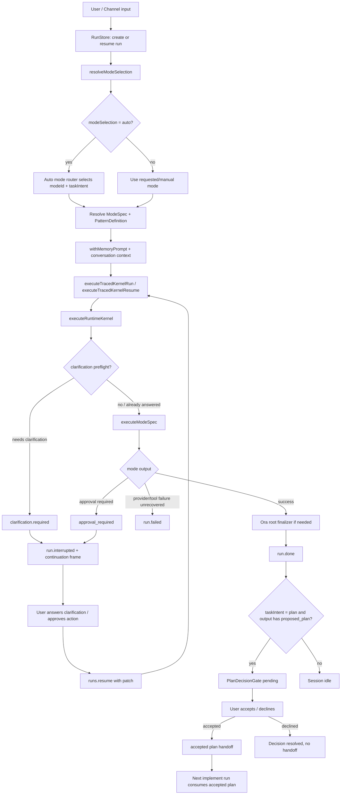
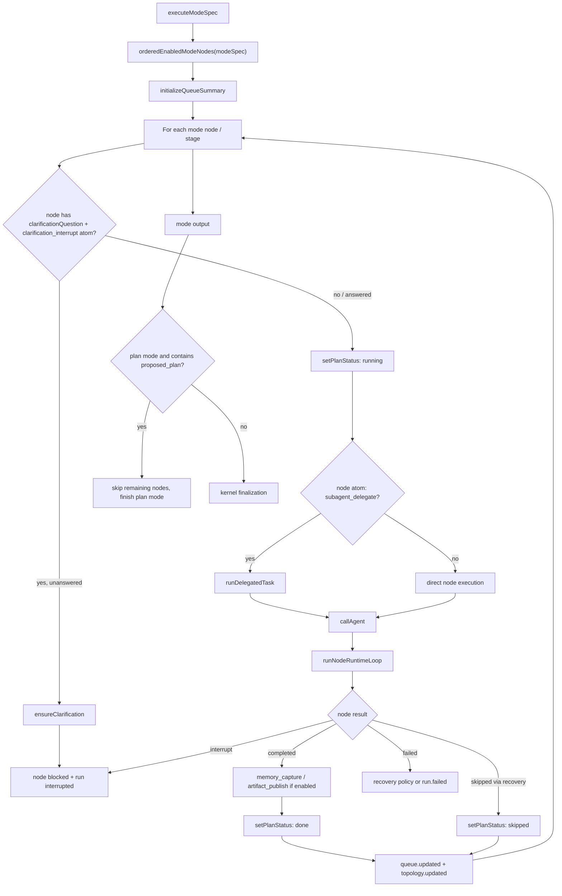
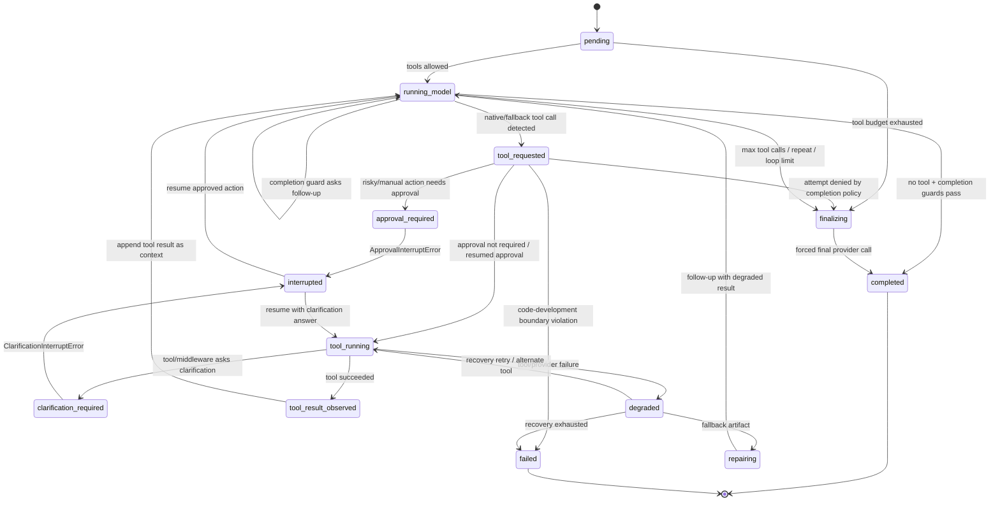
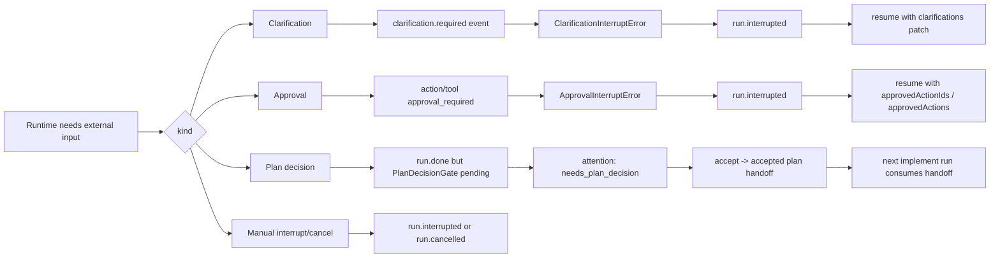

# Ora runtime loop 结构图

本文描述当前 Ora runtime loop 的主结构：run 外层生命周期、mode 编排层、单个 node 内部的 model-tool loop，以及中断、澄清、决策、mode 编排如何影响整个循环。

## 阅读地图

Ora 的 runtime loop 不是单一循环，而是三层嵌套：

1. **Run 生命周期层**：从用户输入开始，完成 mode selection、context/memory 注入、kernel 执行、interrupt/resume、plan decision handoff。
2. **Mode 编排层**：`executeModeSpec` 按 mode nodes/stages 推进 agent 调用，并同步 plan、todo、queue、topology。
3. **Node 执行层**：`runNodeRuntimeLoop` 在单个 agent/node 内做模型调用、工具调用、审批、澄清、恢复和强制 finalization。

主要源码入口：

- `/apps/runtime/src/run-store.ts`
- `/apps/runtime/src/mode-selection.ts`
- `/apps/runtime/src/run-kernel-lifecycle.ts`
- `/apps/runtime/src/harness/runtime-kernel.ts`
- `/apps/runtime/src/harness/node-runtime-loop.ts`
- `/apps/runtime/src/harness/runtime-clarifications.ts`
- `/apps/runtime/src/harness/runtime-interrupts.ts`
- `/apps/runtime/src/patterns/driver-registry.ts`
- `/packages/shared/src/runtime.ts`
- `/packages/shared/src/runtime-ledger.ts`

## 1. 外层 run lifecycle

外层循环的关键点：

- `resolveModeSelection` 先把输入解析成确定的 `ModeSpec`、`PatternDefinition` 和完整 `RunConfig`。
- `modeSelection: "auto"` 会调用 auto mode router，选择 `modeId`，并在 `taskIntentMode: "auto"` 时推断 `taskIntent`。
- `executeTracedKernelRun` 和 `executeTracedKernelResume` 都进入同一个 `executeRuntimeKernel`，resume 只是额外带入 clarification patch、approved action ids 和上一轮 resume state。
- kernel 捕获 `ClarificationInterruptError` 和 `ApprovalInterruptError` 后，把 run 标记为 `interrupted`，并写入 `continuation` frame。
- plan 模式输出完整 `<proposed_plan>` 后，run 本身可以是 `succeeded`，但 session attention 会变成 `needs_plan_decision`，等待用户接受或拒绝计划。

## 2. Mode 编排层

Mode 编排影响 loop 的方式：

- mode 决定 `nodes`、`profiles`、`stages`、`runtimeAtoms`、tool/skill scope、默认 budget、completion policy 和 recovery policy。
- `driver-registry.ts` 里的不同 driver 会把 mode 转成不同执行形态，例如 single owner、orchestrator/subagent、generator/verifier、agent teams、staged transcript。
- 每个 node 进入 `runNode` 时会更新 plan/todo/queue 状态，运行结束后再同步 topology 和 queue。
- 带 `clarification_interrupt` atom 的 mode/node 可以在执行前或执行中主动挂起，等待用户补充信息。
- 带 `subagent_delegate` atom 的 node 会通过 delegated task 事件显式标记任务委派。
- plan 模式中一旦产出完整 `<proposed_plan>`，后续 node 可以被跳过，避免计划已经完备后继续跑无关阶段。

## 3. 单个 node 的 model-tool loop

`NodeRuntimeLoopState` 当前包括：

- `pending`
- `running_model`
- `tool_requested`
- `tool_running`
- `tool_result_observed`
- `repairing`
- `finalizing`
- `completed`
- `degraded`
- `interrupted`
- `failed`

内层循环的关键点：

- provider 支持 native tools 时优先走 native tool call；否则从文本里解析 JSON fallback tool call。
- 每次工具调用都会注册 completion attempt，用于限制重复调用、工具预算、loop safety limit。
- 高风险或 manual approval 模式下，工具 action 会进入 approval gate；未批准时抛 `ApprovalInterruptError`。
- 工具或 middleware 需要用户信息时，通过 `ensureClarification(s)` 抛 `ClarificationInterruptError`。
- 工具成功后，结果会被写回 messages，然后继续下一次模型调用。
- 工具失败后先进入 recovery：可 retry、alternate tool、fallback artifact，或最终 fail。
- 当工具预算耗尽、重复调用被拦截或 runtime loop limit 到达时，进入 forced final answer，禁止继续调用工具。

## 中断、澄清、审批、决策的区别

Important distinction:

- **Clarification/approval** 会中断当前 kernel run，并依赖 `runs.resume` 回到同一个 kernel loop。
- **Plan decision** 不一定中断 run；它通常发生在 plan run 成功之后，是 session-level gate。
- **Attention** 是 UI/会话层看到的阻塞状态，由 `deriveRunAttention` 从 snapshot 的 pending clarifications、pending approvals、plan decisions、status 推导出来。

## Mode 编排对 loop 的影响清单

| 机制 | 影响 |
| --- | --- |
| `modeSelection` | manual 直接使用请求模式；auto 先用 router 选择 mode 和 task intent。 |
| `taskIntent` | chat/plan/implement 会改变系统提示、是否允许修改、是否生成 plan decision、是否消费 accepted plan。 |
| `runtimeAtoms` | 开启 clarification interrupt、recovery policy、memory capture、artifact publish、delegation、shared state 等能力。 |
| `profiles` | 决定 agent 身份、工具集合、skill 集合和 system overlay。 |
| `nodes/stages` | 决定 mode 的执行顺序、handoff、stage transcript 和 plan/todo 进度。 |
| `capabilityFlags.toolIds` | 决定 agent 可用工具；部分 mode 会禁用默认 web tools 或启用特定工具。 |
| `completionPolicy` | 影响工具预算、重复调用限制、forced final answer。 |
| `approvalMode` | auto/high_risk_only/manual 决定 action 是否进入审批 gate。 |
| `recoveryPolicy` | provider/tool failure 后决定 retry、alternate tool、fallback artifact 或 fail。 |
| `memoryPolicy` | mode 含 long-term memory atom 时可注入 active memory，并在 run 后更新 memory。 |

## 特殊路径

### Code Development boundary

`code_development` mode 下，orchestrator 不能执行 mutation 类工具，例如：

- `file.write`
- `file.patch`
- `file.delete`
- `modes.applyDraft`
- `selfIteration.apply`
- `skills.create`
- `skills.update`
- `skills.setEnabled`
- 高风险 `shell.execute`

orchestrator 负责计划和协调，实际代码修改必须落到 builder 阶段。

### Accepted plan handoff

plan run 输出 `<proposed_plan>` 后：

1. snapshot 归一化时生成 pending `PlanDecisionGate`。
2. 用户 accept 后，session ledger 记录 `handoff.accepted_plan`。
3. 下一次 `taskIntent: "implement"` 的 run 会把 accepted plan 注入 conversation context。
4. implement run 启动后会把 handoff 标记为 consumed，避免重复消费。

### Resume continuation

当 run 因 clarification 或 approval interrupted：

1. kernel 创建 `continuation.activeFrameId`。
2. frame 记录 pending action/tool/clarification ids、agent、node、plan item、conversation cursor。
3. resume 时，RunStore 合并 clarification patch 或 approved actions。
4. `executeTracedKernelResume` 重新进入 `executeRuntimeKernel`，同时传入上一轮 snapshot state。

## 建议的文档呈现方式

推荐在架构文档或产品说明里使用三张图，而不是合并为一张：

- 第一张给产品/前端理解：为什么有 running、interrupted、needs decision、resume。
- 第二张给 mode 作者理解：mode spec 如何映射到 runtime 编排。
- 第三张给 runtime 工程理解：模型、工具、审批、澄清、恢复在一个 node 内如何循环。

如果要做交互式可视化，可以把三层映射成：

- **Run lane**：run status、attention、checkpoint、session ledger。
- **Mode lane**：node/stage、plan/todo、queue/topology。
- **Agent lane**：model call、tool call、action approval、clarification、recovery。

