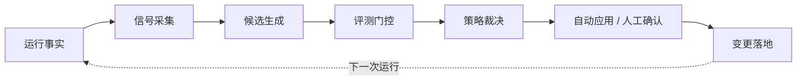
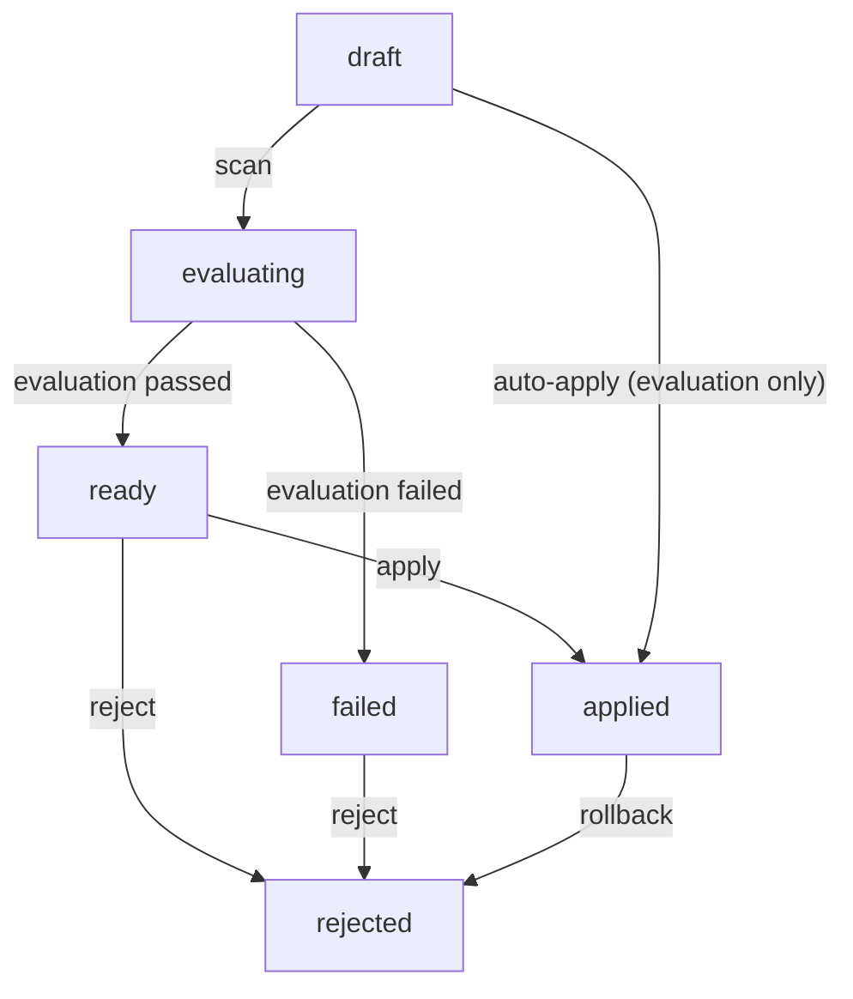
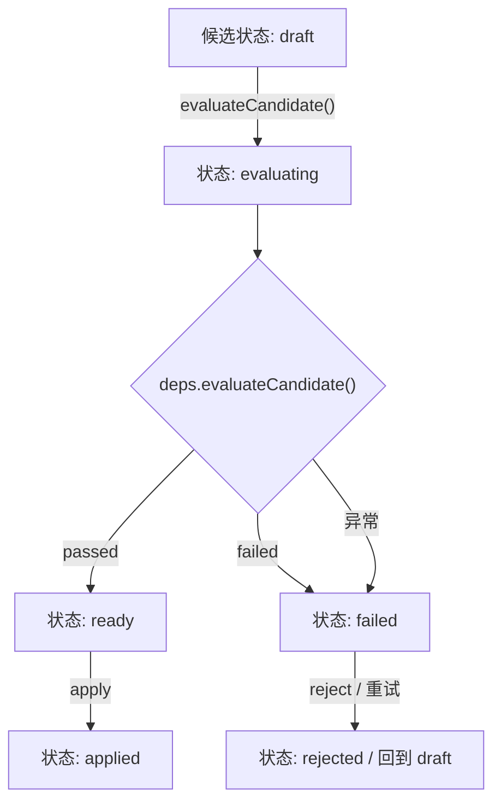
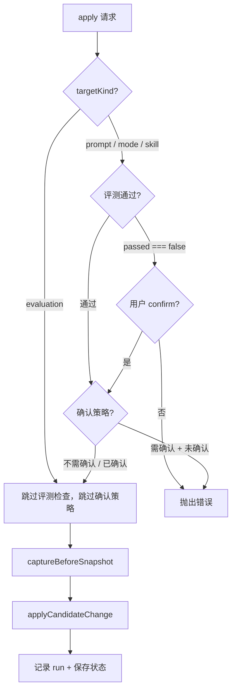
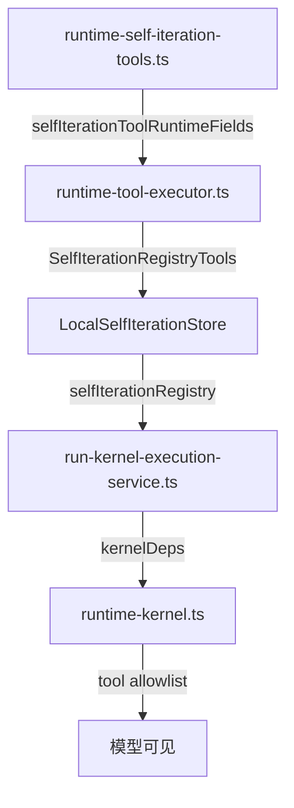
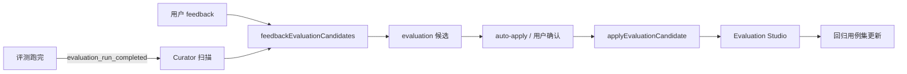
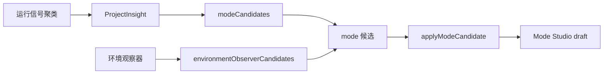
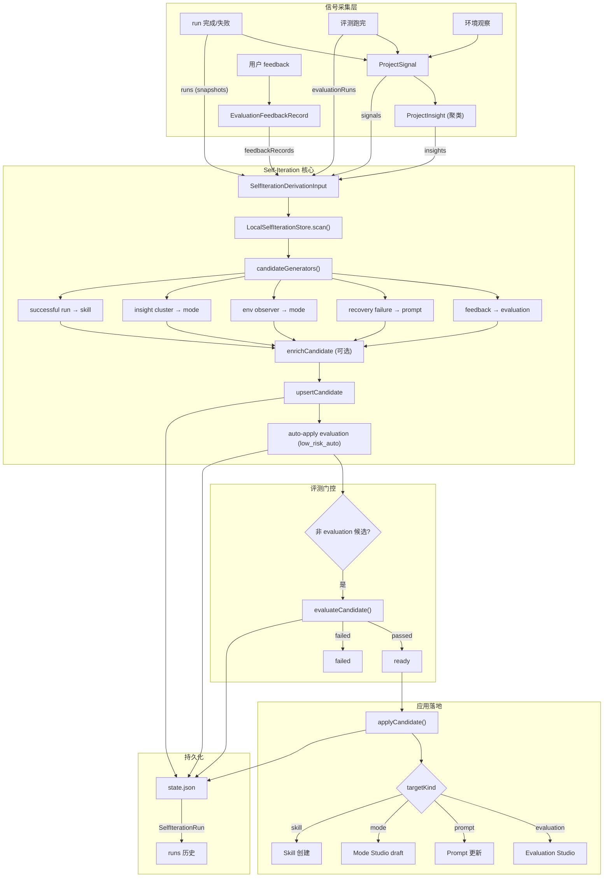

# Ora Self-Iteration Loop

本文描述 Ora 的 Self-Iteration 闭环：从运行信号、评测反馈、环境观察到候选方案生成、评测门控、自动应用的完整链路。读完本文，应能理解 Self-Iteration 的五类候选来源、三种自治级别、curator 扫描节律，以及它如何与 Evaluation Studio 和 Mode Studio 协作。

## 阅读地图

| 关注点 | 对应章节 |
| --- | --- |
| Self-Iteration 要解决什么问题 | [1. 定位：Self-Iteration 在 Ora 中的角色](#1-定位self-iteration-在-ora-中的角色) |
| Candidate 的类型体系与生命周期 | [2. Candidate：候选方案的结构与状态机](#2-candidate候选方案的结构与状态机) |
| 五类候选如何从信号中生成 | [3. 候选生成：五条信号→候选的派生路径](#3-候选生成五条信号候选的派生路径) |
| Policy 如何控制自治行为 | [4. Policy：自治级别与应用策略](#4-policy自治级别与应用策略) |
| Curator 的扫描节律与触发条件 | [5. Curator：扫描调度与节律控制](#5-curator扫描调度与节律控制) |
| 评测门控：候选如何通过 evaluation gate | [6. Evaluation Gate：候选的评测门控](#6-evaluation-gate候选的评测门控) |
| 低风险自动应用与高风险确认 | [7. Apply：自动应用与确认边界](#7-apply自动应用与确认边界) |
| 五个 Runtime Tool 的职责边界 | [8. Runtime Tools：模型可调用的 Self-Iteration 工具](#8-runtime-tools模型可调用的-self-iteration-工具) |
| 与 Evaluation Studio / Mode Studio 的关系 | [9. 与 Evaluation Studio 和 Mode Studio 的协作](#9-与-evaluation-studio-和-mode-studio-的协作) |
| 从信号到候选到应用的完整链路 | [10. 端到端数据流](#10-端到端数据流) |
| 容易误解的点 | [11. 常见误解与边界](#11-常见误解与边界) |
| 当前实现边界与可演进方向 | [12. 实现边界与演进方向](#12-实现边界与演进方向) |

核心源码文件：

| 文件 | 职责 |
| --- | --- |
| `packages/shared/src/self-iteration.ts` | Shared contract：Candidate、Policy、ScanResult 等 Zod schema 与类型 |
| `apps/runtime/src/self-iteration-store.ts` | 核心实现：候选人管理、扫描生成、评测调度、应用执行、策略持久化 |
| `apps/runtime/src/harness/runtime-self-iteration-tools.ts` | 五个 runtime tool 的注册与执行适配（list/get/scan/evaluate/apply） |
| `apps/runtime/src/harness/runtime-tool-executor.ts` | `SelfIterationRegistryTools` 接口定义与 tool context 注入 |
| `apps/runtime/src/run-kernel-execution-service.ts` | Kernel 启动时将 `selfIterationRegistry` 传入 kernel deps |
| `apps/runtime/src/harness/runtime-kernel.ts` | Kernel tool allowlist 中包含 selfIteration 工具 |
| `apps/runtime/src/feedback-loop-store.ts` | 信号→行动链路中生成 `draft_self_iteration_candidate` action |
| `packages/shared/src/feedback-loop.ts` | `ProjectSignal`、`ProjectInsight`、`ProjectSignalEvidence` 等信号类型 |

## 1. 定位：Self-Iteration 在 Ora 中的角色

Ora 的 Self-Iteration 不是「模型自己改自己的 prompt」这么简单。它是一条**从运行证据到结构化改进提案的闭环管线**：



Self-Iteration 要解决的核心问题：

| 问题 | 没有 Self-Iteration 时 | 有 Self-Iteration 时 |
| --- | --- | --- |
| 运行失败后如何改进？ | 用户手动分析、手动改 prompt/mode | 系统从 recovery 信号自动生成 prompt 候选 |
| 用户反馈如何变成回归防护？ | 反馈丢失在聊天记录中 | 反馈自动生成 evaluation 候选，进入 Evaluation Studio |
| 成功的 multi-tool 工作流如何复用？ | 用户凭记忆重复操作 | 系统从成功 run 中提取 skill 候选 |
| 多个信号如何聚合成一个改进动作？ | 人工分析和决策 | ProjectInsight 聚合信号，生成 mode 候选 |
| 哪些改进可以自动落地？ | 全部需要人工 | 低风险 evaluation 候选自动应用，高风险变更需确认 |

## 2. Candidate：候选方案的结构与状态机

### 2.1 候选的四种目标类型

Self-Iteration 可以产出四种目标的候选方案：

```typescript
// packages/shared/src/self-iteration.ts
type SelfIterationTargetKind = "prompt" | "mode" | "skill" | "evaluation";
```

| TargetKind | 含义 | 生成来源 | 落地方式 |
| --- | --- | --- | --- |
| `evaluation` | 评测用例候选 | 用户 feedback（pending review） | 直接写入 Evaluation Studio |
| `prompt` | Prompt 优化候选 | 重复 recovery 失败 / 运行失败 | 修改对应 mode node 的 prompt |
| `mode` | Mode 编排候选 | ProjectInsight（信号聚类）/ 环境观察 | 生成 Mode Studio draft |
| `skill` | Skill 候选 | 成功的 multi-tool 工作流 | 创建新 skill 文件 |

### 2.2 候选的完整结构

```typescript
SelfIterationCandidate {
  id: string;                    // 全局唯一，如 "proj:self:prompt:single_agent"
  projectId: string;
  targetKind: SelfIterationTargetKind;
  targetRef: {                   // 指向被修改的目标
    kind: "prompt" | "mode" | "skill" | "evaluation";
    id: string;
    modeId?: string;             // prompt 候选关联的 mode
    skillName?: string;          // skill 候选的名称
    feedbackId?: string;         // evaluation 候选关联的 feedback
    evaluationRunId?: string;    // 评测 run id
  };
  title: string;                 // 人类可读标题
  summary: string;               // 候选理由
  evidence: ProjectSignalEvidence[];  // 支撑证据（至少一条）
  proposedChange: {              // 提议的具体变更
    operation: string;           // 如 "mode.node.prompt.update"
    title: string;
    summary: string;
    before?: unknown;
    after?: unknown;
    patch?: unknown;
    metadata: Record<string, unknown>;
  };
  riskLevel: "low" | "medium" | "high" | "critical";
  status: SelfIterationCandidateStatus;
  evaluationRunId?: string;      // 关联的评测 run
  rejectionReason?: string;
  applyResult?: unknown;
  beforeSnapshot?: unknown;      // 应用前快照，用于回滚
  verification?: {               // 可选的应用后验证
    status: "pending" | "verified" | "regressed";
    baselineScore?: number;
    baselinePassRate?: number;
    lastVerifiedAt?: number;
    verifiedRunId?: string;
  };
  createdAt: number;
  updatedAt: number;
}
```

### 2.3 候选状态机



关键规则：
- **Draft 可被覆盖**：重新 scan 时如果候选仍为 `draft` 或 `evaluating`，会更新内容。已进入 `ready`/`rejected`/`applied`/`failed` 的候选不会被覆盖。
- **Evaluation 候选直接 apply**：不经过 evaluating 和 ready 阶段，由 `evaluationAutoApply` 策略控制。
- **非 evaluation 候选需评测**：prompt/mode/skill 候选需要通过 evaluation gate 才能进入 ready。

## 3. 候选生成：五条信号→候选的派生路径

`candidateGenerators` 函数组合了五条独立的候选生成器，每条从一个不同的信号源派生候选：

```typescript
// self-iteration-store.ts
function candidateGenerators(projectId, input, now): SelfIterationCandidate[] {
  return [
    ...feedbackEvaluationCandidates(projectId, input, now),  // feedback → evaluation
    ...runtimePromptCandidates(projectId, input, now),       // recovery failure → prompt
    ...environmentObserverCandidates(projectId, input, now), // file snapshot → mode
    ...modeCandidates(projectId, input, now),                // insight cluster → mode
    ...skillCandidates(projectId, input, now),               // successful run → skill
  ];
}
```

### 3.1 Feedback → Evaluation 候选

**信号源**：`input.feedbackRecords` 中 `status === "pending"` 的记录。

```typescript
// 对于每条 pending feedback：
candidate = {
  targetKind: "evaluation",
  targetRef: { kind: "evaluation", id: feedback.id, feedbackId: feedback.id },
  proposedChange: {
    operation: "evaluation.feedback.accept",
    title: "Accept feedback into Evaluation Studio",
    summary: "Add this reviewed feedback as regression material.",
  },
  riskLevel: "low",
}
```

这是唯一 riskLevel 为 `low` 的候选类型，因为它是将人工审核过的反馈转化为评测用例，不修改运行行为。

### 3.2 Recovery Failure → Prompt 候选

**信号源**：`input.signals` 中 source 为 `recovery_event` 且 severity 为 `critical`，或 `runStatus === "failed"` 的记录。

按 `modeId` 去重——同一 mode 的多次失败只生成一个 prompt 候选：

```typescript
// 去重后，每个 modeId 生成一个候选：
candidate = {
  targetKind: "prompt",
  id: `${projectId}:self:prompt:${modeId}`,
  targetRef: { kind: "prompt", id: modeId, modeId },
  proposedChange: {
    operation: "mode.node.prompt.update",
    title: "Add failure-aware prompt guidance",
    after: "Before finalizing, state assumptions, verify tool outcomes, and surface blockers...",
  },
  riskLevel: "high",
}
```

### 3.3 Environment Observer → Mode 候选

**信号源**：`input.signals` 中 source 为 `project_file` 且 `observerKind === "environment_snapshot"` 的记录。最多取 1 条。

```typescript
candidate = {
  targetKind: "mode",
  proposedChange: {
    operation: "mode.studio.generateDraft",
    title: "Open a Mode Studio draft from environment context",
  },
  riskLevel: "high",
}
```

这个候选要求人工在 Mode Studio 中审查和编辑，不会自动应用。

### 3.4 Insight Cluster → Mode 候选

**信号源**：`input.insights` 中 `status === "open"` 且与 recovery/approval/evaluation/drift 相关的记录。最多取 3 条。

```typescript
candidate = {
  targetKind: "mode",
  proposedChange: {
    operation: "mode.studio.generateDraft",
    title: "Open a Mode Studio improvement draft",
  },
  riskLevel: "high",
}
```

每个 insight 本身是多个信号的聚类（通过 `signalIds` 引用），因此这个候选代表一组相关问题的综合响应。

### 3.5 Successful Run → Skill 候选

**信号源**：`input.runs` 中 `status === "succeeded"` 且 `toolCalls.length >= 2` 的记录。最多取 1 条。

```typescript
const skillName = `learned-${run.modeId}`;
candidate = {
  targetKind: "skill",
  proposedChange: {
    operation: "skills.create",
    after: {
      name: skillName,
      content: `Use this skill when a request resembles run ${run.runId}...`,
    },
  },
  riskLevel: "high",
}
```

### 3.6 候选生成的 enrich 钩子

`scan` 方法接受可选的 `enrichCandidate` 回调，在生成候选后、落库前对每个候选做增强处理（如通过 LLM 补充候选内容）。如果 enrich 失败，候选仍以原始内容保留。

```typescript
const enriched = input.enrichCandidate
  ? await Promise.all(generated.map((c) => input.enrichCandidate!(c, input).catch(() => c)))
  : generated;
```

## 4. Policy：自治级别与应用策略

每个 project 有独立的 `SelfIterationPolicy`，控制 Self-Iteration 的行为边界。

### 4.1 三种自治级别

```typescript
type SelfIterationAutonomy = "low_risk_auto" | "human_review" | "experimental_auto";
```

| 级别 | 自动应用 evaluation？ | curator 自动扫描？ | 适用场景 |
| --- | --- | --- | --- |
| `low_risk_auto` | 是（仅 evaluation 候选） | 是 | 生产环境默认：仅低风险自动，高风险需确认 |
| `human_review` | 否 | 是 | 保守模式：所有候选需人工审查 |
| `experimental_auto` | 是 | 是 | 实验模式：允许更宽松的自动应用（预留扩展） |

### 4.2 确认策略

```typescript
SelfIterationPolicy {
  evaluationAutoApply: boolean;          // evaluation 候选是否自动应用（默认 true）
  promptApplyRequiresConfirmation: boolean;   // prompt 候选是否需确认（默认 true）
  modeApplyRequiresConfirmation: boolean;     // mode 候选是否需确认（默认 true）
  skillApplyRequiresConfirmation: boolean;    // skill 候选是否需确认（默认 true）
}
```

**apply 时的确认逻辑**（`requiresConfirmation`）：

```typescript
function requiresConfirmation(candidate, policy) {
  if (candidate.targetKind === "prompt") return policy.promptApplyRequiresConfirmation;
  if (candidate.targetKind === "mode") return policy.modeApplyRequiresConfirmation;
  if (candidate.targetKind === "skill") return policy.skillApplyRequiresConfirmation;
  return false;  // evaluation 候选不需要此检查
}
```

注意 evaluation 候选有自己的确认路径：由 `evaluationAutoApply` 和 `autonomy` 共同决定（见扫描时的自动应用逻辑），不走 `requiresConfirmation`。

### 4.3 环境观察器子策略

```typescript
SelfIterationEnvironmentObserverPolicy {
  enabled: boolean;              // 默认 false
  paused: boolean;
  watchedPaths: string[];        // 默认 ["."]
  excludedGlobs: string[];       // 默认 [".git/**", "node_modules/**", ...]
  scanBudgetFiles: number;       // 默认 200
  maxFileBytes: number;          // 默认 512000
}
```

环境观察器是 Self-Iteration 的文件系统感知层，但当前默认关闭（`enabled: false`），需要显式开启。

## 5. Curator：扫描调度与节律控制

Curator 是 Self-Iteration 的后台调度器，负责按策略节律周期性扫描信号并生成候选。

### 5.1 触发条件

```typescript
type SelfIterationCuratorTrigger =
  | "evaluation_run_completed"   // 评测跑完
  | "feedback_accepted"         // 反馈被接受
  | "feedback_submitted"        // 反馈被提交
  | "recovery_insight_created"  // recovery 事件产生 insight
  | "run_completed_idle";       // run 完成后空闲
```

### 5.2 扫描节律

```typescript
SelfIterationPolicy {
  curatorEnabled: boolean;          // 是否启用 curator（默认 true）
  scanCadenceMs: number;            // 最小扫描间隔（默认 5 分钟）
  idleScanDelayMs: number;          // 空闲后延迟扫描（默认 30 秒）
}
```

`triggerCuratorScan` 方法实现节律控制：

```typescript
async triggerCuratorScan(params, input, deps) {
  // 1. 检查 curatorEnabled
  if (!policy.curatorEnabled) return { scanned: false, reason: "disabled" };

  // 2. 检查 scanCadenceMs
  const lastScanAt = this.state.curator[projectId]?.lastScanAt;
  if (!force && now - lastScanAt < policy.scanCadenceMs) {
    return { scanned: false, reason: "cadence" };
  }

  // 3. 执行扫描
  const result = await this.scan({ projectId }, input, deps);
  this.state.curator[projectId] = { lastScanAt: now, lastTrigger: trigger };
  return { scanned: true, result };
}
```

### 5.3 扫描的自动应用逻辑

在 `autonomy === "low_risk_auto"` 时，扫描完成后自动应用 evaluation 候选：

```typescript
if (policy.autonomy === "low_risk_auto" && policy.evaluationAutoApply) {
  for (const candidate of upserted.filter(
    item => item.targetKind === "evaluation" && item.status === "draft"
  )) {
    autoApplied.push(this.applyCandidate(
      { candidateId: candidate.id, confirmed: true }, deps
    ));
  }
}
```

这意味着 evaluation 候选在生成后立即应用，不需要经过 evaluating/ready 状态。

## 6. Evaluation Gate：候选的评测门控

非 evaluation 候选在应用前需要通过评测门控。

### 6.1 评测流程



### 6.2 评测输出

```typescript
interface SelfIterationEvaluationOutcome {
  evaluationRunId?: string;
  passed?: boolean;              // false → failed, otherwise → ready
  message?: string;
  metadata?: Record<string, unknown>;
  proposedChangeAfter?: unknown;     // 评测后更新的变更
  proposedChangeMetadata?: Record<string, unknown>;
}
```

评测结果存入 `proposedChange.metadata.selfIterationEvaluation`：

```typescript
{
  passed: boolean,
  message: string,
  evaluationRunId: string,
  gateKind?: string,
  safetyGate?: { ... },
  impactEvaluation?: { ... },
  score?: number,
  passRate?: number,
  regressionCount?: number,
  totalAttempts?: number,
}
```

### 6.3 评测的防重入

`inflightEvaluations` 集合防止同一个候选被并发评测：

```typescript
if (this.inflightEvaluations.has(candidate.id)) {
  throw new Error(`Candidate ${candidate.id} is already being evaluated.`);
}
```

### 6.4 Apply 时的评测检查

应用非 evaluation 候选时，检查评测是否通过：

```typescript
if (candidate.targetKind !== "evaluation" && evaluation?.passed === false && !parsed.confirmed) {
  throw new Error("candidates failed evaluation and require explicit override confirmation");
}
```

即使评测失败，用户仍可通过 `confirmed: true` 强制应用（override）。

## 7. Apply：自动应用与确认边界

### 7.1 应用前置条件

应用一个候选需要满足：

1. **评测通过**（非 evaluation 候选）：评测 `passed` 不为 `false`，或用户显示 confirm
2. **确认策略**：targetKind 对应的 `requiresConfirmation` 检查
3. **Approval gate**（runtime tool 路径）：`selfIteration.apply` tool 标记 `requiresApprovalCopy: true` 和 `actionRiskLevel: "high"`，通过 approval gate 获取用户批准



### 7.2 变更分发

`applyCandidateChange` 按 targetKind 分发到不同的 deps 函数：

```typescript
function applyCandidateChange(candidate, deps) {
  return candidate.targetKind === "evaluation" ? deps.applyEvaluationCandidate?.(candidate)
    : candidate.targetKind === "prompt" ? deps.applyPromptCandidate?.(candidate)
    : candidate.targetKind === "skill" ? deps.applySkillCandidate?.(candidate)
    : candidate.targetKind === "mode" ? deps.applyModeCandidate?.(candidate)
    : { applied: true };
}
```

这些 deps 由 runtime 层注入（`SelfIterationApplyDeps`），对应到实际的 Evaluation Studio / prompt 编辑 / skill 创建 / Mode Studio 操作。

### 7.3 回滚

已应用的候选可以通过 `rollbackCandidate` 回滚：

1. 状态必须为 `applied`
2. 依赖 `beforeSnapshot` 或 `deps.rollbackSnapshot` 恢复
3. 状态转为 `rejected`，记录 rejection reason 为 "Rolled back by user."

### 7.4 应用后验证

应用后可选设置 `verification` 字段，包含基线 score/passRate，用于后续判断变更是否引起回归。

## 8. Runtime Tools：模型可调用的 Self-Iteration 工具

Self-Iteration 暴露了五个 runtime tool，模型可以在 kernel loop 中调用它们。

### 8.1 工具清单

| Tool ID | 用途 | 风险 | 需审批 |
| --- | --- | --- | --- |
| `selfIteration.list` | 列出候选（可按 status/targetKind 过滤） | 只读 | 否 |
| `selfIteration.get` | 获取单个候选详情 | 只读 | 否 |
| `selfIteration.scan` | 触发一次扫描 | 只读（但会生成候选） | 否 |
| `selfIteration.evaluate` | 对候选执行评测 | 中 | 否 |
| `selfIteration.apply` | 应用候选 | 高 | 是 |

### 8.2 工具注册路径



### 8.3 apply 的审批流程

`selfIteration.apply` 是唯一需要审批的工具：

1. `requiresApprovalCopy: true` — 触发 approval gate
2. `actionRiskLevel: () => "high"` — 高风险
3. `approvalRequest` — 生成中英双语的审批请求，包含变更说明和风险提示
4. `execute` 检查 `context.allowRisky === true` — 审批通过后才真正执行

```typescript
case "selfIteration.apply":
  return {
    requiresApprovalCopy: true,
    actionRiskLevel: () => "high",
    approvalRequest: selfIterationApplyApprovalRequest,
    execute: (args, context) => ({
      output: applyRuntimeSelfIterationCandidate(
        context.selfIterationRegistry, args, context.allowRisky === true
      )
    }),
  };
```

## 9. 与 Evaluation Studio 和 Mode Studio 的协作

Self-Iteration 不是孤立闭环，它与 Ora 的另外两个 Studio 有直接的协作关系。

### 9.1 与 Evaluation Studio 的关系



**Evaluation 候选是双向的**：
- **入**：用户 feedback → evaluation 候选 → Evaluation Studio（将反馈转化为回归用例）
- **出**：评测结果 → 触发 curator 扫描 → 可能生成新的 prompt/mode 候选（基于评测回归信号）

### 9.2 与 Mode Studio 的关系



**Mode 候选不直接修改 mode**，而是生成 Mode Studio draft。这意味着：
1. 候选落地为 Mode Studio 中的草稿
2. 用户在 Mode Studio 中审查、编辑、验证
3. 只有用户主动保存后，draft 才变成正式的 mode 变更

这是 Self-Iteration 的安全边界：**系统可以提案，但 mode 的结构性变更始终需要人类在 Mode Studio 中确认**。

### 9.3 与 Feedback Loop 的协作

`feedback-loop-store.ts` 中的 `draftSelfIterationAction` 函数将信号分析结果与 Self-Iteration 连接起来：

```typescript
function draftSelfIterationAction(projectId, label): ProjectSignalAction {
  return {
    kind: "draft_self_iteration_candidate",
    label,
    payload: { projectId },
    requiresConfirmation: true,
  };
}
```

这个 action 出现在信号分析面板中，让用户可以从信号列表一键触发候选生成。

## 10. 端到端数据流



## 11. 常见误解与边界

### 11.1 "Self-Iteration 是模型自己改自己"

**不是。** Self-Iteration 是一个结构化的候选生成与门控系统。候选是从运行信号中规则化派生的，不是模型自由发挥。prompt/mode/skill 候选需要评测门控和人工确认才能落地。evaluation 候选虽然可以自动应用，但它们只是将审查过的 feedback 转化为评测用例，不修改运行行为。

### 11.2 "Evaluation 候选不需要评测"

**是，但语义不同。** Evaluation 候选的「评测」是用户对 feedback 的 review（已在 feedback 阶段完成），所以直接进入 apply 路径。其他候选的「评测」是通过 Evaluation Studio 运行回归测试。

### 11.3 "环境观察器默认开启"

**不是。** `SelfIterationEnvironmentObserverPolicy.enabled` 默认为 `false`。即使开启，也仅扫描文件元数据（文件名、大小），不读取文件内容（由 `maxFileBytes` 控制，默认 512KB）。

### 11.4 "候选 ID 冲突会创建多个候选"

**不会。** `upsertCandidate` 检查候选 ID 是否已存在。如果存在且状态不是 `draft` 或 `evaluating`，保留现有候选不更新。只有在草稿/评测中状态时才会刷新内容。同一个 recovery signal 的 modeId 在 `runtimePromptCandidates` 中已去重，不会产生重复候选。

### 11.5 "扫描会每次都生成新候选"

**部分正确。** 扫描每次都会执行五条生成器，但 `upsertCandidate` 的防覆盖逻辑确保已进入终态的候选（ready/rejected/applied/failed）不会被覆盖。这意味着：
- 一个已 applied/rejected 的 prompt 候选不会被同一 mode 的新 failure 自动替换
- 用户需要手动 reject → 让候选回到可覆盖状态，或等待旧候选被手动处理后，新 scan 才会更新

### 11.6 "Self-Iteration 替代了 Evaluation Studio"

**不是。** Self-Iteration 是候选生成和管理层，Evaluation Studio 是评测执行和结果管理层。Self-Iteration 的 evaluation gate 依赖 Evaluation Studio 来运行实际的评测。它们是互补关系，不是替代。

### 11.7 "Curator 在每次 run 完成后都会扫描"

**不是。** Curator 受到 `scanCadenceMs`（默认 5 分钟）的节律限制。`trigger` 参数只是记录触发原因，不影响扫描执行——如果距上次扫描不足 5 分钟，即使有新的 trigger 到达也会被跳过（`force: true` 除外）。

### 11.8 "Skill 候选会自动创建 skill 文件"

**不是。** Skill 候选的 `applySkillCandidate` deps 由 runtime 注入，实际行为取决于注入的实现。当前实现中 `proposedChange.after` 包含 skill 内容模板，但落地需要用户在对应界面中确认。

## 12. 实现边界与演进方向

### 12.1 当前实现边界

| 方面 | 当前状态 | 保守边界 |
| --- | --- | --- |
| 候选存储 | `state.json` 文件（`LocalSelfIterationStore`） | 单节点内存+文件，无分布式一致性。多进程会各自维护独立状态 |
| 候选生成 | 五条规则化生成器，基于信号/insight/feedback 过滤 | 不涉及 LLM 生成（`candidateGenerationLLM` 默认为 false）。候选内容为模板化文案 |
| Enrich 钩子 | `enrichCandidate` 回调可选注入 | 需要外部提供 LLM 调用；失败时候选以原始内容保留 |
| 评测门控 | 通过 `SelfIterationEvaluateDeps` 注入 | 实际评测由外部 Evaluation Studio 执行；self-iteration store 只做状态管理 |
| 环境观察器 | Policy 已定义，默认关闭 | `enabled: false`，且仅扫描文件元数据 |
| 自治级别 | 三种级别定义完成 | `experimental_auto` 的行为与 `low_risk_auto` 相同，尚未实现差异化的自动应用策略 |
| 回滚 | 依赖 `beforeSnapshot` 或 `deps.rollbackSnapshot` | 回滚后的验证状态未自动清除 |
| 跨 project 能力 | Candidate/Policy 以 projectId 分区 | 候选不跨 project 共享；同一 signal 在不同 project 中独立生成候选 |

### 12.2 可演进方向

1. **LLM-enriched 候选生成**：当前 `candidateGenerationLLM: false`。开启后，候选的 `proposedChange.after` 可由 LLM 根据 evidence 生成具体内容，而不是使用模板文案。
2. **候选优先级与排序**：当前 list 按 `updatedAt` 降序。未来可按 riskLevel、evidence 强度、评测分数综合排序，让用户先看到最有价值的候选。
3. **候选合并**：同一 mode 的多个 insight cluster 候选可以合并为一个，减少候选碎片化。
4. **Automation rules 与 Self-Iteration 联动**：当前 `SelfIterationPolicy` 和 `AutomationPolicy` 独立。可以让 Self-Iteration 的自动应用策略与 automation rules 共享决策框架。
5. **环境观察器深度集成**：当前观察器只扫描文件元数据。未来可以结合 AST 分析或 git diff 来生成更精确的 mode/prompt 候选。
6. **候选效果追踪**：应用后的 `verification` 字段可以扩展为完整的 A/B 对比报告，追踪候选落地后的实际运行效果。
7. **分布式状态**：当前 `LocalSelfIterationStore` 基于文件。云端部署需要支持数据库存储和多节点一致性。

---

## 附录 A：核心类型速查

| 类型 | 定义位置 | 说明 |
| --- | --- | --- |
| `SelfIterationCandidate` | `packages/shared/src/self-iteration.ts` | 候选方案的完整结构 |
| `SelfIterationCandidateStatus` | `packages/shared/src/self-iteration.ts` | 候选状态枚举（6 种） |
| `SelfIterationTargetKind` | `packages/shared/src/self-iteration.ts` | 候选目标类型（4 种） |
| `SelfIterationPolicy` | `packages/shared/src/self-iteration.ts` | 项目级自治策略 |
| `SelfIterationAutonomy` | `packages/shared/src/self-iteration.ts` | 自治级别（3 种） |
| `SelfIterationCuratorTrigger` | `packages/shared/src/self-iteration.ts` | Curator 触发条件（5 种） |
| `SelfIterationRun` | `packages/shared/src/self-iteration.ts` | Self-Iteration 操作记录 |
| `SelfIterationScanResult` | `packages/shared/src/self-iteration.ts` | 扫描操作的完整返回 |
| `SelfIterationProposedChange` | `packages/shared/src/self-iteration.ts` | 候选提议的具体变更 |
| `SelfIterationEnvironmentObserverPolicy` | `packages/shared/src/self-iteration.ts` | 环境观察器子策略 |
| `SelfIterationDerivationInput` | `self-iteration-store.ts` | 候选生成的输入信号集 |
| `SelfIterationApplyDeps` | `self-iteration-store.ts` | 应用候选所需的依赖注入 |
| `SelfIterationEvaluateDeps` | `self-iteration-store.ts` | 评测候选所需的依赖注入 |
| `SelfIterationEvaluationOutcome` | `self-iteration-store.ts` | 评测结果的结构 |
| `SelfIterationRegistryTools` | `runtime-tool-executor.ts` | 面向 runtime tool 的 store 接口 |

## 附录 B：状态文件格式

`LocalSelfIterationStore` 将状态持久化到 `state.json`：

```json
{
  "schemaVersion": 1,
  "candidates": {
    "proj:self:evaluation:fb-1": {
      "id": "proj:self:evaluation:fb-1",
      "projectId": "proj",
      "targetKind": "evaluation",
      "targetRef": { "kind": "evaluation", "id": "fb-1", "feedbackId": "fb-1" },
      "title": "Turn feedback into an Evaluation case",
      "summary": "用户反馈的原文...",
      "evidence": [{ "id": "fb-1", "label": "Evaluation feedback", "target": { "kind": "feedback", "id": "fb-1" } }],
      "proposedChange": {
        "operation": "evaluation.feedback.accept",
        "title": "Accept feedback into Evaluation Studio",
        "summary": "Add this reviewed feedback as regression material.",
        "metadata": { "feedbackId": "fb-1" }
      },
      "riskLevel": "low",
      "status": "applied",
      "createdAt": 1715000000000,
      "updatedAt": 1715000001000
    }
  },
  "policies": {
    "proj": {
      "projectId": "proj",
      "autonomy": "low_risk_auto",
      "evaluationAutoApply": true,
      "promptApplyRequiresConfirmation": true,
      "modeApplyRequiresConfirmation": true,
      "skillApplyRequiresConfirmation": true,
      "curatorEnabled": true,
      "scanCadenceMs": 300000,
      "idleScanDelayMs": 30000,
      "updatedAt": 1715000000000
    }
  },
  "runs": [
    {
      "id": "self-iteration-run-0001",
      "projectId": "proj",
      "kind": "scan",
      "candidateIds": ["proj:self:evaluation:fb-1"],
      "status": "succeeded",
      "message": "Self-Iteration scan created or refreshed 1 candidate.",
      "createdAt": 1715000000000
    }
  ],
  "curator": {
    "proj": {
      "lastScanAt": 1715000000000,
      "lastTrigger": "feedback_accepted"
    }
  }
}
```

---

> **核心判断**：Self-Iteration 是 Ora 从「被动执行工具」到「主动改进自身」的关键架构跃迁。它不依赖模型自我反思，而是通过结构化的信号→候选→评测→应用管线，确保每次变更都有证据支撑、有评测门控、有回滚能力。当前实现已经建立了完整的类型体系和规则化生成框架，LLM-enriched 候选生成和跨候选合并是下一步的核心演进方向。
